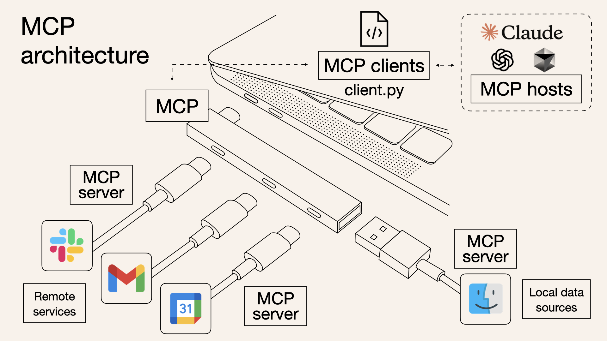
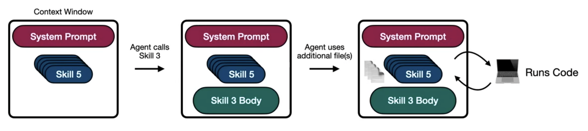

# AI Agent Skills

> A simple, open format for giving agents new capabilities and expertise.  
> : 에이전트에게 새로운 기능과 전문 지식을 제공하기 위한 간단하고 열려있는 기능

요즘날 사용하는 LLM은 완벽해보이지만, LLM만으로 해결할 수 없는 문제들이 많이 있었다. 예를 들어 LLM으로 코드의 오류를 리뷰하고 싶을 때, 파일 접근 권한이 없거나(Tool의 부재) 실행되지 않는 코드의 논리적 오류(Silent Error)를 잡아내지 못하는 한계가 있다.
이러한 한계를 해결하기 위해 인공지능에게 **적절한 도구**와 **구체적인 맥락(Context)** 을 제공하여 특정 작업을 완수하게 하는 표준이 필요해졌다. 그렇게 등장한 게 MCP(Model Context Protocol)이다.

##  MCP (Model Context Protocol)

Anthropic에서 제안한 **"AI 앱의 USB-C 포트"** 로, LLM에 적절한 도구와 맥락을 제공하는 개방형 표준이다. Client-Server 구조를 가지며, **MCP Client**는 AI 앱 내부에 위치하고, **MCP Server**는웹 검색, 파일 읽기 등 실제 도구(Tools), 리소스(Resources), 프롬프트(Prompts)를 제공한다.




mcp server 초기화 시, mcp client는 **사용 가능한 모든 도구 목록**을 요청한다. server는 엄청난 양의 텍스트를 응답하는데, 이 안에는 어떤 도구를 사용할 수 있는지, 어떻게 작동하는지, 어떤 경우에 사용해야 하는지, 도구를 호출할 때 스키마가 어떻게 되는지 등에 대한 정보를 담고 있다. 에이전트가 모든 맥락을 이해하여 효율적으로 도구를 사용할 수 있게하기 위함이다.
따라서 에이전트는 실제로 사용하지 않는 도구에 대한 정보도 context window에 추가하게 되면서, 맥락 붕괴(context rot)에 도달할 수 있으며, 비효율적으로 토큰을 사용하게 된다.


## Agent Skills

간단히 말하면, 지침이 담긴 폴더 집합이다.

에이전트의 컨텍스트 관리를 효율화하기 위한 구조화된 지침으로, 반복 작업의 표준화, 팀 간 지식 공유, 복잡한 작업의 캡슐화가 가능하다. 컨텍스트 파일이 **'우리 팀의 개발 문화'** 라면, Skills는 **'특정 업무의 작업 매뉴얼'** 이다.

* **Self-documenting**: 자기 문서화가 가능함.
* **Extensible**: 확장이 용이함.
* **Portable**: 휴대성이 좋아 어디서든 사용 가능함.


### 디렉터리 구조
`SKILL.md` 파일 + 관련 리소스 폴더
```text

my-skill/
├── SKILL.md          # Required: instructions + metadata
├── scripts/          # Optional: executable code (실행 가능한 코드)
├── references/       # Optional: documentation
└── assets/           # Optional: templates, resources

```

### SKILL.md 양식

* **Frontmatter**: 메타데이터 (name, description).
* **Body**: 구체적인 지침(Instructions) 본문.

```markdown
---
name: skill-name
description: A description of what this skill does and when to use it.
---
body
```


### 단계적 노출(Progressive Disclosure)
agent skills가 context를 효율적으로 사용할 수 있는 이유로, 에이전트에게 필요한 순간에만 충분한 맥락을 제공한다.

1. **Discovery (검색)**: 시작할 때 에이전트는 각 스킬의 이름과 설명만 로드한다.
2. **Activation (활성화)**: 작업이 결정되면 에이전트는 `SKILL.md` 내부의 지침(Instructions)과 컨텍스트를 읽는다.
3. **Execution (실행)**: 에이전트는 지침에 따라 선택적으로 `references`를 로드하거나 `scripts`를 실행한다.



## MCP vs Skills 비교 분석

두 기술은 상호 보완적이지만, 접근 방식에서 차이가 있습니다.

| 비교 항목 | MCP (Model Context Protocol) | Agent Skills |
| --- | --- | --- |
| **핵심 목적** | LLM에 도구와 컨텍스트를 연결 | 에이전트에 컨텍스트와 코드를 부여 |
| **표준 상태** | 널리 채택된 오픈 표준 (Widely adopted) | 초기 단계의 오픈 표준 (Early days) |
| **로딩 방식** | **Startup 시 모든 스키마 로드**. 서버 연결 시 도구 목록 전체 파악. | **필요 시 로드 (Progressive Disclosure)**. 컨텍스트와 코드를 단계별로 호출. |
| **필요 역량** | MCP Client + Tool Calling 능력 필요. | File Tools + Code Interpreter 능력 필요. |
| **구현 난이도** | 커스텀 서버 구축 시 코딩 필요. | **자연어(Natural Language)** 기반으로 스킬 설계 가능. |
| **주요 가치** | 에이전트에게 특정 도구 사용 권한 부여. | 에이전트에게 특정 업무를 위한 **지식과 매뉴얼** 전수. |

---

##  결론: 왜 Skills를 쓰는가?

MCP는 강력한 연결 도구이지만, 모든 도구의 맥락을 한꺼번에 이해하려 하면 **문맥 붕괴(Context Rot)** 현상이 발생하거나 비용이 상승할 수 있습니다.

반면 **Skills**는:

1. **효율성**: 필요한 정보만 단계적으로 제공하여 컨텍스트 윈도우를 아낌.
2. **접근성**: 전문 개발 지식이 부족해도 자연어로 업무 매뉴얼(Skill)을 설계하여 AI에게 가르칠 수 있음.
3. **관리 편의성**: 에이전트의 컨텍스트 관리 면에서 표준화된 폴더 구조를 제공하여 유지보수가 쉬움.

<br>

> **한 줄 요약**: "MCP가 AI에게 어떤 **도구(Tool)** 를 쥐여줄지 결정한다면, Skills는 그 도구를 가지고 **어떤 순서와 규칙(Knowledge/Workflow)** 으로 일할지 가르치는 것"입니다.


### 참고
https://agentskills.io/what-are-skills  
https://daleseo.com/agent-skills/  
[Agent Skills vs MCP: What’s the difference?](https://www.youtube.com/watch?v=6wdvSH61xGw)  
skills 집합 사이트 https://skills.sh/