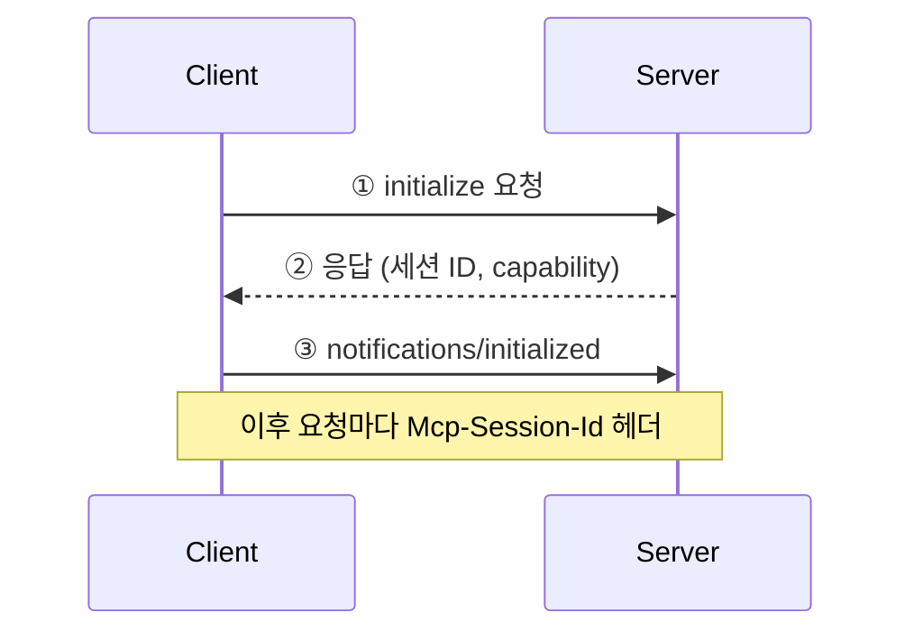
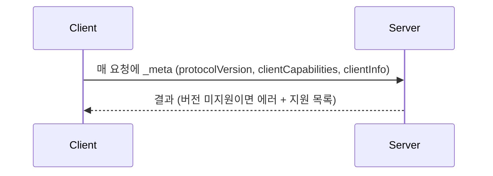

# MCP 변천사 — 전송 방식과 세션이 바뀐 이유

> MCP 서버를 레거시 SSE에서 Streamable HTTP로 옮기다가, 2026-07-28 스펙에서 세션과 핸드셰이크가 아예 사라진 걸 알게 됐다. 왜 그렇게 됐는지 정리.

|                        | 전송 방식           | 세션                 |
| ---------------------- | --------------- | ------------------ |
| v2 (2024-11)           | SSE             | 있음                 |
| v3 (2025-03 ~ 2025-11) | Streamable HTTP | 있음                 |
| v4 (2026-07)           | Streamable HTTP | **없음 (stateless)** |

## 전송 방식

### v2. SSE (Server-Sent Event)

서버가 클라이언트에게 일방적으로 계속 말을 걸 수 있는 HTTP 연결. 클라이언트가 GET 한 번으로 연결을 열어두면 서버가 `data: ...`를 흘려보낸다. 단방향이라 MCP는 `GET /sse`(서버가 말하는 통로) + `POST /messages`(클라이언트가 요청하는 통로) 두 개를 조합해서 썼다. 연결을 항상 열어둬야 하고, 끊기면 세션이 사라진다.

### v3. Streamable HTTP

엔드포인트를 `/mcp` 하나로 합쳤다. 클라이언트가 POST로 요청하면 짧은 답은 JSON으로, 긴 답은 그 응답 자체를 SSE 스트림으로 바꿔 보낸다. SSE가 없어진 게 아니라 "항상 켜 둔 연결"이 없어진 것.

## 세션 & 핸드셰이크

### v3. 처음 한 번 핸드셰이크

- 처음에 한 번만 한다. initialize 정보(버전, capability, 구독 상태 등)는 **서버가 세션에 기록**해둔다.
- 서버가 기억한다 = 서버 한 대에 묶인다. 서버가 여러 대면 다른 서버는 그 세션을 모른다.
- 우회책 3가지
  - Sticky session — 로드밸런서가 `Mcp-Session-Id` 헤더를 해시해서 같은 서버로 보낸다
  - 세션 외부 저장 — Redis 등. 스펙·SDK 기본 지원 없음
  - `stateless_http=True` — 서버가 세션을 안 만든다. 클라이언트는 initialize를 한 번 보내지만 서버가 그 결과를 잊는다

### v4. Stateless

- 핸드셰이크 없음. 매 요청마다 클라이언트가 `_meta`에 자기 정보를 실어 보내고, 서버는 아무것도 기억하지 않는다.
- 이건 인증이 아니라 **협상**이다. "나는 이 버전으로 말하고 이런 기능을 지원한다." 진짜 인증(`Authorization` 헤더)은 예전에도 지금도 HTTP 층에서 따로 한다.

## Q. 세션이 오래 유지되어야 하는 경우는?

**MCP 서버가 agent에게 먼저 말을 걸어야 하는 경우.** 툴만 쓰면 agent가 요청하고 서버가 답할 뿐이라 서버가 먼저 말 걸 일이 없다.

- 예: Claude Code에 MCP 서버를 붙이면, 세션 시작 때 initialize 한 번 → MCP 세션 하나 → Claude Code 세션 동안 계속 그걸 쓴다.
- 툴 외 기능: 되묻기(툴 실행 중 서버가 사용자에게 질문), 알림, 구독. 예를 들어 서버에 툴이 추가되면 서버가 알림을 보내서 Claude Code를 재시작하지 않아도 새 툴이 반영된다.
- 우리 사내 helpshift backend agent처럼 `async with Client(...)`로 멀티턴 한 건마다 세션을 열고 닫으면, 세션을 수십 초만 쓰고 버리는 셈이라 stateless로 바뀌어도 체감 변화가 없다.

---

## 추가로 알아두면 좋은 것

- **v4에서 세션 기능은 어떻게 대체됐나** — 되묻기는 서버가 "정보 더 필요"로 응답하고 클라이언트가 답을 붙여 같은 요청을 재전송(MRTR). 알림·구독은 `subscriptions/listen` 요청 하나를 열어두고 그 응답 스트림으로 받는다. 세션 없이도 되게 재설계한 것.
- **Roots·Sampling·Logging은 deprecated** — 거의 안 쓰이면서 세션을 강제하는 주범이라 v4에서 빠지는 방향.

## 참고

- [MCP 스펙 — Streamable HTTP (2026-07-28)](https://modelcontextprotocol.io/specification/2026-07-28/basic/transports/streamable-http)
- [MCP 스펙 — 버전 협상 (2026-07-28)](https://modelcontextprotocol.io/specification/2026-07-28/basic/versioning)
- [MCP 스펙 — 전송 (2025-06-18, 세션 있던 시절)](https://modelcontextprotocol.io/specification/2025-06-18/basic/transports)
- [FastMCP — HTTP 배포 (세션·sticky·stateless)](https://gofastmcp.com/deployment/http)
