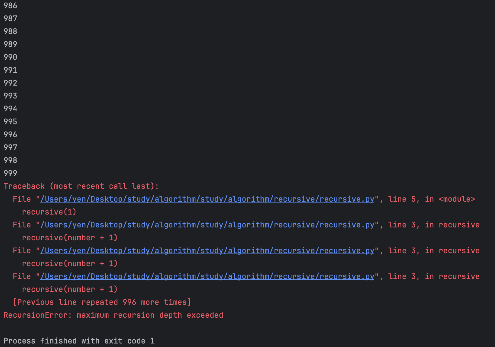
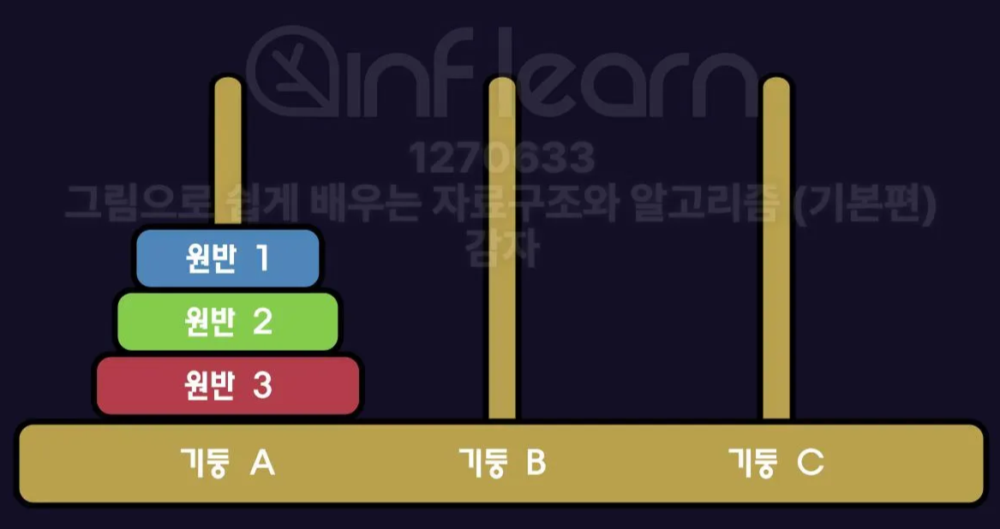

# 재귀(recusion)
재귀의 정의는 **어떠한 것을 정의할 때 자기 자신을 참조하는 것**이다.<br>
이때, 재귀적으로 정의된 함수를 **재귀함수**라고 한다.


```python
def recursive(number):
    print(number)
    recursive(number + 1)

recursive(1)
```

위 코드를 실행해보면 프로그램이 자동으로 종료된다.
콜스택이 계속 쌓여서 메모리가 부족해졌기 떄문이다.



위와 같은 에러를 해결하기 위해서,<br>
재귀함수는 **탈출 조건(기저 조건)** 이 반드시 있어야 한다.

```python
def recursive(number):
    if number <= 10:
        print(number)
        recursive(number + 1)

# 또는

def recursive(number):
    if number > 10:
        return
    print(number)
    recursive(number + 1)

recursive(1)
```

재귀함수는
(1) `단순한 반복 실행`과
(2) `하향식 계산`의 패턴을 갖는다.
하향식 계산이란, 하위 문제의 결과를 기반으로 현재 문제를 계산하는 것이다. (큰 문제를 작은 문제로 쪼개서 해결하는 것)

---

## 콜스택
**콜스택(Call Stack)** 은 `함수 호출과 관련된 실행 정보(스택 프레임)`가 저장되는 스택 구조의 메모리 영역이다.<br>
함수가 호출되면 새로운 스택 프레임이 생성되어 콜스택에 추가되며, 함수가 종료되면 해당 스택 프레임이 콜스택에서 제거된다.

**스택 프레임(Stack Frame)** 에는 함수의 매개변수, 호출이 끝난 뒤 돌아갈 반환 주소, 함수 내 지역 변수 등 함수 실행에 필요한 정보가 포함된다.

하지만 앞서 본 코드처럼 탈출조건이 없거나 잘못된 재귀함수는 
`스택 오버플로우(stack overflow)`가 발생할 수 있다. 

재귀 함수는 호출할 때마다 콜스택이 쌓이기 때문에 반복문보다 더 많은 메모리 공간을 차지한다.
그럼에도 불구하고 재귀를 사용하는 이유는 반복문으로는 해결하기 복잡한 문제를 쉽게 해결할 수 있기 때문이다.

---

## 재귀함수의 예
### 팩토리얼
```python
def factorial(number):
    if number < 0:
        raise ValueError("0 또는 자연수만 입력 가능합니다.")
    if number == 0:
        return 1
    if number < 3:
        return number
    return number * factorial(number - 1)
```

### 배열의 모든 원소의 합 구하기
하향식 계산으로 접근해보자. 
현재 문제 = [1, 2, 3, 4, 5] 의 합 구하기
		= 하위 문제 ([1, 2, 3, 4]의 합 구하기) + 5

```python
def sum_of_array(arr):
    if len(arr) == 1:
        return arr[0]
    return sum_of_array(arr[0:len(arr) - 1]) + arr[-1]

print(sum_of_array(list(range(1, 6))))
```

### 문자열의 길이 계산
```python
def get_length(str):
    if str == "":
        return 0
    return get_length(str[:-1]) + 1

print(get_length("Hello World!"))
```

### 지수 함수
```python
def power(a, n):
    if n == 0:
        return 1
    if n < 0:
        return power(a, n + 1) / a
    return power(a, n - 1) * a

print(power(2, 5))
print(power(5, - 2))
print(power(-5, 3))
```

---

### 하노이 탑
1883년, 프랑스 수학자 에두아르드 뤼카가 발표한 게임으로,<br>
`세 개의 기둥`과 `서로 다른 크기의 원반`이 주어졌을 때,<br>
한 기둥에 크기 순으로 꽂혀있는 원판들을 그 순서 그대로 다른 기둥으로 옮겨서 다시 쌓는 문제이다.

게임 규칙
```text
1. 한 번에 하나의 원반을 움직일 수 있다. 
2. 가장 위에 있는 원반만 옮길 수 있다.
3. 아래에 작은 원반이 올 수 없다. 
```

<br>



하향식 방법으로 하노이 탑 문제에 접근해보면, <br>
현재 문제 = `[원반 1, 2, 3]을 A ➡️ C`<br>
&emsp;&emsp;&emsp;&emsp;= `[원반 1, 2] A ➡️ B` + `[원반 3] A ➡️ C` + `[원반 1, 2] B ➡️ C` <br>
&emsp;&emsp;&emsp;&emsp;= `[원반 1] A ➡️ C` + `[원반 2] A ➡️ B `+ `[원반 1] C ➡️ B`<br>
&emsp;&emsp;&emsp;&emsp;= ...


```python
def hanoi(number, from_, to_, via_):

- number = 원반 개수
- from_ = 시작 기둥
- to_ = 목표 기둥
- via_ = 임시 기둥
```

#### 코드
```python
def hanoi(number, from_, to_, via_):
    if number == 0:
        return 0
    count = 0
    count += hanoi(number - 1, from_, via_, to_)
    print("원반 %d : %s ➡ %s" % (number, from_, to_))
    count += 1
    count += hanoi(number - 1, via_, to_, from_)
    return count

print("총 이동 횟수 : %d" % hanoi(7, 'A', 'C', 'B'))
```

<br>

> [그림으로 쉽게 배우는 자료구조와 알고리즘 (기본편)](https://www.inflearn.com/courses/lecture?courseId=328971&type=LECTURE&unitId=115670&subtitleLanguage=ko&tab=curriculum) Section3 Unit1 시청 후 정리

> 추가 참고 
> [스택 프레임](https://www.tcpschool.com/c/c_memory_stackframe)