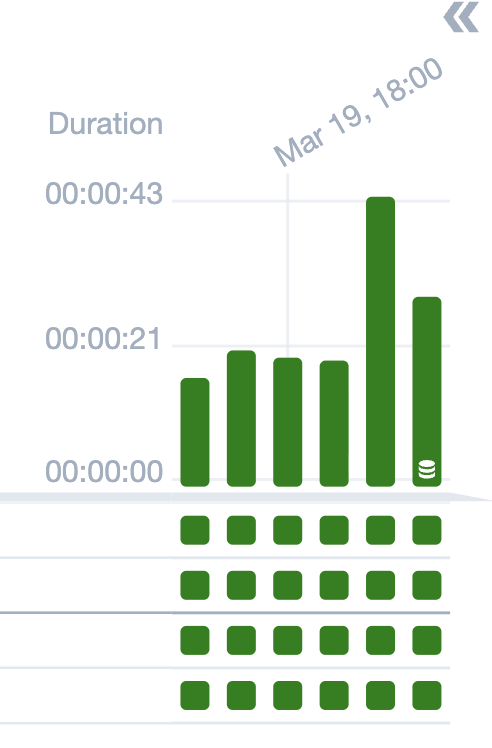
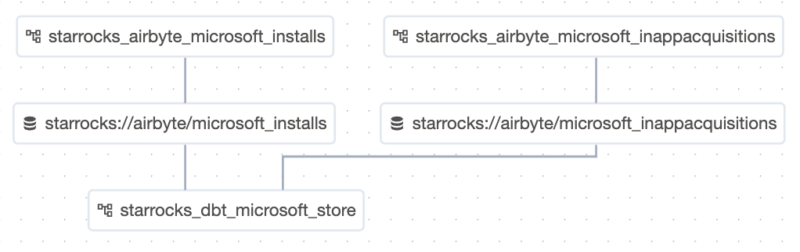

# Dataset
Airflow 2.4부터 도입된 개념으로,
데이터 파일이나 테이블 등 “데이터 그 자체”를 DAG 간 연결의 중심으로 삼는 방법이다. 즉, "데이터가 갱신되면 다른 DAG를 실행시킨다." 컨셉을 갖는 event-driven 기반의 스케쥴링이다.

## Producer & Consumer
### 생산자(Producer)
- 데이터 파일이나 테이블을 생성 또는 업데이트하는 DAG이다.
- 작업이 성공하면, 특정 데이터 셋이 업데이트되었다는 신호를 airflow에 보낸다.
### 소비자(Consumer)
- 특정 데이터셋이 업데이트될 때까지 기다리다가 신호가 오면 즉시 실행된다.

## 데이터셋 정의
Dataset 클래스와 URI 형식의 문자열로 데이터셋을 정의한다.
```python
from airflow.datasets import Dataset

# 데이터셋 정의 (식별자 역할을 하는 URI)
example_dataset = Dataset("s3://my-bucket/processed_data.csv")
```

## 구현
### producer 설정
태스크가 성공적으로 완료되면 데이터셋이 업데이트되었음을 알리기 위해 `outlets` 파라미터를 사용한다.
```python
with DAG(dag_id="producer_dag", ...):
    @task(outlets=[example_dataset])  # 태스크 성공 시 데이터셋 업데이트 알림
    def update_data():
        print("S3에 데이터를 저장 중...")

    update_data()
```


### consumer 설정
`schedule` 파라미터에 시간(Cron) 대신 위에서 정의한 데이터셋 객체를 넣는다. 
```python
with DAG(
    dag_id="consumer_dag",
    schedule=[example_dataset],  # 데이터셋이 업데이트되면 실행
    ...
):
    @task
    def process_new_data():
        print("새 데이터가 준비되어 처리를 시작합니다.")

    process_new_data()
```

#### 논리연산자
- 여러 데이터셋의 업데이트도 대기할 수 있음
- AND (``&``) : 지정된 모든 데이터셋가 업데이트된 후에만 DAG가 실행
- OR (``|``) : 지정된 데이터셋 중 하나라도 업데이트되면 DAG가 트리거
    ```python
    dag1_dataset = Dataset("s3://dag1/output_1.txt")
    dag2_dataset = Dataset("s3://dag2/output_1.txt")

    with DAG(
        # Consume dataset 1 and 2 with dataset expressions
        schedule=(dag1_dataset & dag2_dataset),
        ...,
    ):
        ...

    with DAG(
        # Consume dataset 1 or 2 with dataset expressions
        schedule=(dag1_dataset | dag2_dataset),
        ...,
    ):
        ...
```


## ExternalTaskSensor 보다 좋은 이유?
1. 리소스 효율성: 
    이전 작업이 완료될때까지 대기하며 폴링할 때 워커를 점유하는 센서 방식과 달리, 대기 중에 리소스를 전혀 사용하지 않는다.
2. 낮은 결합도: 소비자 DAG는 데이터셋이 준비 여부만 확인하면 되므로, 생산자 DAG가 누구인지 몰라도 된다.
3. 직관적인 관리: 시간이 아닌 "데이터의 흐름"으로 파이프라인을 설계하므로 실질적인 데이터 비즈니스 로직과 일치한다.


## 실무 운영
ELT 파이프라인 구축 중, airbyte EL dag 성공 시 dbt transformation 작업이 자동으로 실행되도록 하고 싶었다. 기존의 el dag에 dbt를 실행하는 task를 추가해볼까 했는데 2개 이상의 stream으로부터 최종 mart 데이터를 만드는 매체들이 있어서 airflow에서 지원하는 event driven 기능을 사용해보기로 했다. sensor에 대해서만 알고 있었는데, 2.4버전부터 나온 Dataset 기능이 더 리소스 측면에서 효율적이라는 사실을 알고 Dataset을 도입해보았다. 

우리 회사는 매체 단위로 dag를 분리하고 그 안에서 account 단위로 task를 분리한다. 따라서 airbyte el dag에서 모든 account의 raw data 적재가 완료되면 Dataset 시그널을 생성한다.

```python
sr_dataset = Dataset(f"starrocks://airbyte/{pid}_{stream_name}")

@task(task_id="signal_dataset", outlets=[sr_dataset])
def signal_dataset():
    print(f">>> All accounts for {pid}_{stream_name} loaded. Signaling dataset.")

signal = signal_dataset()
for group in account_groups:
    if group:
        group >> signal
```

dataset 목록은 airflow variables로 관리한다. 모든 dataset이 생성되고 transformation 작업이 실행되어야하므로 Dataset 객체 리스트를 그대로 schedule에 넣어주었다. 기본값이 & 연산자라고 한다.

```python
dataset_list = []
depends_on = dbt_conf.get('depends_on')
if not depends_on:
    logger.warning(f"Skipping dbt_conf for category '{category}' because 'depends_on' is missing or empty.")
    continue

for table_name in depends_on:
    dataset_list.append(Dataset(f"starrocks://airbyte/{table_name}"))

dag_params = dbt_conf.get('dag_params', {
    "start_date": "2026-03-01",
    "catchup": False
})
if 'schedule_interval' in dag_params:
    del dag_params['schedule_interval']
dag_params['schedule'] = dataset_list
```

이렇게 dag를 수정하고나니 el dag가 성공하면, tr dag가 manual 처럼 생성되는 것을 확인하였다. 




그리고 Airflow UI의 상단 목록에 있는 Datasets에 들어가보면 계보가 그려져있는 것을 확인할 수 있다!! 신기방기




### 참고
https://airflow.apache.org/docs/apache-airflow/2.9.3/authoring-and-scheduling/datasets.html  
https://wnsgud4553.tistory.com/658  