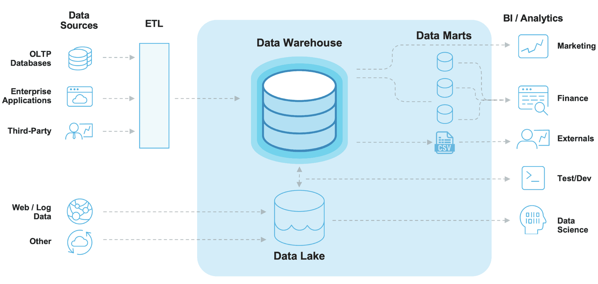

데이터의 활용 목적과 형태에 따라 아래와 같이 데이터 저장소의 종류를 분류할 수 있다.

## 1. Data Warehouse (데이터 웨어하우스)
* **개념:** 데이터 분석을 위해 사전 처리(가공)된 데이터를 저장하는 거대한 중앙 집중형 저장소이다.
* **특징:**
    * 전사적인 관점에서 통합 관리되며, 조직 내 다양한 구성원이 접근 가능하다.
    * 데이터의 주제나 출처(Source)에 제한을 두지 않고 다양한 소스에서 데이터를 수집한다.
    * 대용량 데이터를 다루므로 데이터 저장소의 크기가 매우 크다.
    * **정형 데이터(Structured Data)** 를 주로 저장하며, 이를 위해 명확한 **스키마 정의가 필수적**이다.
    * 빠른 속도로 대용량 데이터를 추출하고 분석해야 하므로, 읽기(조회) 및 **쿼리 성능이 최적화**되어 있다. (주로 분석용인 OLAP 성향)

## 2. Data Mart (데이터 마트)
* **개념:** 데이터 웨어하우스의 하위 집합(Subset)으로, 특정 목적에 맞춰 구축된 소규모 저장소이다.
* **특징:**
    * 사전 처리된 데이터를 저장한다는 점은 데이터 웨어하우스와 동일하다.
    * 전사적 관점이 아닌, **특정 부서나 특정 관심사(주제)** 에 맞는 데이터만 선별하여 모아둔다.
    * 데이터 웨어하우스에 저장된 데이터 중 필요한 부분만 추출하여 구축하므로 비교적 저장소의 크기가 작다.
    * 따라서 전사 인원이 접근하기보다는 특정 부서나 목적을 가진 사용자 위주로 접근한다.
    * 상세한 개별 데이터보다는 분석에 바로 쓰일 수 있는 **요약 정보** 위주로 구성된다.

## 3. Data Lake (데이터 레이크)
* **개념:** 방대한 양의 다양한 데이터를 형태 제한 없이 대규모로 저장해 두는 저장소이다.
* **특징:**
    * 정형 데이터뿐만 아니라 텍스트, 이미지 등 **비정형 데이터**를 모두 저장할 수 있다.
    * 데이터를 미리 가공하지 않고 **원시(Raw) 데이터** 상태 그대로 저장한다.
    * 데이터 형태에 제약이 없으므로 저장 시점에 스키마를 정의할 필요가 없다.
    * 당장 목적이 명확하지 않더라도 향후 머신러닝, AI 모델 학습 등 **어떤 목적으로 쓰일지 모르는 데이터를 일단 모아두는 유연한 공간**이다.

## 4. Database (데이터베이스)
* **개념:** 체계적으로 모아둔 데이터 저장소 그 자체를 의미한다.
* **차이점:**
    * 데이터 웨어하우스나 레이크와 대비하여 말할 때는 주로 서비스 운영을 위한 **운영 데이터베이스(OLTP)** 를 지칭한다.
    * 기업의 일상적인 서비스 운영 과정에서 발생하는 트랜잭션(예: 회원가입, 결제 등)을 빠르고 정확하게 처리하고 저장하는 것이 주 목적이다.
    * 각 서비스의 용도에 맞는 개별 데이터베이스들에 쌓인 데이터들이 결국 Data Warehouse나 Data Lake로 흘러 들어가 분석용 데이터로 재탄생하게 된다.

### 💡 요약
정리하면, Data Warehouse, Data Lake, Data Mart 모두 본질은 데이터를 저장하는 저장소이다. 데이터의 형태(가공 여부), 저장 목적, 주 사용자에 따라 역할을 나누고 이름을 다르게 부르는 것이다.

* **Data Lake:** 가공되지 않은 원시 비정형 데이터
* **Data Warehouse:** 가공된 정형 데이터. 전사 직원을 대상으로 하는 통합 데이터
* **Data Mart:** 특정 주제를 위해 요약/추출된 데이터. 특정 부서나 목적을 대상으로 함

## 5. 실무 적용 사례 (자사 Fastlog 파이프라인 매핑)

우리 회사의 대용량 게임 유저 로그(Fastlog) 처리 파이프라인을 학습한 데이터 저장소 개념에 대입하여 정리해 보면,

**[ 파이프라인 흐름 ]**   
로그 서버 Nginx Access Log → SeaweedFS 전송 → FluentD 파싱(TSV 변환) → Doris 적재(Broker Load) → 대시보드용 중간 테이블 / Materialized View 생성

**[ 데이터 저장소 개념 매핑 ]**

* **Data Lake (SeaweedFS):** 가공되기 전 원시 상태의 비정형/반정형 데이터인 Nginx Access Log를 가공 없이 그대로 적재하고 보관하는 데이터 레이크 역할을 수행한다.
* **ETL (FluentD):** 데이터 레이크(SeaweedFS)에 쌓인 로그를 읽어와, 분석 가능한 형태(TSV 파일)로 파싱하고 정제하는 가공 단계이다.
* **Data Warehouse (Doris):** FluentD를 통해 정형화된 데이터를 Broker Load 방식으로 적재하여, 대용량 분석 쿼리를 수행할 수 있는 데이터 웨어하우스로 사용된다. 
* **Data Mart (중간 테이블 / Materialized View):** Doris에 적재된 방대한 전체 Fastlog를 직접 조회하지 않고, '레벨 평가(Level Evaluation) 대시보드 구축'이라는 특정 목적을 위해 데이터를 요약 및 추출해 둔 형태이다. 즉, 목적에 맞게 분리된 데이터 마트라고 볼 수 있다.

### 참고
https://medium.com/@parklaus1078/data-storages-d2dc0362545e
