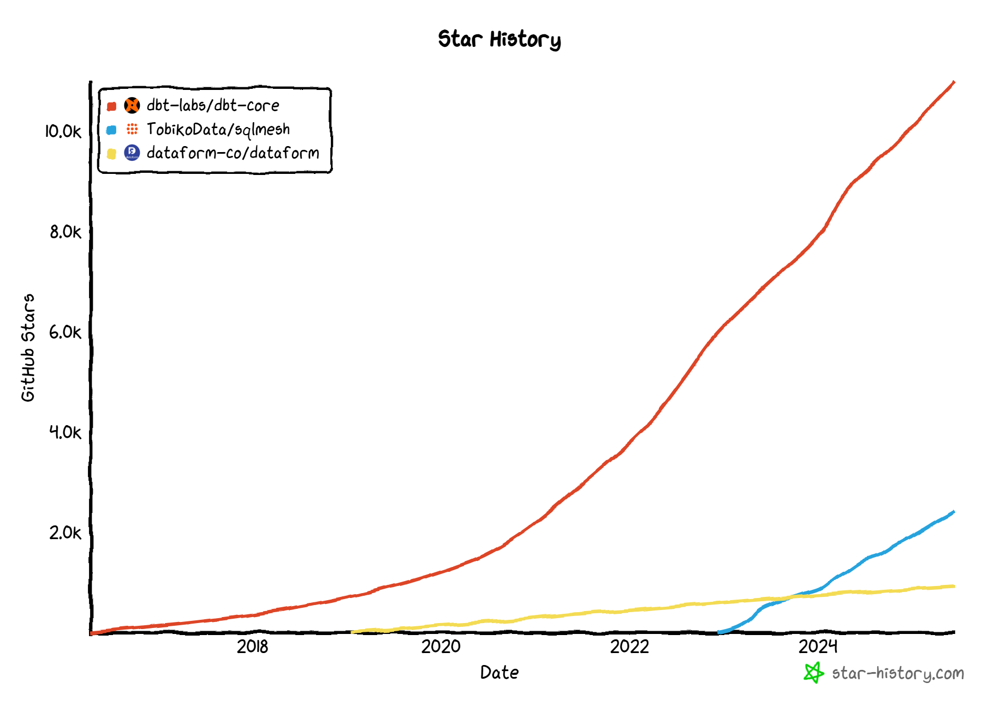

# dbt, 데이터 분석 엔지니어링의 새로운 표준

- dbt의 강력한 기능
- 기존 DW 운영의 고질적인 문제를 어떻게 해결할 수 있는지
- 수동적이고 반복적인 작업들을 자동화하여 크게 해소할 수 있다. 

## Section1. 데이터 분석 엔지니어(DAE)의 핵심 역할과 우리가 매일 겪는 문제들

### 데이터 분석 엔지니어(DAE)의 역할
- 데이터 사용자가 필요한 데이터를 가장 이해하기 쉽고 활용하기 좋은 형태로, 원하는 시점에 정확하게 제공하는 것
- 데이터나 파이프라인 이슈를 빠르게 감지하고, 그 원인을 분석해서 해결하고, 다시 정상 상태로 복구하는 대응을 하는 것

### 데이터 분석 엔지니어의 주요 업무 (=고통?) Top6
1. 데이터 영향도 파악 및 backfill
    - 데이터 리니지
2. 데이터에 집중하지 못하게 하는 부가적인 엔지니어링 업무
3. Workflow Code / SQL 관리의 어려움
4. 복잡하고 직관적이지 않은 데이터 파이프라인(DAG)
5. 데이터 접근성과 메타데이터 관리
6. 데이터 품질 테스트의 높은 장벽

### dbt는 DAE의 일하는 방식을 바꾼다. 
dbt는 보다 더 본질적인 문제 해결에 집중할 수 있게 만들어준다.
- 더 효율적이고 확장 가능한 파이프라인 아키텍처 설계
- 데이터 생애주기(Data Life Cycle)의 체계적 관리
- 비즈니스 요구사항에 맞는 테이블 모델링과 네이밍 컨벤션
- 실제 비즈니스 핵심 성과 지표(Business Metric) 설계와 Semantic Layer 구축

## Section2. 그래서 dbt가 뭔데? 핵심 개념 정복

### dbt?
- Data Build Tool ("T" in ELT / ETL)
- Tool(Python lib) used in building a data warehouse
- "Framework" 
- Independent with Warehouse, orchestration solution
    - adapter (호환성이 매우 좋음)
    - airflow 와 같이 사용하면 편리해지는 것
- 핵심 키워드: Use dbt to build reliable data models **quickly** and **collaboratively**, with super **minimum cost** in **one  place**!
    - 한 곳에서. 빠르고, 협력을 해서, 매우 적은 비용으로. 
    - one place -> 한 곳에서 관리. 앞의 고통 중 3번을 예로
    - version control
    - automated documentation
    - automated data lineage
    - integrated testing
    - ...

자매품: TobikoData/sqlmesh

### dbt 핵심 개념

- SQL + yaml + jinja
    - jinja: python 기반의 템플릿 엔진. HTML, YAML, XML 등을 python 변수 및 로직으로 템플릿화할 떄 사용
- Resources
  - **sources**
    - 원본 데이터를 data lake 또는 data warehouse로 유실없이 가져온 데이터 사본. 외부 운영계에 존재하는 원본 데이터가 아님. 
    - data warehouse에서 접근할 수 있는 모든 테이블을 다 source화 할 수 있음. 따라서 dbt 환경에서 source는 절대적 정의가 아닌, "source로 등록한다" 는 표현이 자주 사용됨
  - **models**
    - source로부터 만들어지는 테이블. 또는 이 만들어진 테이블을 조인하여 만들어진 테이블
  - tests
  - semantic_models
  - metrics
  - ...
- **Profiles**
  - Data Warehouse connection info
  - 환경(prod, dev) 분리
  - 매우 중요. 보안에 신경써서 관리해야 함. 
- Compile + Run 구조
  - 컴파일: yaml + jinja 문법을 포함하여 디비가 읽을 수 있는 SQL이 되는지

<!-- ## Section3. 이것만 알아도 생산성 x5, dbt 핵심 기능 실습
## Section4. 생산성 x5를 넘어 x10으로, dbt 심화 기능 실습
## Section5. Airflow와 함께 화룡점정, dbt 운영 자동화
## Section6. Summary & Wrap-Up -->