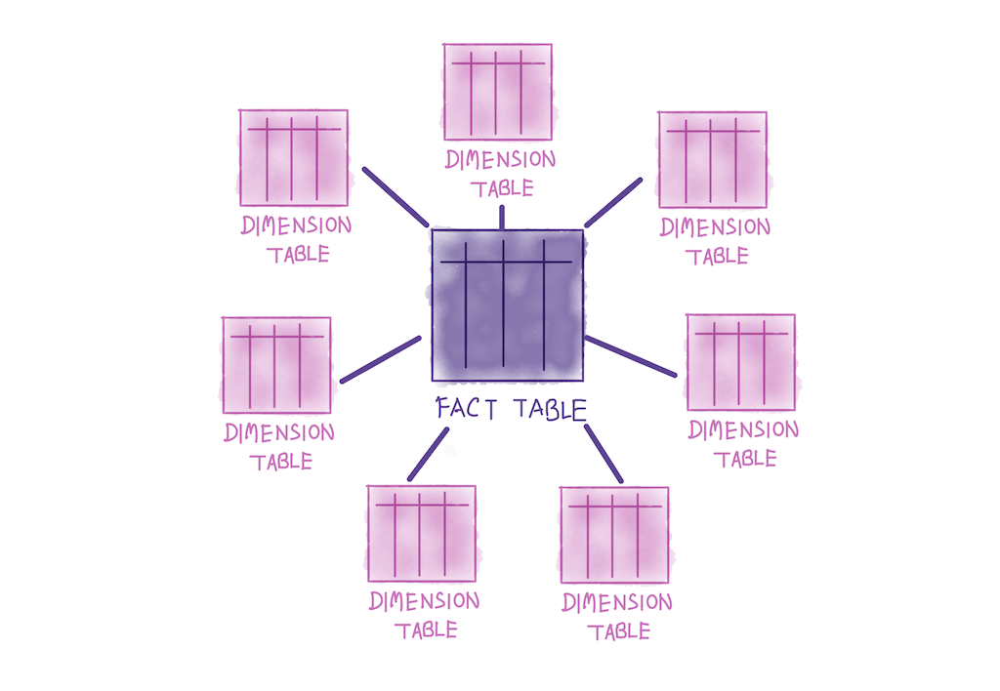
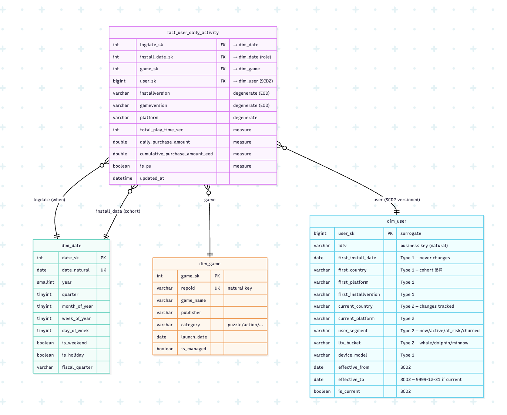

# Kimball Dimensional Modeling

데이터 웨어하우스 레벨의 데이터 모델링 기법

## 도입 배경

기존 레거시 시스템을 데이터 레이크하우스(Gold Layer)로 마이그레이션하면서, 단순히 기존 테이블을 1:1로 매핑하여 대체하는 방식을 고민했다. 하지만 이 방식은 데이터의 재사용성 및 확장성이 떨어지는 한계가 있다.
이를 해결하고 BI 분석의 효율을 극대화하기 위해 **Kimball Dimensional Modeling(킴볼 Dimension 모델링)** 을 PoC 중이다.

## 전제 조건

* **성공적인 모델링의 전제:** 비즈니스 요구사항과 소스 데이터에 대한 명확한 파악이 필수적이다.
* **협업의 중요성:** 모델링 자체는 데이터 엔지니어가 주도하지만, 데이터 거버넌스 담당자 및 해당 비즈니스 분야 전문가(Domain Expert)와의 긴밀한 협업을 통해 설계되어야 한다.

 

---

 

## 개념

### Star Schema

Dimensional Modeling을 관계형 데이터베이스(RDBMS)에 물리적으로 구현한 형태를 말한다.

* 중앙에 거대한 Fact 테이블이 있고, 그 주변을 여러 개의 Dimension 테이블이 둘러싸고 있는 형태
* 복잡한 조인을 거쳐야하는 정규화된 스키마와 다르게, Fact 테이블 중심의 단순한 1 depth 조인만 발생하므로 분석 쿼리 성능이 빠르고 BI 툴과 연동이 직관적이다.

### 핵심 구성 요소

#### Dimension

* 비즈니스 이벤트의 **Who, What, Where, When, Why, How (육하원칙)** 을 나타낸다.
* Fact 데이터를 필터링하고 그룹화(Grouping)하는 데 사용되는 설명적 속성(텍스트)들이 포함되어 있다.
* **단일행 매핑 규칙:** BI 분석 시, 특정 Fact 행은 가능한 단일 Dimension 행과 1:1로 연결되어야 한다.

#### Fact

* 비즈니스 프로세스 이벤트에서 도출된 **측정값**을 의미하며, 거의 항상 **수치형(Numeric)** 데이터다.
* Fact 테이블의 단일 행은, Fact 테이블의 '그레인(Grain)'에 의해 정의된 특정 이벤트와 1:1로 대응해야 한다.

### Design Process

**1) Business Process (비즈니스 프로세스 정의)**

* 대부분의 Fact 테이블은 단일 비즈니스 프로세스의 결과에 중점을 둔다.

**2) Grain (그레인 정의)**

* Fact 테이블의 단일 행이 정확히 무엇을 나타내는지를 규정한다.
* **중요 규칙:** 모든 Dimension이나 Fact는 반드시 그레인과 일관성을 유지해야 한다.
* **Atomic Grain (원자적 그레인):** 특정 비즈니스 프로세스가 데이터를 수집할 수 있는 가장 낮은(상세한) 수준. 서로 다른 그레인을 동일한 Fact 테이블에 혼합해서는 안 된다.

**3) Dimensions (Dimension 정의)**

* Business Process와 Grain에 대한 육하원칙 정보(맥락)를 식별하고 Dimension 테이블로 구성한다.

**4) Fact (Fact 정의)**

* Business Process의 결과로 발생하는 측정값(수치)들을 식별하여 Fact 테이블에 포함시킨다.

### 이점: 재사용성과 확장성

킴볼 모델링이 강력한 이유는 비즈니스 변화에 맞춰 **기존 쿼리나 대시보드를 망가뜨리지 않고 유연하게 확장**할 수 있기 때문이다.

* **Fact (측정값) 추가:** 기존 Grain과 일치한다면, 기존 Fact 테이블에 새 컬럼을 언제든 추가할 수 있다.
* **Dimension (Dimension) 연결 추가:** 새로운 분석 기준이 생기면, Fact 테이블의 Grain을 건드리지 않고 FK만 추가하여 확장할 수 있다.
* **Dimension 속성 추가:** 기존 Dimension에 새로운 그룹화 기준을 쉽게 추가할 수 있다.
* **Grain의 세분화:** 기존 분석 환경의 컬럼명을 유지하면서 밑단의 Fact 테이블을 더 상세한 Grain으로 교체하여, 무중단으로 상세 드릴다운(Drill-down) 분석 환경을 제공할 수 있다.

 

---

 

## 실무 적용

### Bus Matrix

|  | **A. User Daily Activity** | **B. User Hourly Activity** | **C. User Level Progression** | **D. User Stage Play Daily** |
| --- | --- | --- | --- | --- |
| **Description** | 유저가 게임에서 특정 날짜에 한 모든 활동 | 유저가 게임에서 특정 날짜·시간에 한 모든 활동 | 유저가 게임의 특정 레벨에 도달한 사실 | 유저 × 스테이지 × 일별 플레이 사실 |
| **Business Process** | 오늘 몇 명 설치/활동? D7 잔존? PU/Non-PU 분포? | 시간대별 설치/활동 트래픽 분포? | 분기 코호트가 레벨 N에서 몇 % 이탈? | 스테이지별 난이도/이탈/수익성 지표는? |
| **Grain key** | (logdate, repoid, idfv) | (logdate, hour, repoid, idfv) | (repoid, idfv, global_level) | (logdate, repoid, idfv, stage) |
| **Dimension (inline)** | install_date, installversion, gameversion, platform, country | install_date, installversion, gameversion, platform, country | stage, mode, package, level_no, level_label, install_date, installversion | mode, package, level_no, level_label, global_level, detail_version, installversion, install_date |
| **Fact (measures)** | total_play_time_sec, daily_purchase_amount, cumulative_purchase_amount_eod, is_pu | is_install_hour | cumulative_purchase_amount_at_first_reach, is_pu_at_first_reach, first_reached_at | **활동**: play/clear/fail/cancel/retry_session_cnt · **결과**: tight_win/near_miss/far_miss/continue/out_of_moves_cnt · **시간**: sum_(play/clear/fail)_time_sec · **품질**: sum_(win/lose)_narrowness, sum_used_moves · **수익**: paid_item_cnt, is_pu_at_play |

### Dimension 테이블 미분리 이유

정통 킴볼 모델에서는 Fact 테이블과 별개의 Dimension 테이블(예: `dim_user`, `dim_level`)을 만들고 서로 조인(Join)하도록 가이드한다.

하지만 이번 게임 로그 기반 Gold 마트 설계에서는 별도의 Dimension 테이블 없이 **Fact 테이블 안에 Dimension 컬럼(platform, country, install_date 등)을 직접 박아 넣는 넓은 테이블(OBT, One Big Table) 구조**를 채택했다. 그 이유는 다음과 같다.

1. 방대한 유저 수로 인한 조인(Join) 비용 제거 (성능 최적화)  
게임 데이터 특성상 유저 Dimension은 수천만~수억 건의 행을 가지게 된다. 거대한 Fact 테이블과 거대한 User Dimension 테이블을 매번 조인하는 것은 분석 쿼리 성능(BI 로딩 속도)을 심각하게 저하시킨다. Dimension 속성을 Fact 테이블에 미리 역정규화(Denormalization)해두면 조인 없이 풀 스캔 한 번으로 빠르게 집계할 수 있다.

1. 퇴화 Dimension (Degenerate Dimension)의 적극 활용  
킴볼 모델링에서도 `idfv`, `repoid`, `stage` 같은 식별자나 고유 번호들은 굳이 Dimension 테이블로 빼지 않고 Fact 테이블에 그대로 남겨두는 **'퇴화 Dimension(Degenerate Dimension)'** 기법을 공식적으로 인정한다. 이 값들은 그 자체로 분석의 기준(Dimension) 역할을 훌륭히 수행한다. [공식 문서](https://www.kimballgroup.com/data-warehouse-business-intelligence-resources/kimball-techniques/dimensional-modeling-techniques/degenerate-dimension/)

1. Incremental 빌드와 모던 OLAP DB의 특성 반영 
colume 기반 데이터베이스는 수십~수백개의 컬럼을 가진 넓은 테이블을 스캔하고 압축하는 데 최적화되어있다. 또한 incremental 전략으로 빌드되는 dbt 파이프라인 구조에서는 Dimension과 Fact가 하나의 테이블에 모여 있는 것이 데이터 정합성 관리와 개발 복잡도 측면에서 훨씬 유리하다.

### Fact가 Gold Layer인 이유

메달리온 아키텍처 내에서 silver / gold 는 데이터의 가공 단계로 구분된다.

* **silver**: raw data 를 정제한 결과물. SSoT(단일 진실 공급원, Single Source of Truth).
  * 원천 이벤트의 원자 단위를 유지하면서 dedup, 스키마 표준화, 보강 / 부가 컬럼 추가 까지만 수행
* **gold**: 특정 비즈니스의 분석 목적을 가지고 설계된 데이터.
  * silver 를 재료로 grain 재정의 · 집계 · 코호트 매핑 등 분석 컨텍스트를 입혀 BI / 분석가가 바로 소비할 수 있는 형태로 가공

silver 와 gold 를 구분하는 본질적 기준은 **"데이터 자체의 신뢰성"** 과 **"데이터 소비자의 분석 목적"** 중 무엇을 중점적으로 설계되었는가 라고 생각.
이 기준에서 보면 Dimensional Modeling 으로 만든 fact / dimension 테이블은 명백히 gold 에 속한다.

* **Fact 테이블**: "이 비즈니스 프로세스의 결과를 어떤 grain 으로 측정할 것인가" 라는 분석 의도가 처음부터 반영된 설계물
* **Dimension 테이블**: 측정값은 없지만 "fact 를 어떤 축으로 필터링·그룹화할 것인가" 를 기준으로 설계된 분석 컨텍스트 제공 테이블

또한 fact 는 atomic grain 만 잘 정의되어 있으면 **mart view 없이 BI 의 직접 source 로도 활용 가능**

<!-- TODO
### 이점 예시

1. Fact (측정값) 추가 — 기존 Grain 유지하면서 새 measure 컬럼만 추가
2. Dimension 연결 추가 — Grain 그대로, 새 분석 축만 확장
3. Dimension 속성 추가 — 그룹화 기준만 추가
4. Grain 세분화 — 일별 → 시간별 drill-down -->
