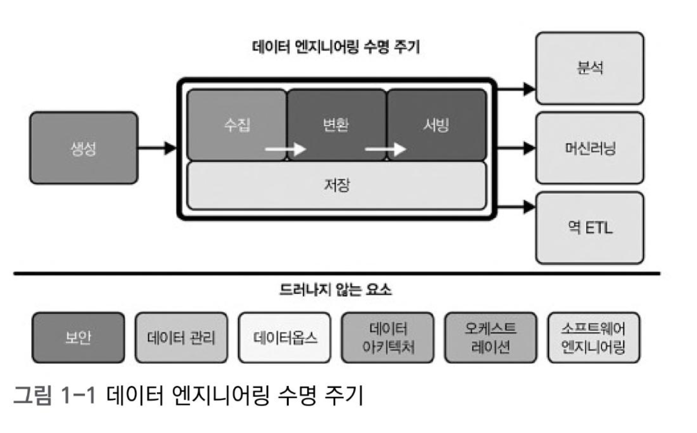
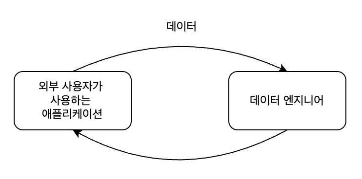
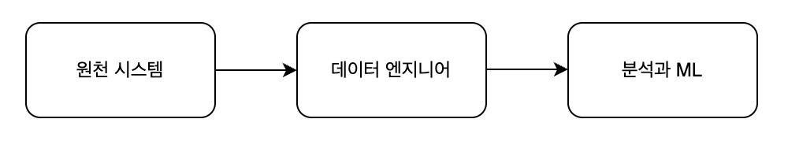

# Chapter1. 데이터 엔지니어링 상세

## 1.1 데이터 엔지니어링이란?

> 🔖 곧 만 1년이 되는 서버개발자이자 데이터 엔지니어인 내가 생각하는 데이터 엔지니어링이란,  
> 사내 구성원들에게 유의미한 인사이트를 제공해줄 수 있는 데이터를 제공하기 위하여 데이터 인프라를 구축하고 데이터를 관리하기 위하여 ETL 파이프라인을 구현하는 일이다.
>
> gemini 왈:
> 최근의 데이터 엔지니어링은 소프트웨어 엔지니어링을 강력한 기반으로 삼고 있다. 과거에는 데이터를 추출하고 적재하는 툴의 사용법을 아는 게 중요했다면, 지금은 인프라를 코드로 관리(IaC)하고 CI/CD를 구축하며 버전 과리를 하는 등 서버 개발의 프랙티스가 데이터 영역에 그대로 적용되고 있다. 

이 첵에서 말하는 정의는,  

**데이터 엔지니어링**은 원시 데이터(raw data)를 가져와 분석 및 머신러닝과 같은 다운스트림 사용 사례를 지원하는, 고품질의 일관된 정보를 생성하는 시스템과 프로세스의 개발, 구현 및 유지 관리이다. 데이터 엔지니어링은 보안, 데이터 관리, 데이터 운영, 데이터 아키텍처, 오케스트레이션, 소프트웨어 엔지니어링의 교차점이다.

**데이터 엔지니어**는 원천 시스템에서 데이터를 가져오는 것부터 시작해 분석 또는 머신러닝과 같은 사용 사례에 데이터를 제공하는 것으로 끝나는 데이터 엔지니어링 수명 주기를 관리한다.

### 데이터 엔지니어링 수명주기

### 데이너 엔지니어의 진화
1. 1980년부터 2000년까지: 데이터 웨어하우징에서 웹으로  
   - 1970년, 데이터 웨어하우징에 뿌리를 두어 데이터 엔지니어가 탄생
   - 1980년, 비즈니스 데이터 웨어하우스 용어 등장
   - 1989년, **데이터 웨어하우스** 용어 공식적으로 만들어짐
   - 데이터 웨어하우징은 시장에 출시되는 대량의 데이터를 처리하고 전례 없는 막대한 양의 데이터를 지원하고자, 다수의 프로세서를 사용하느 새롱룬 대규모 병렬 처리 (MPP) 데이터베이스로 확장성 있는 분석의 첫 시대를 열었다. 
2. 2000년대 초: 현대 데이터 엔지니어링의 탄생
   - 1990년대 후반, 웹 서비스들이 성장하면서 데이터의 규모는 어마어마해졌고, 전통적인 모놀리식 관계형 데이터베이스와 데이터 웨어하우스에 부담이 가면서 시스템이 불안정해짐. 따라서 비용 효율적이고, 확장성과 가용성이 있으며, 안정적인 접근 방식이 필요해짐. 전통적인 모놀리식 서비스를 분산하고 분리하기 시작함. 즉, **빅데이터** 시대가 시작됨
   - 2003년, 구글은 구글 파일 시스템(Google File System)에 관한 논문 발표
   - 2004년, 초확장 데이터 처리 패러다임인 맵리듀스에 대한 논문 발표
   - 2006년, 위 두 구글 논문의 영감을 받아 아파치 하둡이 개발되었고 오픈 소스화
   - 비슷한 시기 **퍼블릭 클라우드 서비스**의 등장: 아마존은 많은 양의 데이터 요구에 대응하기 위하여 EC2, S3, 다니아모DB를 비롯한 데이터 빌딩 블록을 구축함. 아마존 웹 서비스(AWS, Amazon Web Services) 등장. + 구글 클라우드(Google Cloud), 마이크로소프트 애저(Microsoft Azure), 디지털 오션(DigitalOcean). 
1. 2000년대와 2010년대: 빅데이터 엔지니어링
	- 하둡 생태계의 오픈 소스 빅데이터 도구 빠르게 성장
	- 배치 컴퓨팅에서 이벤트 스트리밍으로 전환되면서 실시간 빅데이터의 시대가 열림
	- 하지만, 무분별한 빅데이터 엔지니어링이 이루어짐. 예를 들어, 몇 기가바이트를 처리하는 데 하둡 클러스터를 사용한다거나, 작은 데이터 문제에도 빅데이터 도구를 사용
	- 2010년대 후반, 단순화(simplification) 등장: 스노우플레이크나 빅쿼리 같은 클라우드 데이터 웨어하우스가 복잡한 인프라 관리를 대신해줌. 과거 하둡은 분산 처리 인프라 자체를 띄우고 유지보수하는 데 엔지니어의 리소스가 80% 이상 사용되면서, 비즈니스 문제 < 빅데이터 인프라 기술에 더 집중하는 문제가 있었음. 
	- 따라서 많은 회사들이 데이터의 크기가 아닌 문제 해결에 집중하게 됨. 빅데이터 용어의 사용이 의미가 없어짐
2. 2020년대: 데이터 수명 주기를 위한 데이터 엔지니어링
	- 클라우드 데이터웨어하우스의 사용이 업계 표준이 됨
	- 인프라 관리에 대한 부담이 줄어들면서, 데이터 수명 주기에 집중하게 됨.

## 1.2 데이터 엔지니어링 기술과 활동
**데이터 성숙도(data maturity)**: 조직 전체에 걸쳐 더 높은 데이터 활용률(utilization), 기능(capability), 통합(integration)을 향해 나아가는 과정

데이터 성숙도 모델에는 여러 종류가 있지만, 이 책에서 만든 단순화된 데이터 성숙도 모델을 정리해보면,  

**1단계: 데이터로 시작하기**
* 제대로 된 인프라나 아키텍처가 없는 '생존형' 수작업 단계
* 예: 개발자가 운영 DB에 직접 `SELECT` 쿼리를 날려 CSV 파일로 다운받아 수동 전달

**2단계: 데이터로 확장하기**
* **견고한 데이터 아키텍처 구축:** 운영 DB 부하 방지를 위해 분석용 데이터 웨어하우스(DW) 도입
* **데브옵스 및 데이터옵스 관행 채택:** 데이터 코드 테스트 및 배포 시스템 구축
  * 예: GitHub 형상 관리 및 CI/CD(GitHub Actions 등) 파이프라인 구축
* **ML을 지원하는 시스템 구축:** AI 모델 학습이나 분석을 위해 데이터를 정제하여 저장
* **선택과 집중 (SaaS 활용):** 차별화되지 않은 인프라 업무는 기성품(SaaS)에 맡기고, 기업 핵심 로직 개발에 집중

**3단계: 데이터로 선도하기**
* **셀프서비스 분석 환경 제공:** 개발자 개입 없이 사내 직원이 직접 데이터를 조회하고 분석
  * 예: 마케터가 BI 툴(superset, metabase 등)로 직접 대시보드 생성
* **사용자 정의 시스템 구축 (경쟁 우위):** 기성품으로 해결 안 되는 대규모/특수 요구사항을 위한 자체 시스템 직접 개발
* **데이터 거버넌스와 품질 관리에 집중:** 데이터 신뢰성 확보 및 보안 규칙 적용
  * 예: 민감 정보 자동 마스킹, 데이터 누락 시 슬랙 알람 구축
* **데이터 카탈로그 및 계보 도구 배포:** 데이터의 위치와 흐름을 쉽게 파악하도록 전파
  * 예: 사내 검색창에서 특정 데이터를 검색하면 출처(테이블)와 담당자를 한눈에 확인
* **협업 및 커뮤니티 환경 구축:** 직책 상관없이 데이터를 기반으로 소통하는 사내 문화 및 스터디 형성

<!-- > Q) 지금 우리 회사는 어디일까?
> 2단계에서 3단계로 넘어가려는 단계인 것 같다. 
> 최근 openmetadata를 도입하여 데이터 간 계보를 보여주려고 하고 있고, 우리는 데이터를 쌓아주기만 하고, 이 데이터의 관리 소재를 정하려고함. 우리 팀은 사내 조직원들이 데이터를 잘 사용할 수 있게끔 지원해주는 것. 
> 하지만 현재 상태가 완전한 2단계라고도 할 수 없는게 중복된 데이터가 너무 많고, 데이터가 여기저기 산재되어있음.  -->

 

### Q. 데이터 엔지니어는 어떤 언어를 알아야 할까?  
**1차 범주(주요 언어)**
- SQL
- 파이썬(python)  
	: 많은	데이터 엔지니어링 도구가 파이썬으로 작성되거나 파이썬 API를 가짐
- 자바 가상 머신(JVM, Java Virtual Machine). 자바 또는 스칼라  
	: 스파크, 하이브, 드루이드(Druid)와 같은 아파치 오픈 소스 프로젝트에 널리 쓰임. 파이썬 API보다 저수준 접근 가능
- 배시(bash)

**2차 범주(보조 언어)**
- R, 자바 스크립트, 고, 러스트 C/C++, C#, 줄리아 등
- 사내에서 널리 쓰이는 인기 있는 언어이거나 도메인 고유의 데이터 도구와 함께 사용될 때 이런 언어가 필요한 경우 있음

 

### 데이터 엔지니어 유형
**A형 데이터 엔지니어**
- abstraction. 추상화
- 데이터 아키텍처를 가능한 한 추상적이고 단순하게 유지
- 시판되는 기성 제품(SaaS), 관리형 서비스와 도구들을 사용해 데이터 엔지니어링 수명 주기를 관리
- 즉, 단순화와 클라우드 서비스를 활용하는 엔지니어. 비즈니스 가치를 빠르게 뽑아내는 데 집중

**B형 데이터 엔지니어**
- build. 구축
- 기업의 핵심 역량과 경쟁 우위를 확장하고 활용할 데이터 도구와 시스템을 구축
- 데이터 성숙도 범위에서 데이터를 확장하고 선도하는 2-3단계에 해당
- 즉, 데이터 파이프라인 프레임워크나 분산 처리 도구를 직접 개발함.   
넷플릭스, 우버, 에어비엔비 같은 데이터 엔지니어들이 여기에 속함. 

 

> 📌 왜 넷플릭스, 우버, 에어비앤비가 B형 엔지니어의 대표적 예시일까?
> * **한계 돌파:** 회사가 급격히 성장하면서, 기존의 상용 도구(기성품)로는 그 어마어마한 트래픽과 데이터 규모를 도저히 감당할 수 없었음.
> * **직접 구축 (Build):** 남들이 만든 툴을 조립해서 쓰는 것(A형)을 넘어, 자사만의 특수한 문제를 해결하기 위해 세상에 없던 **새로운 프레임워크를 밑바닥부터 직접 개발함.**
> * **오픈소스 생태계 기여:** 이렇게 직접 만든 혁신적인 도구들을 비영리 단체인 **'아파치(Apache) 재단'에 기증(오픈소스화)** 하여, 오늘날 전 세계 데이터 엔지니어링의 표준 기술을 만들어냄.
>     * **에어비앤비:** 복잡한 파이프라인 작업을 스케줄링하기 위해 $\rightarrow$ **아파치 에어플로우(Apache Airflow)** 개발
>     * **넷플릭스:** 수억 개의 파일(PB급)에서 원하는 데이터를 순식간에 찾기 위해 $\rightarrow$ **아파치 아이스버그(Apache Iceberg)** 개발
>    * **우버:** 거대한 데이터 저장소에서 실시간으로 데이터를 수정/삭제하기 위해 $\rightarrow$ **아파치 후디(Apache Hudi)** 개발

## 1.3 조직 내 데이터 엔지니어

**외부 대면(external-facing)**  
- 소비자가 실제 게임 유저. 
- 소셜 미디어 앱, 사물 인터넷(IoT) 장치, 전자 상거래 플랫폼과 같은 외부용 애플리케이션의 사용자와 연계함.  
- 외부 대면 쿼리 엔진은 내부 대면 시스템보다 큰 동시성 부하를 처리하는 경우가 많음.     
  -> 사용자가 호출하는 쿼리에 제한을 두어 인프라에 미치는 영향을 제어해야 함. 

  

**내부 대면(internal-facing)**   
- 소비자가 우리 회사 직원.
- 비즈니스 및 내부 이해관계자의 요구 사항에 중요한 활동에 집중.   
- ex) BI 대시보드, 보고서, 비즈니스 프로세스, 데이터 과학, ML 모델용 데이터 파이프라인 및 데이터 웨어하우스의 생성 및 유지보수

  

 

**업스트림 이해관계자**
- 데이터 아키텍트
  - 조직 내 데이터 관리를 위한 청사진 설계
  - 전체적인 기술 스택과 구조, 보안 규칙을 설계
- 소프트웨어 엔지니어
  - 내부 데이터 생성 업무에 책임을 가짐
  - 게임 회사의 경우, 게임 유저 로그를 제공해주는 게임 클라이언트 개발자. 
- 데브옵스 엔지니어 / 사이트 신뢰성 엔지니어

**다운스트림 이해관계자**
- 데이터 과학자: '미래를 예측하느냐'
- 데이터 분석가: '과거/현재를 보느냐'
- 머신러닝 엔지니어 / 인공지능 연구원

