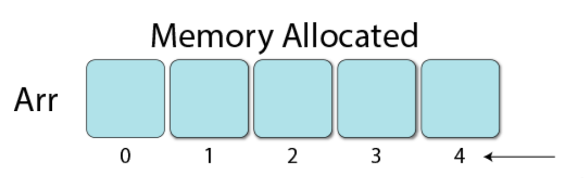

## 배열(Array)

- 동일한 데이터 타입을 가진 요소들의 모임으로,
메모리에서 **연속된** 공간에 위치한다.
- 운영체제는 배열의 시작 주소만 기억한다.
- 데이터의 위치와 상관없이 값의 참조에 대해서 동일한 시간복잡도를 갖는다.  즉, 데이터의 참조에 대해서 $O(1)$
- 하지만 데이터의 삽입 및 삭제 성능은 좋지 않다. 
	그 예로 초기에 지정한 크기보다 더 많은 데이터를 삽입하려고 할 때, 더 큰 공간의 연속된 메모리를 찾아서 기존 데이터를 모두 복사해야 한다. 
	따라서 데이터의 삽입 및 삭제는 $O(n)$
- 배열 선언 시 크기 지정이 필수이기 때문에 크기 예측이 어려운 경우 메모리 낭비가 발생할 수 있다. 

 

> 💡 배열의 단점을 해결하기 위한 고민 
> 저장하려는 데이터를 메모리 공간에 분산하여 할당하고, 이 데이터들을 서로 연결해주자!

## 연결 리스트(Linked List)

- 핵심 : 첫 노드의 주소만 알고 있으면 다른 모든 노드에 접근할 수 있다.
  - 노드 = 데이터 + 다음 노드(의 주소)
- 데이터 추가 시, 빈 메모리 공간 아무 곳에 데이터를 생성하고 연결만 해주면 되기 때문에 초기 크기를 몰라도 된다.
 따라서 데이터의 삽입 및 삭제의 성능이 좋다. $O(1)$
- 데이터가 연속된 메모리에 있지 않기 때문에, 데이터 참조 시 $O(n)$의 성능을 가짐

## 정리하면
|  | 배열 | 연결 리스트 |
| --- | --- | --- |
| 크기 | 고정(정적) | 동적 |
| 주소 | 연속 | 불연속 |
| 데이터 참조 | $O(1)$ | $O(n)$ |
| 데이터 삽입/삭제 | $O(n)$ | $O(1)$ |

 

---

### 추상 자료형(Abstract Data Type)
어떠한 데이터와 그 데이터에 대한 연산을 표기하는 것

#### 연결리스트의 추상자료형
1. 모든 데이터 출력 `printAll()`
2. 모든 데이터 제거 `clear()`
3. 원하는 인덱스에 데이터 삽입 `insertAt(index, data)`
4. 마지막 위치에 데이터 삽입 `insertLast(data)`
5. 원하는 인덱스에 위치한 데이터 제거 `deleteAt(index)`
6. 마지막 위치의 데이터 제거 `deleteLast()`
7. 원하는 인덱스에 위치한 데이터 읽기 `getNodeAt(index)`

#### [Linked List 구현 코드 🔗](https://github.com/yeeuniii/study-algorithm/tree/main/study/data-structure/linked-list)

> [그림으로 쉽게 배우는 자료구조와 알고리즘 (기본편)](https://www.inflearn.com/courses/lecture?courseId=328971&type=LECTURE&unitId=115670&subtitleLanguage=ko&tab=curriculum) Section2 Unit1-3 시청 후 정리