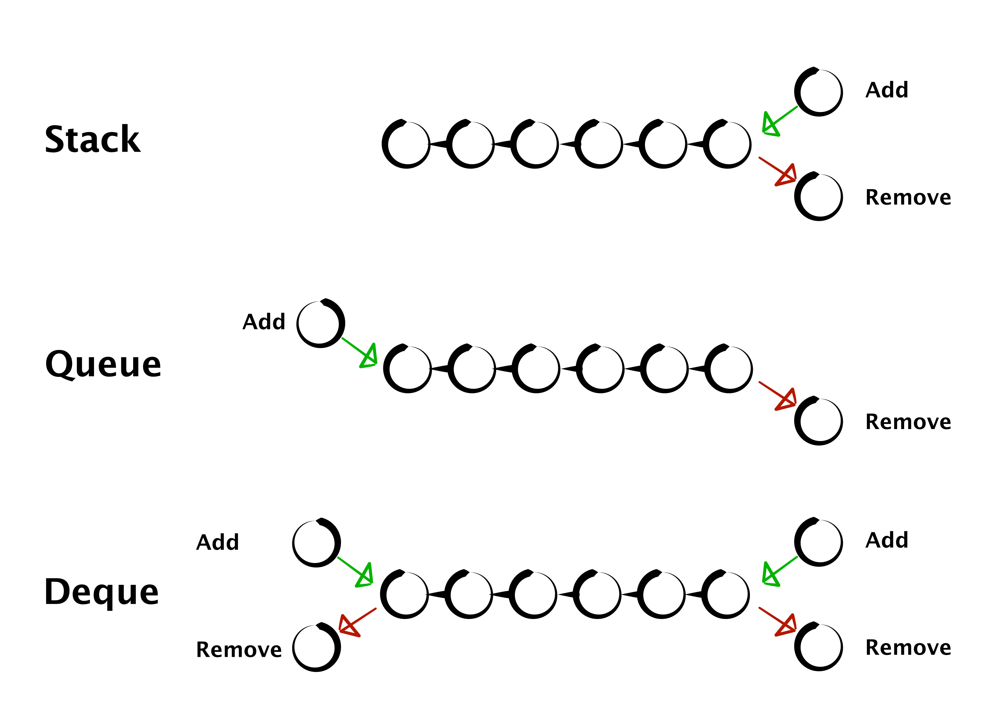

## 스택(Stack)
후입선출(`LIFO`, Last In First Out)

### 활용사례
- 실행취소(Undo, Ctrl + z)
- 함수 콜 스택 : 함수 호출 시 스택에 쌓이고, 종료 시 제거된다.
- 웹 브라우저 방문 기록(뒤로 가기 버튼)
- 구문 분석(파싱) : 컴파일러에서 수식 평가 및 구문 분석
- 메모리 관리 : 프로그램 실행 시 지역 변수와 함수 호출 정보 저장

### 알고리즘에서의 활용
- 짝 맞히기 : 괄호, 태그 etc
- 역순으로 처리 : 마지막에 들어온 요소를 먼저 처리해야하는 경우
- 경로 기록과 되돌아가기 : 미로 문제에서 경로를 저장하는 경우
- 재귀 함수를 반복문으로 변환 : 호출 스택을 직접 관리해야 하는 경우
- DFS 기반 탐색


### 추상 자료형

```text
- push : 데이터 삽입
- pop : 데이터 제거
- peek : 데이터 참조 (top)
- isEmpty : 비었는지 확인
```

### 구현 [🔗](https://github.com/yeeuniii/study-algorithm/blob/main/study/data-structure/stack/stack2.py)
LinkedList를 활용하여 구현하였다. 배열을 사용해서도 구현 가능하다.


## 큐(Queue)
선입선출(FIFO, First In First Out)

### 활용사례
- 일반적인 줄서기(마트 계산대, 맛집, 놀이공원 etc)
- 운영체제의 FIFO 스케줄링
- 메시지 큐 : 마이크로서비스 아키텍처에서 서비스 간 통신
- 이벤트 루프 : 자바스크립트의 비동기 이벤트 처리(콜백 큐)
- 버퍼링 : 데이터 스트리밍, 네트워크 패킷 처리

### 알고리즘에서의 활용
- 순서대로 처리해야하는 경우
- 레벨 단위 처리 : 트리나 그래프에서
- 대기열 시뮬레이션
- 버퍼 관리
- BFS 기반 탐색

### 추상 자료형
```text
- enqueue : 데이터 삽입
- dequeue : 데이터 제거
- front : 데이터 참조
- isEmpty : 비었는지 확인
```


### 구현 [🔗](https://github.com/yeeuniii/study-algorithm/blob/main/study/data-structure/queue/queue2.py)
tail을 알고 있어야 하기 때문에, 이중 연결 리스트를 활용한다.
#### 이중 연결리스트 구현 [🔗](https://github.com/yeeuniii/study-algorithm/blob/main/study/data-structure/linkedlist/doubly_linked_list.py)


## 덱(Deuque)
앞과 뒤, 양방향에서 데이터를 처리할 수 있는 자료형

### 추상 자료형

```text
- printAll : 모든 데이터 출력
- addFirst : head에 데이터 삽입
- removeFirst : head에 데이터 제거
- addLast : tail에 데이터 삽입
- removeLast : tail에 데이터 제거
- isEmpty : 리스트 비었는지 확인
```

이중 연결 리스트(DoublyLinkedList) 구현 시, 
마지막 위치에 데이터 삽입(`insertLast`) 및 삭제(`deleteLast`) 시
반복문을 돌지 않고 if문을 사용했기 때문에 $O(1)$의 시간복잡도를 갖는다.<br>
따라서 덱의 데이터 삽입 및 삭제의 시간복잡도는 $O(1)$이다.

또한, 덱을 이용하여 스택과 큐를 구현할 수 있다.
- 스택
  - `addFirst` + `removeFirst`
  - `addLast` + `removeLast`
- 큐
  - `addFirst` + `removeLast`
  - `addLast` + `removeFirst`

### 구현 [🔗](https://github.com/yeeuniii/study-algorithm/blob/main/study/data-structure/deque/deque.py)

---

> 이전에 정리한 스택/큐 포스팅
[[Week1] 스택(Stack)](https://velog.io/@anna8627/Week1-%EC%8A%A4%ED%83%9D%EA%B3%BC-%ED%81%90)
[[Week1] 큐(Queue)](https://velog.io/@anna8627/Week1-%ED%81%90Queue-l58qoqce)


> [그림으로 쉽게 배우는 자료구조와 알고리즘 (기본편)](https://www.inflearn.com/courses/lecture?courseId=328971&type=LECTURE&unitId=115670&subtitleLanguage=ko&tab=curriculum) Section2 Unit4-8 시청 후 정리

> 추가 참고
[@ttneck.labs 게시물](https://www.instagram.com/p/DG5Du9_Sp4v/?utm_source=ig_web_copy_link&igsh=MzRlODBiNWFlZA==)
