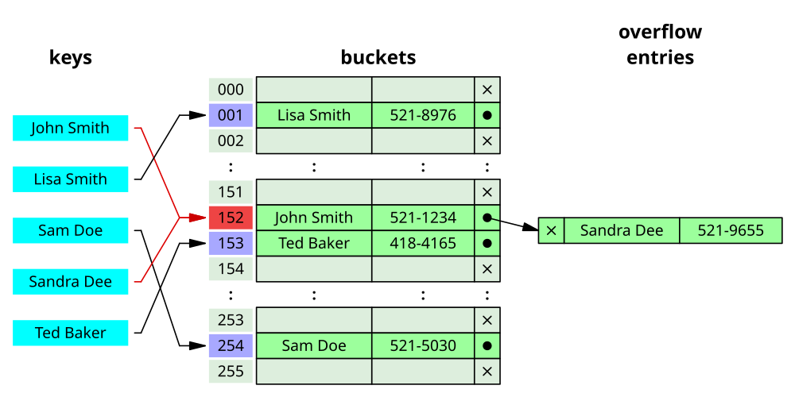

## 해시테이블(HashTable)
키(key)를 값(value)에 매핑하여 데이터를 저장하는 자료구조<br>
해시 함수를 사용하여 키를 해시 값으로 변환하고, 해시 값을 통해 데이터를 저장하거나 검색한다.


---

가장 간단한 해시테이블 구현 방법은, 
key를 index로 갖는 배열을 만드는 것이다.

오늘의 키움히어로즈 선발 선수들 등번호로 예를 들어보자.<br>


| 등번호 | 이름 | ➡️  | 인덱스 | 데이터 |
| --- | --- | --- | --- | --- |
| 13 | 정현우 |  | 0 |  |
| 66 | 푸이그 |  | 1 | 김태진 |
| 4 | 카디네스 |  | 2 | 이주형 |
| 2 | 이주형 |  | 3 |  |
| 24 | 송성문 |  | 4 | 카디네스 |
| 53 | 최주환 |  | 5 |  |
| 38 | 김동엽 |  | 6 |  |
| 97 | 전태현 |  | 7 |  |
| 12 | 김건희 |  | 8 |  |
| 1 | 김태진 |  | … |  |

등번호(key)를 인덱스로 갖는 배열로 나타낸 결과이다.

가장 큰 등번호인 97까지 필요하므로 데이터의 크기가 98인 배열을 만들어야한다. 하지만 스타팅 선수는 10명밖에 없기때문에 꽤나 많은 공간이 낭비된다.

따라서 이를 해결하기 위해 선수들의 등번호에 어떠한 계산을 거쳐 한 자릿수로 만들어 0~9의 인덱스에 저장하도록 하는 방법을 고안했다. 이때 어떠한 계산을 하는 함수를 `해시 함수`라고 한다.

정리하면,<br>
**해싱(hashing)** 이란 임의의 길이의 값을 해시 함수를 사용하여 고정된 크기의 값으로 변환하는 작업이고,<br>
**해시 함수(hash function)** 이란 주어진 key를 고유한 숫자 값인 hash code로 변환해준다.

### 해시 충돌 

그런데 다른 key의 해시 함수의 결과가 똑같다면 어떻게 될까?
위 예시에서도 정현우랑 최주환의 등번호의 첫째자리수는 3으로 동일하다.
이러한 경우처럼, 해시 함수가 서로 다른 키에 대해 같은 반환값을 가지면서, 해시 테이블의 같은 위치에 두 개 이상의 값이 저장되려는 현상을 **해시 충돌(Collision)** 이라고 한다.

그렇다면 해시 충돌은 어떻게 해결할 수 있을까?
1. 해시 테이블의 구조 개선
2. 해시 함수 개선

특히나 해시 함수에 따라서 해시 테이블의 성능은 천차만별이기에, 
해시 테이블에 있어서 좋은 해시 함수의 구현은 필수적이다.

해시 테이블의 구조를 개선하는 두 가지 방법에 대해 알아보자.


#### Chaining



`Chaining 기법`은 해시 테이블 저장공간 이외의 공간을 활용하는 기법이다.
즉, 충돌 발생 시 해당 인덱스가 가리키는 해시 테이블 공간 뒤로 `연결 리스트`를 사용하여 추가적으로 연결시켜 저장한다.

#### Open Addressing
해시 테이블에 해시 함수의 결과의 위치에 이미 값이 있는 경우, 다른 주소를 사용하는 기법이다.
Open Addressing의 경우 기존의 해시 테이블의 저장공간 내에서 충돌 문제를 해결한다.

<br>

1. Linear Probing(선형 탐사)<br>
충돌 발생 시, 해당 해시 값의 다음 값부터 순회를 시작하여 처음으로 나오는 해시 테이블의 빈 공간에 저장하는 기법이다.

1. Quadratic Probing(제곱 탐사)
2. Double Hashing(이중 해싱)

---

### 해시 테이블의 성능
해시 테이블은 데이터의 저장과 검색 속도가 빠르다는 장점이 있다.<br>
Collision이 없는 경우, 데이터의 검색, 저장, 수정, 삭제의 시간 복잡도는 $O(1)$이다.<br> 
또한 특정 key에 대한 value가 존재하는지, 중복 확인도 쉽게 할 수 있다.

그러나 메모리를 많이 차지한다는 점과, 충돌이 방지하기 위해 별도의 자료구조를 요구하거나, 좋은 해시함수를 필수로 구현해야한다는 단점도 존재한다.

따라서 해시 테이블의 주요 용도는 다음과 같다.
- 데이터의 저장, 삭제, 검색이 자주 사용되는 경우
- 중복 확인이 많이 필요한 경우

---

### 해시 테이블 추상 자료형
```text
- set : 데이터 삽입
- get : 데이터 읽기
- remove : 데이터 제거
```

### 구현 [🔗](https://github.com/yeeuniii/study-algorithm/blob/main/study/data-structure/hashtable/hash_table.py)

<br>

> [그림으로 쉽게 배우는 자료구조와 알고리즘 (기본편)](https://www.inflearn.com/courses/lecture?courseId=328971&type=LECTURE&unitId=115670&subtitleLanguage=ko&tab=curriculum) Section2 Unit9-10 시청 후 정리
> 

> 추가 참고<br>
> [[자료구조] 해시 테이블(Hash Table)이란?](https://gbdai.tistory.com/16)<br>
> [[DS] 해쉬 테이블(Hash Table)이란?](https://baeharam.netlify.app/posts/data%20structure/hash-table)