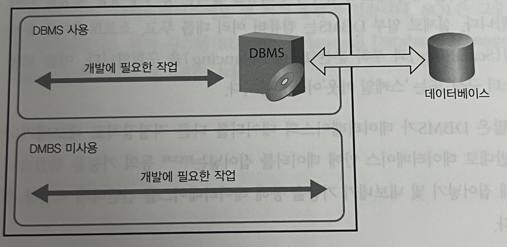
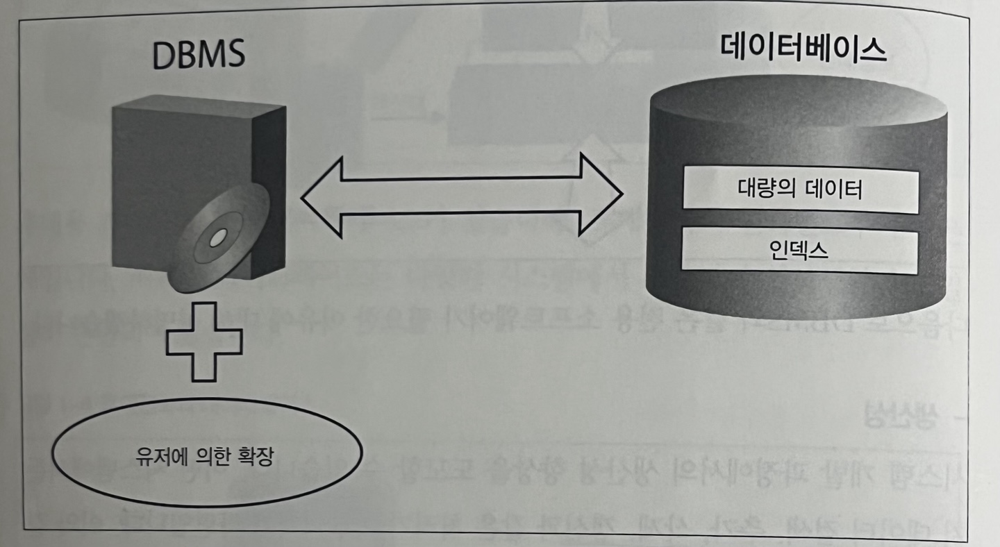
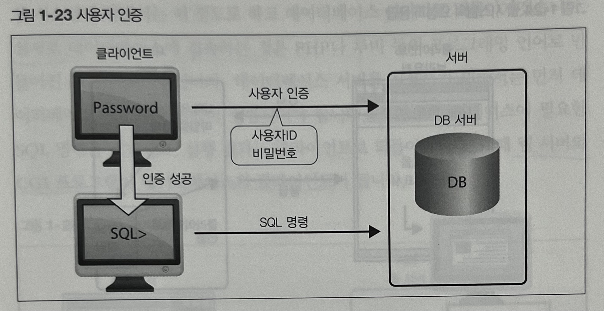
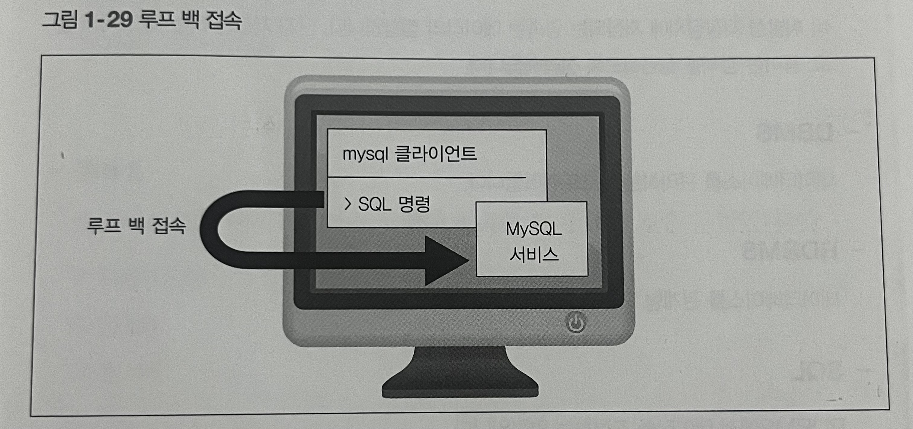
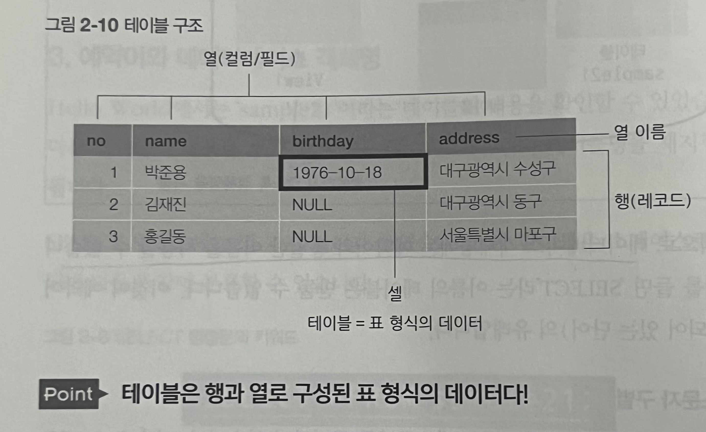
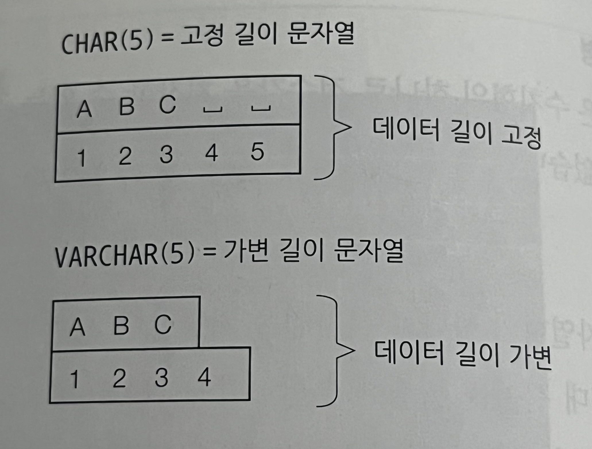
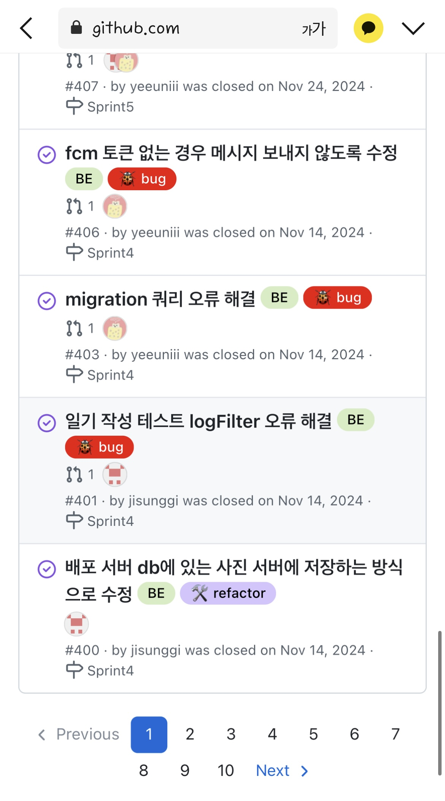

# SQL 첫걸음
## [1장 - 데이터베이스와 SQL]
### 1강. 데이터베이스
특정 데이터를 확인하고 싶을 때 간단하게 찾아낼 수 있도록 정리된 형태로, 하드디스크나 플래시메모리(SSD) 등 비휘발성 저장장치에 저장된다.

#### 데이터베이스 관리 시스템(DBMS; Database Management System)
데이터베이스를 효율적으로 관리하는 시스템

**> 왜 필요한가?**
1. **생산성**<br>
가장 기본적인 데이터 처리나 CRUD를 DBMS가 제공한다. 
<br>


1. **기능성**<br>
복수의 사용자의 요청에 대응하거나, 대용량의 데이터를 저장하고 고속으로 검색하는 기능을 제공한다. 또한 데이터베이스 관리 기능을 유저가 확장할 수도 있어 유연한 개발이 가능하다. 이와 같은 데이터베이스를 다루는 여러 가지 기능을 DBMS가 제공한다.<br>
   

1. **신뢰성**<br>
대규모 데이터베이스의 경우, 여러 대의 하드웨어를 구성하여 신뢰성을 높이고 성능을 향상시킬 수 있다.
   
   > 일부 DBMS는 컴퓨터를 여러 대 두고, 소프트웨어를 통해 확장성(Scalability)과 부하 분산(Load Balancing)을 구현한다. 이를 보통 ‘클러스터 구성’ 또는 ‘스케일 아웃’이라 부른다.
   
   또한 `export`, `import` 를 통한 간단한 백업이 가능핟.

#### SQL
- RDBMS의 데이터를 관리하기 위한 언어
- IBM이 개발한 SEQUEL(관계형 데이터베이스 조작용 언어)를 기반으로 만들어짐
- 종류
  DML(데이터 조작) + DDL(데이터 정의) + DCL(데이터베이스 제어)

---

### 2강. 다양한 데이터베이스
#### 관계형 데이터베이스 (RDB; Relational Database)

#### 데이터베이스 종류 
오래된 순서로. 
1. 계층형 데이터베이스
   - 계층 구조로 데이터를 저장하는 방식
   - EX) 하드디스크, DVD 파일시스템
2. 관계형 데이터베이스
   - 행과 열을 가지는 표 형식 데이터를 저장하는 형태의 데이터베이스
3. 객체지향 데이터베이스
   - 가능하면 객체 그대로를 데이터베이스의 데이터로 저장하는 방식
4. XML 데이터베이스
   - XML 형식으로 기록된 데이터를 저장하는 데이터베이스
5. Key-Value Store(KVS)
   - 키(key)와 그에 대응하는 값(value) 형태의 데이터를 저장하는 데이터베이스
   - From NoSQL(Not only SQL)
   - also called by 열 지향 데이터베이스

#### RDBMS 종류
1. Oracle
   - 오라클에서 개발한 RDBMS
   - RDBMS의 표준이라고 해도 무방
2. DB2
   - IBM
   - 한동안 IBM 컴퓨터에서만 구동됨 ➡️ 시장 점유율 확대 어려움의 이유
3. SQL Server
   - 마이크로소프트
   - 윈도우 플랫폼에서만 동작
4. PostgreSQL
   - 오픈소스 커뮤니티
5. MySQL
   - 오픈소스 커뮤니티
6. SQLite
   - 오픈소스 커뮤니티
   - 임베디드 시스템에 자주 사용됨. 
   - 매우 작음. 경량화

---

### 3강. 데이터베이스 서버
#### RDBMS의 클라이언트/서버
RDBMS는사용자 별로 데이터베이스 접근을 제한할 수 있기 때문에, 사용자 인증이 필요하다. 일반적으로 사용자 ID와 비밀번호로 인증한다.



<br>

#### 루프 백 접속
클라이언트에서 서버에 접속 시, 네트워크를 경유해서 PC의 서버로 되돌아오는 형태이다. PC 한 대로 클라이언트와 서버 모두 실행할 수 있지만 네트워크 기능이 필요하다.
  


---

## [2장 - 테이블에서 데이터 검색]



### 검색
  ```SQL
  SELECT * FROM 테이블명;
  ```

> 예약어와 데이터베이스 객체명은 대소문자를 구별하지 않는다.

---

#### 테이블 구조 참조하기
  - MySQL
    ```
    DESC 테이블명;
    ```
  - postgreSQL
    ```
    \d 테이블명;
    ```

---

#### 자료형
1. INTEGER 형<br>
   : 정수값을 저장할 수 있는 자료형.
2. CHAR 형<br>
   : 문자열을 저장할 수 있는 자료형.<br>
   언제나 고정된 길이로 데이터가 저장. 즉, 고정 길이 문자열
   따라서 최대 길이보다 작은 문자열 저장 시, 공백 문자로 나머지를 채운 후 저장하게 됨.
3. VARCHAR 형<br>
   : 문자열을 저장할 수 있는 자료형.<br>
   데이터 크기에 맞춰 저장공간의 크기 변경됨. 가변 길이 문자열
4. DATE 형<br>
   : 날짜값을 저장할 수 있는 자료형
5. TIME 형<br>
   : 시간을 저장할 수 있는 자료형



---

### 검색 조건 지정하기
  ```SQL
  SELECT * FROM 테이블명 WHERE 조건식;
  ```
  - 열 선택은 SELECT 구
  - 행 선택은 WHERE 구

---

### 패턴 매칭에 의한 검색
#### 패턴 매칭 / 부분 검색
특정 문자나 문자열이 포함되어 있는지를 검색하는 것으로, `LIKE` 술어를 사용하여 문자열의 일부분을 비교할 수 있다.

```sql
열명 LIKE 패턴
```

- 수치형 상수를 지정할 수 없다.
- 와일드카드(메타문자)를 사용할 수 있다.
  - `%` : 임의의 문자열. 빈 문자열도 포함.
  - `_` : 임의의 문자 하나
- 이스케이프 <br>
메타 문자에 `%`나 `_`를 포함하고 싶을 때 `\%` 또는 `\_`로 검색
- 문자열 상수 `'`는 2개를 연속으로 기술한다. 즉, `''`

---
## [3장 - 정렬과 연산]
### 정렬
```sql
SELECT 열명 FROM 테이블명 WHERE 조건식 ORDER BY 열명 [ASC(default) | DESC]
```
`ORDER BY` 구를 통해 검색 결과의 행 순서를 바꿀 수 있다.<br>
기본 정렬방법은 오름차순(`ASC`)이며, 열명 뒤에 `DESC` 기입 시 내림차순 정렬된다. <br>
`ORDER BY` 구를 따로 지정하지 않으면 일반적으로 데이터베이스 내부에 저장된 순서대로 출력되지만, 이마저도 일정하지 않다. 즉, `ORDER BY` 구 생략 시, 데이터 출력 순서는 데이터베이스 서버의 당시 상황에 따라 결정된다.
<br>

`ORDER BY`는 테이블에 영향을 주지 않는다. 즉, 서버에 클라이언트로 행 순서를 바꾸어 결과를 반환하는 것뿐, 저장장치에 저장된 데이터의 행 순서를 변경하는 것은 아니다.

#### 사전식 순서에서 주의할 점
수치형과 문자열형은 대소관계 계산 방법이 서로 다르다.<br>
수치형은 수치의 대소관계로, 문자열형은 사전식 순서로 비교한다.

**예시**
```text
mysql> DESC order_sample;
+----------+-------------+------+-----+---------+-------+
| Field    | Type        | Null | Key | Default | Extra |
+----------+-------------+------+-----+---------+-------+
| int_col  | int         | YES  |     | NULL    |       |
| char_col | varchar(10) | YES  |     | NULL    |       |
+----------+-------------+------+-----+---------+-------+

mysql> SELECT * FROM order_sample;
+---------+----------+
| int_col | char_col |
+---------+----------+
|       1 | 1        |
|      10 | 10       |
|      11 | 11       |
|       2 | 2        |
+---------+----------+
```

`int_col`은 수치형(INTEGER), `char_col`은 문자열형(VARCHAR)인 테이블이 있다.

`int_col` 열을 기준으로 정렬하면, 
```
mysql> SELECT * FROM order_sample ORDER BY int_col;
+---------+----------+
| int_col | char_col |
+---------+----------+
|       1 | 1        |
|       2 | 2        |
|      10 | 10       |
|      11 | 11       |
+---------+----------+
```

`char_col` 열을 기준으로 정렬하면,
```
mysql> SELECT * FROM order_sample ORDER BY char_col;
+---------+----------+
| int_col | char_col |
+---------+----------+
|       1 | 1        |
|      10 | 10       |
|      11 | 11       |
|       2 | 2        |
+---------+----------+
```

#### 복수의 열을 지정해서 정렬하기
```sql
SELECT 열명 FROM 테이블명 WHERE 조건식
ORDER BY 열명1 [ASC|DESC], 열명2 [ASC|DESC] ...
```


`NULL`은 데이터베이스 제품에 따라서 기준이 다르다. 특성상 대소비교를 할 수 없기에, ‘특정 값보다 큰 값‘ 또는 ’특정 값보다 작은 값‘ 두 가지로 나뉜다. 즉, `ORDER BY`로 지정한 열에서 `NULL` 값을 가지는 행은 가장 먼저 표시되거나 가장 나중에 표시된다. 예를 들어, MySQL의 경우는 `NULL` 값을 가장 작은 값으로 취급하고, PostgreSQL은 가장 큰 값으로 취급한다.

---

### 결과 행 제한하기
```sql
SELECT 열명 FROM 테이블명 LIMIT 행수 [OFFSET 시작행]
```

`LIMIT` 구를 사용해 표시할 행 수를 제한할 수 있다. `SELECT` 명령의 마지막에 지정해서 사용한다.

`WHERE` 을 사용해서 `LIMIT`과 동일한 결과를 얻을 수 있다. 다만 두 절은 기능과 내부처리 순서가 전혀 다르다.

이때 주의해야할 점은 `LIMIT` 구는 표준 SQL이 아니다. MySQL과 PostgreSQL에서만 사용 가능하다. 
SQL Server은 `TOP`을, Oracle은 `ROWNUM`이라는 열을 사용해 행을 제한할 수 있다.
- LIMIT
  ```sql
  SELECT * FROM sample LIMIT 3;
  ```
- TOP
  ```sql
  SELECT TOP 3 * FROM sample;
  ```
- ROWNUM
  ```sql
  SELECT * FROM sample WHERE ROWNUM <= 3;
  ```

<br>

#### 오프셋 지정

웹 시스템에서는 클라이언트의 브라우저를 통해 페이지 단위로 화면에 표시할 내용을 처리한다. 대량의 데이터를 하나의 페이지에 표시하는 것은 기능적으로도 속도 측면에서도 효율적이지 못하므로 일반적으로 페이지 나누기(pagination) 기능을 사용한다.



몇번째 행부터 `LIMIT` 행 수만큼 출력할 것인지를 나타낼 때, `OFFSET`으로 몇번째 행부터를 나타낸다. `OFFSET`은 생략 가능하며 기본값은 0이다.
