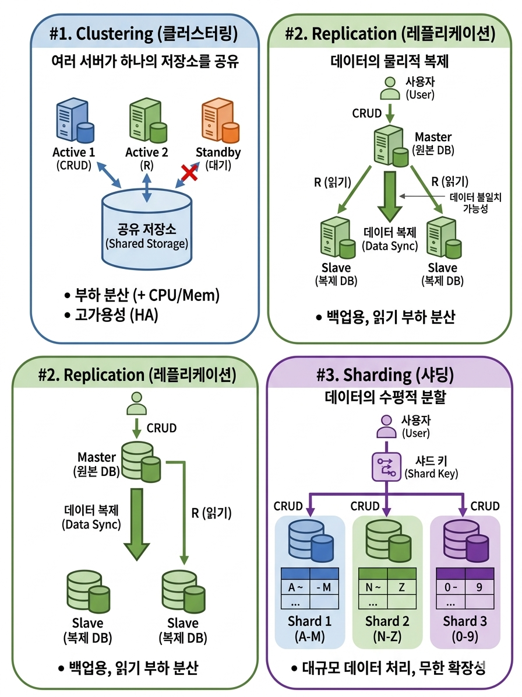

# 💾 데이터베이스 튜닝 방법: Clustering, Replication, Sharding

**분산 시스템 / 환경**을 구현하는 방법들로, 데이터베이스를 여러 개로 만드는 기술들이다. 

 

## 1. Clustering (클러스터링)

여러 개의 데이터베이스 서버를 하나의 논리적 단위로 묶어 동작하게 만드는 기술로, 하나의 저장소(Storage)를 여러 대의 데이터베이스 서버가 공유한다.

### 장점
* **부하 분산:** CPU, Memory 자원을 여러 서버가 나누어 처리함.
* **고가용성 확보:** 특정 서버에 장애가 발생해도 서비스 중단 없이 운영 가능.

### 단점
* **병목 현상 가능성:** 여러 서버가 하나의 저장소에 의존하므로 저장소에서 병목이 생길 수 있음.
* **비용 증가:** 서버 대수가 늘어남에 따라 비용이 상승함.

### 운영 방식
1. **Active-Active:** 모든 서버가 가동 상태. 장애 발생 시 즉각 대응 가능하며 성능과 가용성이 높음.
2. **Active-Standby:** 하나는 운영, 하나는 대기 상태. 대기 서버의 유지 비용이 발생함.

---

## 2. Replication (레플리케이션) 

데이터 저장소를 물리적으로 복제하여 관리하는 기술. 

### Master / Slave 구조

* **Master (Source):** 원본 데이터 소유 및 데이터 변경(C, U, D)을 담당하며 동기화를 주도함.
* **Slave (Replica):** Master로부터 데이터를 전달받아 동기화하며 주로 **읽기(Read)** 작업을 담당함.

-  **단순 백업:** Master의 데이터를 Slave에 실시간으로 복사하여 보관.
-  **부하 분산:** 
   * `Master` ➔ Create, Update, Delete (쓰기 작업)
   * `Slave` ➔ Read (조회 작업)

동일한 샤드의 복제본(replica)들 사이에서는 데이터 정합성을 위해 Master가 CUD를 주도하고 Slave는 동기화(Sync)를 맞추는 데 집중한다

---

## 3. Sharding (샤딩)

데이터를 여러 데이터베이스에 **수평적으로 분할**하여 저장하는 기술. 동일한 스키마(Table)를 가진 데이터를 작은 단위(**Shard, 샤드**)로 나누어 여러 서버에 분산 저장함. 각 샤드는 독립적으로 동작하며, 특정 데이터는 특정 샤드에만 저장된다. 
디비 엔진에 따라서 다른 단어로 불린다. shard(샤드), bucket(버킷), tablet(태블릿)

### 특징  
**수평적 확장(Scale-out)** 에 용이하다. 따라서 서버 한 대의 사양을 높이는 대신, 저렴한 서버를 여러 대 추가하여 성능을 확장할 수 있다.  왜냐햐면, 데이터가 이미 독립적인 작은 조각 단위(shard)로 나누어져있기 때문이다. 따라서 새로운 서버가 추가되면, 기존 서버에 몰려있던 샤드 중 일부를 새 서버로 옮기기만 하면 된다. 큰 덩어리를 옮기는 것보다 간단하다.   
또한 모든 서버에 데이터가 균일하게 분산되어 저장될 수 있다. 또한 병렬 처리가 가능하여 대규모 트래픽 환경에서 빠른 속도를 보장한다. 특히 여러 서버에서 동시에 쓰기(CUD) 작을 수행할 수 있어 전체 처리량이 향상된다.

### 샤딩 방식
**샤드 키 (Shard Key):** 분할된 여러 샤드 중 어떤 샤드를 선택할지 결정할 때 사용하는 기준 값.
1.  **Hash sharding**  
	: 샤드의 수만큼 hash 함수 결과에 따라 db 서버에 저장하는 방식. 구현이 간단하다는 특징이 있지만, 샤드 수가 늘어나면 hash 함수가 변경되어야 함. 기존의 데이터 정합성 깨질 가능성 있음
2.  **Dynamic sharding**  
	: 로케이터 서비스를 이용하여 테이블 형식의 데이터를 바탕으로 샤드를 결정해서 데이터를 저장하는 방식  
	확장이 쉽지만, 로케이터 서비스에 의존하기 때문에 장애 발생 시 샤드도 문제 생김. 
3. **Entity Group**  
	: 연관성이 있는 엔티티를 한 샤드에 두는 방식  
	같은 샤드에 있는 데이터를 조회할 때는 효과적이지만, 다른 샤드에 있는 데이터를 함께 조회할 때는 성능이 떨어짐

---

## 🚀 Apache Doris로 이해하는 분산 아키텍처

### FE(Frontend) 노드 여러 대 = **Clustering**
* **목적:** **고가용성(HA)** 및 서비스 무중단 운영.
* **특징:**
    * FE 노드 한 대가 장애를 일으켜도 다른 노드들이 요청을 넘겨받아 서비스가 지속됨.
    * 사용자 요청을 여러 입구로 나누어 받는 **부하 분산(Load Balancing)** 효과.

### 2. BE(Backend) 노드 여러 대 = **Sharding + Replication**
실제 데이터를 저장하고 처리하는 물리적인 토대입니다.

#### **① Sharding (샤딩)**
* **Doris 용어:** 사용자가 설정할 때는 **Bucket(버킷)**, 시스템 내부의 물리적 조각은 **Tablet(태블릿)** 이라 부름.
* **원리:** 테이블 생성 시 설정한 `bucket` 수만큼 데이터를 쪼개어 여러 BE 노드에 분산 저장.
* **장점:** 데이터를 병렬로 처리하여 **쿼리 속도**가 비약적으로 상승하고, 서버를 추가하는 **수평 확장(Scale-out)** 에 매우 유리함.

#### **② Replication (레플리케이션)**
* **원리:** 설정한 `replication` 수만큼 각 버킷(태블릿)의 복제본을 생성하여 서로 다른 BE 노드에 분산.
* **장점:** * **데이터 유실 방지:** 특정 노드가 죽어도 다른 복제본으로 데이터를 보존.
    * **Self-healing:** 노드 장애 시, 시스템이 스스로 부족한 복제본만큼 데이터를 다시 복제하여 복구함.
    * **조회 성능 향상:** Master(CUD 담당)와 Slave(Read 담당)로 역할을 분담하여 부하를 줄임.

---

### Doris에서 샤딩을 더 잘 쓰려면?
**샤딩 방식** 중 Doris는 주로 **Hash Sharding**을 사용한다.

* **Hash Sharding:** 설정한 `Distribution Key`의 해시 결과에 따라 데이터를 버킷에 나눔.
* **주의사항:** 샤드 키(Distribution Key)의 데이터가 특정 값에 몰려있으면 특정 노드만 과부하가 걸리는 **데이터 스큐(Data Skew)** 가 발생할 수 있으므로, 값이 고르게 분포된 컬럼을 키로 잡는 것이 중요함.

---

### 정리하면 ...
* **Clustering** ➔ **고가용성**. 시스템이 죽지 않게 함.
* **Replication** ➔ **데이터 보존**. 데이터를 잃어버리지 않게 함.
* **Sharding** ➔ **성능 & 확장**. 대량의 데이터를 빛의 속도로 처리하게 함.

---

### 참고
https://www.youtube.com/watch?v=y42TXZKFfqQ&t=333s  
https://haon.blog/haon/mysql/scale-out/  
https://f-lab.kr/insight/database-clustering-and-sharding-20250613  
https://coding-review.tistory.com/309
