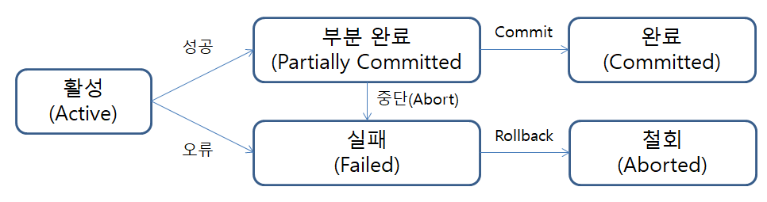

## 트랜잭션(Transaction)
데이터베이스에서 수행하는 작업의 논리적인 최소 단위이다. 즉, 한꺼번에 수행되어야 하는 연산의 모음이다. 

은행 ATM기에서 현금을 인출할 때를 트랜잭션의 예로 들 수 있다. ATM기에서 현금이 인출되거나, 인출되지 않거나 둘 중의 하나의 경우만 있을 뿐, 그 중간의 다른 상태는 없다.

데이터베이스와 애플리케이션의 데이터 거래에 있어서 안정성을 확보하기 위한 방법이 트랜잭션이다.
또한 작업의 단위는 질의어 한 문장이 아니라, 질의어 명령문들을 사람이 정하는 기준에 따라 정하는 것을 의미한다.

### 트랜잭션 특징
**ACID 속성**. 
ACID는 트랜잭션을 정의하는 4가지 속성을 가리키는 약어이다. 데이터베이스 작업에 이러한 ACID 속성이 있다면, 이를 ACID 트랜잭션이라 부른다. ACID 트랜잭션은 한 테이블의 읽기, 쓰기 또는 수정 작업이 ACID 속성을 갖는다고 보장한다.

#### 원자성(Atomicity)
트랜잭션에 속한 각각의 작업을 하나의 단위로 취급한다. 
즉, 트랜잭션 내의 모든 작업은 전부 실행되거나 전부 실행되지 않아야 한다. 하나의 작업이라도 실패하는 경우에는 트랜잭션 자체가 롤백되어 이전 상태로 돌아간다.

#### 일관성(Consistency)
트랜잭션의 작업 처리 결과가 항상 일관성있어야 한다. 
데이터 손상이나 오류로 인한 데이터 무결성에 위배되는 결과가 발생하지 않도록 보장해야 한다. 즉, 항상 데이터 무결성 제약 조건을 만족해야 한다.

#### 고립성(Isolation)
또는 격리 
여러 개의 트랜잭션이 동시에 실행될 경우, 각각의 트랜잭션은 서로 간섭없이 독립적으로 실행되어야 한다.
따라서 하나의 특정 트랜잭션이 완료될 때까지 다른 트랜잭션이 특정 트랜잭션의 결과를 참조할 수 없다. 
또한 트랜잭션이 진행되는 동안에 데이터베이스가 변경되더라도 업데이트된 데이터베이스로 작업되는 것이 아니라, 처음에 트랜잭션을 진행하기 위해 참조한 데이터베이스로 진행된다.

#### 영속성(Durability)
또는 지속성 
트랜잭션이 성공적으로 완료됐을 경우, 그 결과가 데이터베이스에 영구적으로 저장되어야 한다. 

### 트랜잭션 상태

### 참고
[ACID 트랜잭션](https://www.databricks.com/kr/glossary/acid-transactions) 
[[MYSQL] 📚 트랜잭션(Transaction) 개념 & 사용 💯 완벽 정리](https://inpa.tistory.com/entry/MYSQL-%F0%9F%93%9A-%ED%8A%B8%EB%9E%9C%EC%9E%AD%EC%85%98Transaction-%EC%9D%B4%EB%9E%80-%F0%9F%92%AF-%EC%A0%95%EB%A6%AC)

