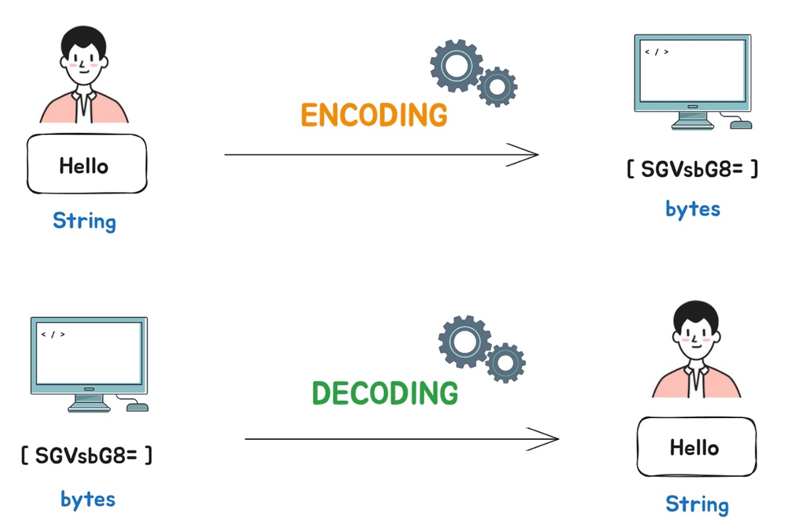
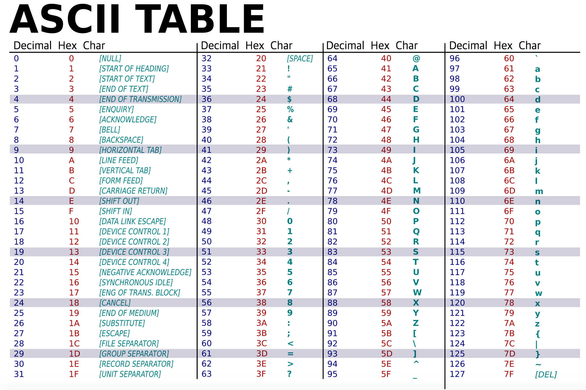
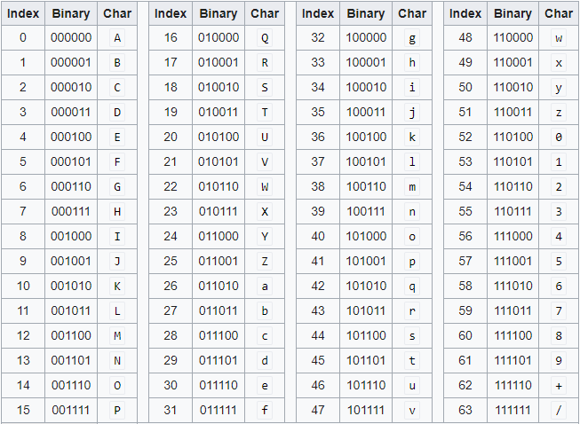

# 인코딩과 디코딩

## 인코딩(Encoding)
사람이 인지할 수 있는 문자(언어)를 약속된 규칙에 따라 컴퓨터가 이해하는 언어(0과 1)로 이루어진 코드로 바꾸는 것을 말한다. 
즉, 인코딩이란 정해진 규칙에 따라 코드화, 암호화, 부호화하는 것을 말한다.

인코딩을 하는 이유는 정보의 형태 및 형식을 표준화, 보안, 처리 속도 향상, 저장 공간 절약 등을 위해서이다. 모스 부호도 대표적인 인코딩 방식 중 하나이다.

인코딩 종류에는 크게 문자 인코딩과 사진·오디오·비디오 인코딩 으로 나누어진다.

### 문자 인코딩
문자 인코딩의 종류에는 6가지가 있다.

1. ASCII 인코딩
2. Base64 인코딩
3. Hex 인코딩 (Base16 인코딩)
4. URL 인코딩
5. UNICODE 인코딩
6. HTML 인코딩

#### ASCII 인코딩
American Standard Code for Information Interchange (ASCII) 
대부분의 현대 문자 인코딩 방식들은 ASCII를 기반으로 이루어진다.

#### Base64 인코딩
Binary 데이터를 Text 형식으로 변환시키는 방식으로,
Binary 데이터를 character set에 영향을 받지 않는 공통 ASCII 영역이 문자로만 이루어진 문자열로 바꾸는 인코딩이다.

원리: 문자열 ➡️ ASCII ➡️ Binary ➡️ Cut 6bit ➡️ Base64_encode  

<!-- Ex) Man
// todo: table -->

ASCII 한 문자당 8비트이기 때문에, 6비트로 자르면서 2비트가 남게 된다. 이때 모든 문자열이 6비트로 딱 맞게 나눠지지 않는다. (모든 문자열이 3개의 문자로 떨어지지 않는다는 말과 같다.)  
이를 해결하기 위해 padding 문자 = 로 남는 비트 자리를 채워준다. JSON이나 HTTP 메시지를 통해 데이터 길이를 명시적으로 구분할 수 있다면 padding 문자가 반드시 필요하지 않다. 하지만 TCP처럼 stream 형태로 데이터를 주고받는 경우에는 padding이 유용하다.  
따라서 Base64 인코딩은 6bit 당 2biy의 overhead가 발생하기 때문에 인코딩 후 원본 데이터보다 33% 큰 결과를 얻게 된다.

그렇다면, 인코딩 전보다 33%나 데이터가 증가하고, 인코딩/디코딩 추가 CPU 연산을 감수하면서까지 Base64 인코딩을 사용하는 이유는 무엇인가? 
가장 큰 이유는 Binary 데이터를 텍스트 기반 규격으로 다룰 수 있기 때문이다. 
JSON과 같은 문자열 기반 데이터 안에 이미지 파일 등이 웹에서 필요할 때 Base64로 인코딩하면 UTF-8과 호환 가능한 문자열을 얻을 수 있다.
모든 Binary 데이터가 ASCII 코드에 포함되지 않기 때문에 기존 ASCII 코드는 시스템 간 데이터를 전달하기에 안전하지 않다. 반면 Base64는 ASCII 중 제어문자와 일부 특수문자를 제외한 64개의 안전한 출력 문자만 이용하므로 데이터 전달에 더 적합하다.  
정리하면, 이메일, 웹 데이터 전송, HTTP 인증 등의 텍스트 기반 환경에서 Binary 데이터를 안전하고 호환성있게 처리 가능하다. 

#### URL 인코딩
인터넷을 통해 전송될 수 있는 형식으로 문자를 변환시키는 방식으로, 
ASCII character-set 을 사용하여 인터넷으로 URL을 전송하는 데 사용된다.
따라서 ASCII가 아닌 문자는 %와 16진수로 치환된다. 
Ex)  /hello?name=예은 ➡️ %2Fhello%3Fname%3D%EC%98%88%EC%9D%80

#### UNICODE 인코딩
유니코드(UNICODE)란 많은 character set으 기준이 되는 표준 인코딩이다. (universal character set)
전 세계 대부분의 언어나 writing system을 인코딩하여 표현하고 다룰 수 있다. 유니코드는 글자를 나타내기 위해 8, 16, 32 비트를 사용하는데 이 중 8비트를 사용하는 UTF-8이 유니코드의 기준이 된다.

Ex) 
- ‘A’ 
  ➡️ 0x41 (UTF8)
  ➡️ 0x0041 (UTF16)
- ‘가’ 
  ➡️ 0xEAB080 (UTF8. 3byte)
  ➡️ 0xAC00 (UTF16. 2byte)

#### HTML 인코딩
HTML 페이지를 올바르게 나타내기 위해 사용되는 방식

<!-- ---

### 사진·오디오·비디오 인코딩
 -->

---

## 디코딩(Decoding)
인코딩된 정보를 원래의 형태로 변환하는 과정으로 전송된 문자를 원래의 상태로 복원하는 것을 통틀어 일컫는다.

### 참고
[Types of Encoding Techniques](https://www.tpointtech.com/types-of-encoding-techniques) 
[인코딩 vs 디코딩 정확하게 이해하기](https://codingpractices.tistory.com/entry/%EC%9D%B8%EC%BD%94%EB%94%A9-vs-%EB%94%94%EC%BD%94%EB%94%A9-%EC%A0%95%ED%99%95%ED%95%98%EA%B2%8C-%EC%9D%B4%ED%95%B4%ED%95%98%EA%B8%B0#google_vignette) 
[우리가 Base64를 사용하는 이유](https://blue-boy.tistory.com/227#%25F-%25-F%25--%AEBase%25----%25--%EC%25-D%25B-%EC%BD%25--%EB%25--%25A-)

<!-- #### TODO
[Encoder & Decoder 에 대한 개념을 설명하는 영상](https://www.youtube.com/watch?v=feBvhLFQEDk) -->
