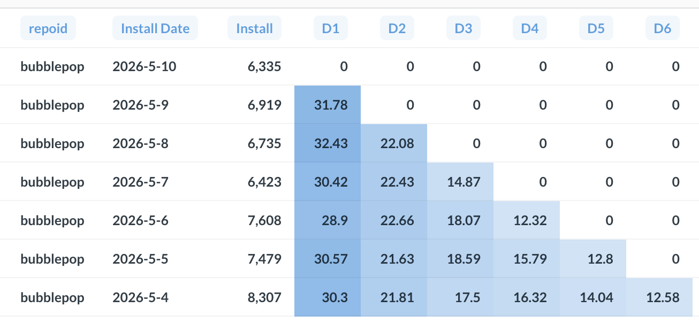

# 프로덕트 분석 용어

프로덕트/그로스 분석에서 자주 쓰이는 용어 정리.

---

## 코호트 (Cohort)

공통된 특성이나 경험을 공유하는 사용자 집단.

"특정 기간"은 코호트의 정의가 아니라 가장 흔한 한 가지 유형일 뿐이다.
본질은 전체를 한 덩어리로 보지 않고 **쪼개서 본다**는 것.

### 코호트 종류

| 종류                   | 기준          | 예시                  |
| -------------------- | ----------- | ------------------- |
| Acquisition Cohort   | 가입/유입 시점    | 2026년 1월 가입자        |
| Behavioral Cohort    | 특정 행동       | 결제 완료 유저, 온보딩 완료 유저 |
| Demographic Cohort   | 인구 통계       | 성별, 연령대, 국가         |
| 기타 (plan, channel …) | 요금제, 유입 채널  | 프리미엄 플랜 유저          |

> "Acquisition cohort"가 가장 흔하다 보니 코호트 = 기간 기준이라는 오해가 생기기 쉬움.

### Q) 왜 코호트로 쪼개서 보나 — 게임 번들 예시

신규 번들을 출시했더니 전체 인앱 구매율이 10% → 15%로 올랐다.
얼핏 보면 성공적인 번들처럼 보이지만, 코호트로 쪼개보면 이야기가 달라진다.

| 코호트     | 도입 전 | 도입 후 | 변화   |
| ------- | ---- | ---- | ---- |
| 신규 유저   | 5%   | 6%   | +1pp |
| 기존 유저   | 15%  | 24%  | +9pp |
| **전체**  | 10%  | 15%  | +5pp |

이 번들은 사실상 기존 유저에게만 먹혔다. 신규 유저는 거의 안 움직였고, 전체 +5pp는 기존 유저가 끌어올린 결과다. "전체 평균"만 봤으면 신규 유저 문제를 그대로 놓쳤을 것.

게임 도메인에선 코호트 축이 거의 무한하다 — 가입일, 레벨대, 과금 등급(Whale / Dolphin / Minnow), 디바이스, 국가, 캠페인 채널 등. 분석 목적에 따라 어떤 축으로 자를지 고르는 게 핵심.

### 코호트 분석과 함께 쓰이는 지표

코호트 분석은 그 자체로 끝이 아니라, 코호트별로 어떤 지표를 볼 것이냐가 본론이다.

- **리텐션 (Retention)** — 코호트별 잔존율 비교
- **세그먼트 분석 (Segmentation)** — 다른 축으로 교차해서 보기
- **LTV (Lifetime Value)** — 코호트별 생애 매출
- **퍼널 (Funnel)** — 코호트별로 전환율이 어디서 빠지는지

### 코호트 vs 세그먼트

| 구분  | 코호트                  | 세그먼트                 |
| --- | -------------------- | -------------------- |
| 기준  | "시작점"이 같은 집단         | "현재 특성"이 같은 집단       |
| 시점성 | 시간축 추적이 핵심           | 스냅샷 비교가 핵심           |
| 예시  | 2026년 1월 가입자         | 현재 Whale 등급 유저       |

실무에선 거의 같은 의미로 섞어 쓰기도 한다 (behavioral cohort ≈ segment).

---

## 리텐션 (Retention)

고객/사용자가 특정 기간 동안 서비스/제품을 이탈하지 않고 지속적으로 이용하는 비율.
게임에선 유저가 이탈하지 않고 계속 플레이하는 비율을 뜻한다.

### 종류

| 지표                       | 의미                  |
| ------------------------ | ------------------- |
| **D1 / D7 / D30**        | 가입 후 N일째에 돌아온 비율    |
| **N-day Retention**      | N일 "그 날" 정확히 접속했는지 (엄격) |
| **Rolling Retention**    | N일 "이후 언제든" 한 번이라도 접속 (느슨)   |

### 코호트 리텐션 테이블 예시

가장 흔한 시각화. 행 = 가입일자(코호트), 열 = 경과일수.

- 대각선 아래쪽(0)은 아직 그 일자만큼 시간이 안 지난 코호트라 비어 있음
- D1이 30% 안팎에서 안정 → 첫날 이탈은 일정한 패턴
- D2부터 단계적으로 감소 (D1 ≈ 30% → D2 ≈ 22% → D3 ≈ 17% …)
- 같은 D1끼리 일자별로 비교해서 튀는 날이 있다면, 그 날 마케팅/업데이트 등 변수를 의심

### 왜?

- 신규 유입(Acquisition)에 돈만 쏟아도 리텐션이 받쳐주지 않으면 매출은 안 따라온다.
- 코호트별 리텐션을 비교하면 업데이트/캠페인이 실제로 효과 있었는지 판단 가능 (예: 5월 업데이트 코호트의 D7 vs 4월 코호트의 D7).
- 리텐션 곡선이 어느 시점부터 평평해지면, 그 이후로 남은 유저는 "코어 유저"로 봐도 됨.

---

## 참고

- [코호트 분석 정리 (LinkedIn)](https://www.linkedin.com/posts/iceman88_%EC%BD%94%ED%98%B8%ED%8A%B8cohort-%EB%B6%84%EC%84%9D%EC%9D%B4-%EB%AD%90%EC%A3%A0-cohort-%EC%9C%A0%EC%82%AC%ED%95%9C-activity-7199544628457398273-4tXw)
