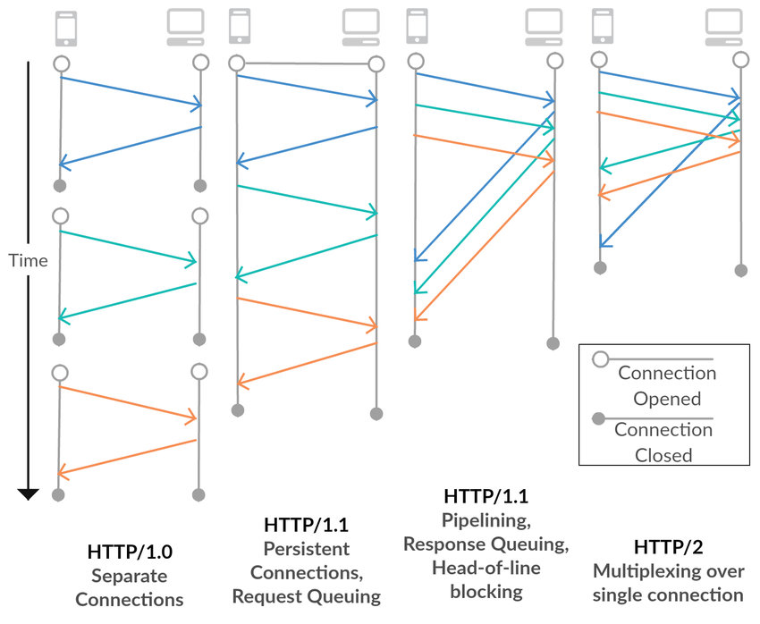
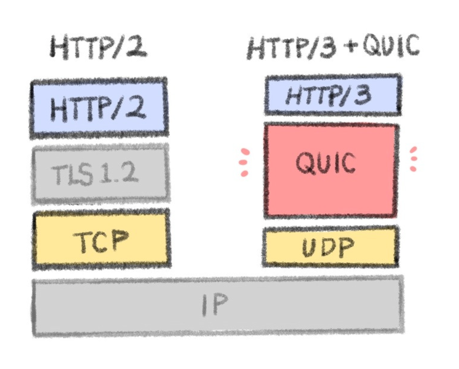
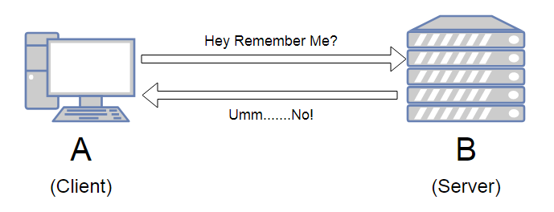
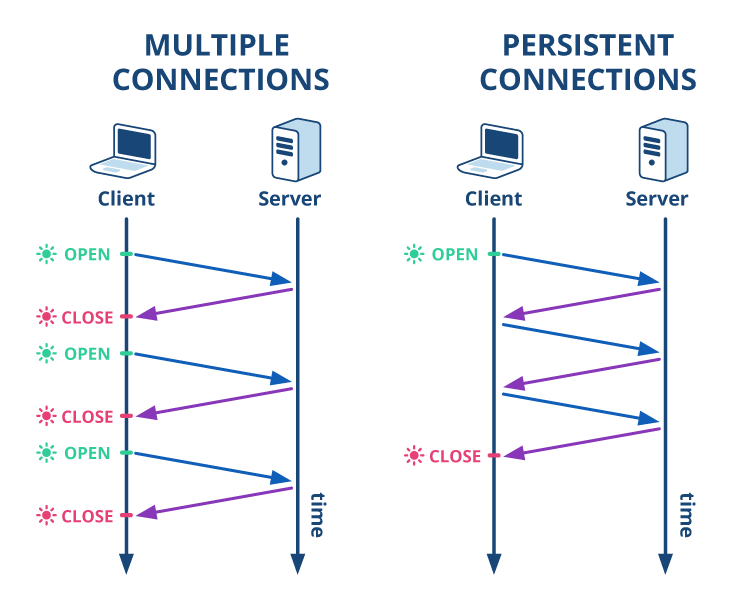
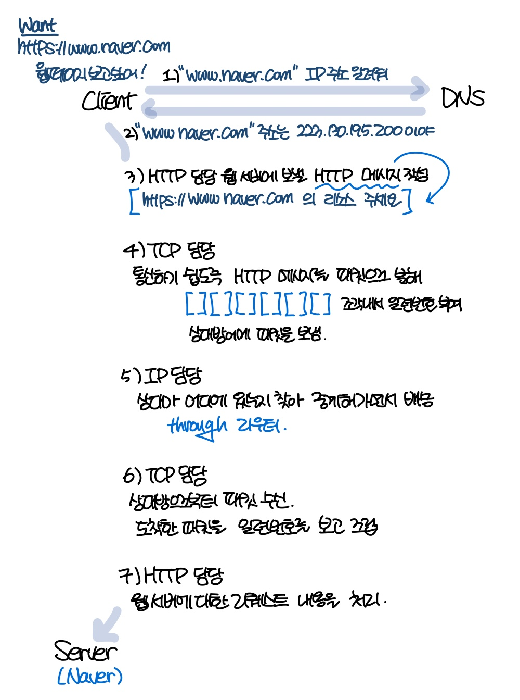
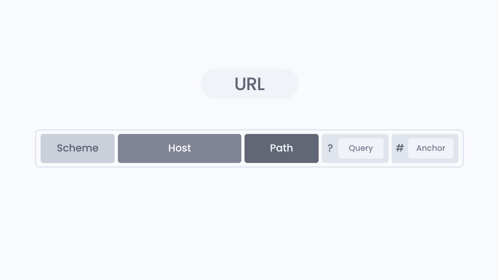

# 웹은 HTTP로 나타낸다.
## HTTP(HyperText Transfer Protocol)
웹 브라우저(클라이언트)와 웹 서버 간에 데이터를 주고받기 위해 사용하는 프로토콜

### 등장 배경
1989년 3월, CERN(유럽 입자 물리학 연구소)의 팀 버너스 리 박사는 멀리 떨어져 있는 동료 연구자와 지식을 공유하기 위한 시스템을 고안하였다. 이때 등장한 것이 `WWW(World Wide Web, 월드 와이드 웹)`로, 하이퍼텍스트(HyperText) 방식으로 텍스트나 그림, 소리, 영상 등의 멀티미디어 정보를 연결하여 제공한다. 간단히 줄여서 WWW나 W3, 웹(Web)이라고 부른다. 

> `하이퍼텍스트(HyperText)`란, 문서 내부에 또 다른 문서로 연결되는 참조를 집어 넣음으로써 웹 상에 존재하는 여러 문서끼리 서로 참조할 수 있는 기술을 말한다.  
> 이때 문서 내부에서 또 다른 문서로 연결되는 참조를 `하이퍼링크(HyperLink)`라고 부른다.

WWW를 구성하는 기술에는 다음 세 가지가 제안되었다.
- 문서 기술 언어 - HTML(HyperText Markup Language)
- 문서 전송 프로토콜 - HTTP
- 문서 주소 지정 방법 - URL(Uniform Resource Locator)

---

### HTTP의 변천사
#### HTTP/0.9
- 1990년
- HTTP 1.0 이전이라는 의미에서 HTTP/0.9라고 불린다.

#### HTTP/1.0
- 1996년 5월, RFC1945 발행
- 헤더(Header) 등장
- `비연결성(Connectionless)`

#### HTTP/1.1
- 1997년 1월, 당시 사양은 RFC2068이지만 최신 버전은 RFC2616(개정판)
- 현대에 가장 많이 사용되는 버전
- `지속 연결(Persistant Connections)` : HTTP 1.0의 비연결성의 한계 해결
- `Pipelining` : 응답이 올 때까지 기다리지 않고, 한 번에 여러 개의 요청을 보낼 수 있다. 

#### HTTP/2
- 성능과 속도 개선을 주 목적으로 한다.
- `바이너리 프레이밍(Binary Framing)` : 텍스트 형식이던 HTTP 메시지를 더 작은 단위인 바이너리 형태로 캡슐화
- `요청과 응답 병렬 처리` : 이전의 요청에 대한 응답을 대기하지 않고도 뒤의 응답을 받을 수 있다.
- `Multiplexing(멀티플렉싱)` : 한 번의 요청만으로도 여러 개의 응답을 받을 수 있다.
- `Server Push` : 클라이언트의 요청 없이 서버에서 필요한 리소스를 푸시할 수 있다. 

#### HTTP/3
`QUIC(Quick UDP Internet Connection)`

- `UDP` 위에서 동작하기에, 속도가 빠르다.
- 데이터 전달의 신뢰성을 위해 `QUIC`를 통해 중간에 데이터 손실 발생 시 이를 개별적으로 재전송한다.

	
---

### 특징
1. **Client - Server 구조**  
	클라이언트가 서버에 요청을 보내면, 서버가 요청에 대해 처리하여 응답을 보낸다.
2. **Stateless(무상태) 프로토콜**  
	
	
	처리한 요청과 응답의 상태를 기억하지 않는다.
	- 장점 
		- 서버 확장성(scalability)이 높다. 
			요청 시, 아무 서버에나 호출해도 되기 때문에 스케일 아웃(수평 확장)에 유리하다.
		- 서버의 리소스 소비를 억제할 수 있고, 단순하다는 이점이 있다.
	- 단점
		- 사용자 정보나 로그인 상태를 기억하지 못한다. 
		따라서 브라우저 쿠키나 서버 세션, 토큰 등과 같은 기술 도입이 필요하다. 
3. **비연결성(Connectionless)**  
	

	HTTP 1.0 을 기준으로, HTTP는 기본적으로 TCP 커넥션을 유지하지 않는다.

	하지만, HTTP 통신을 할 때마다 TCP에 의한 연결과 종료를 반복하면, 통신마다 3-Way Handshake를 해야하는 등 오버헤드가 발생한다. 따라서 이러한 서버에 대한 부하를 줄이기 위해서 HTTP 1.1 부터는 `지속 연결(Persistant Connections)`을 지원한다. 

---

### HTTP와 관계가 깊은 프로토콜: IP/TCP/DNS
#### IP(Internet Protocol)
IP의 역할은 개개의 패킷을 상대방에게 전달하는 것이다. 

`IP 주소`와 `MAC 주소`(Media Access Control Address)를 통해 IP 통신이 이루어진다. 
- IP 주소는 각 노드에 부여된 주소를 가리키고,  
MAC 주소는 각 네트워크 카드에 할당된 고유의 주소이다. 
- IP 주소는 MAC 주소와 결합된다. 
- IP 주소는 변경 가능하지만, MAC 주소는 변경할 수 없다. 

또한 어떤 컴퓨터나 네트워크 기기도 인터넷 전체를 파악하고 있지 않다. 따라서 네트워크 기기들은 목적지에 도착하기까지 대략적인 목적지만을 알고 있고, 이 시스템을 `라우팅`이라 부른다.

#### TCP(Transfer Control Protocol)
신뢰성있는 바이트 스트림 서비스를 제공한다.

> `바이트 스트림 서비스`란, 용량이 큰 데이터를 전송하기 쉽게 TCP 세그먼트라고 불리는 단위 패킷으로 작게 분해하는 것을 말한고, 
`신뢰성 있는 서비스`란, 상대방에게 전달하는 서비스를 의미한다.

즉, TCP는 대용량의 데이터를 보내기 쉽게 **작은 패킷으로 분해** 하여 상대에게 전달하고, 이때 **정확하게** 도착했는지 확인하는 역할을 한다.

택배 배송을 예로 들면, IP는 트럭 내비게이션이고, TCP는 택배 기사이다. 내비게이션은 최단 경로로 정확한 목적지에 도착하는 것을 목표로 하지만, 택배 전달에는 관심이 없다. 이때 빠진 물품이 없는지, 물품이 잘 전달되었는지의 역할은 택배 기사가 한다.

#### DNS(Domain Name System)
도메인명에서 IP 주소를 조사하거나, 반대로 IP 주소로부터 도메인명을 조사하는 서비스를 제공한다.

---

### URI와 URL
#### URI
Uniform Resource Identifiers 
인터넷상의 리소스 자원 자체를 식별하기 위한 고유한 문자열

- Uniform - 리소스를 식별하는 통일된 방식
- Resource - 자원
- Identifier - 식별자

#### URL
Uniform Resource Locator 
리소스의 장소(네트워크 상의 위치)

### 참고
[책 - 그림으로 배우는 Http & Network Basic](https://m.yes24.com/goods/detail/15894097) 
[웹사이트는 어떻게 찾아갈까? IP, DNS, URL 개념 잡기](https://yozm.wishket.com/magazine/detail/2795/) 
[[네트워크/HTTP] HTTP란? – 특징(무상태와 비 연결성)](https://hanamon.kr/%EB%84%A4%ED%8A%B8%EC%9B%8C%ED%81%AC-http-http%EB%9E%80-%ED%8A%B9%EC%A7%95-%EB%AC%B4%EC%83%81%ED%83%9C-%EB%B9%84%EC%97%B0%EA%B2%B0%EC%84%B1/) 
[그림으로 쉽게 보는 HTTP 변천사](https://brunch.co.kr/@swimjiy/39)