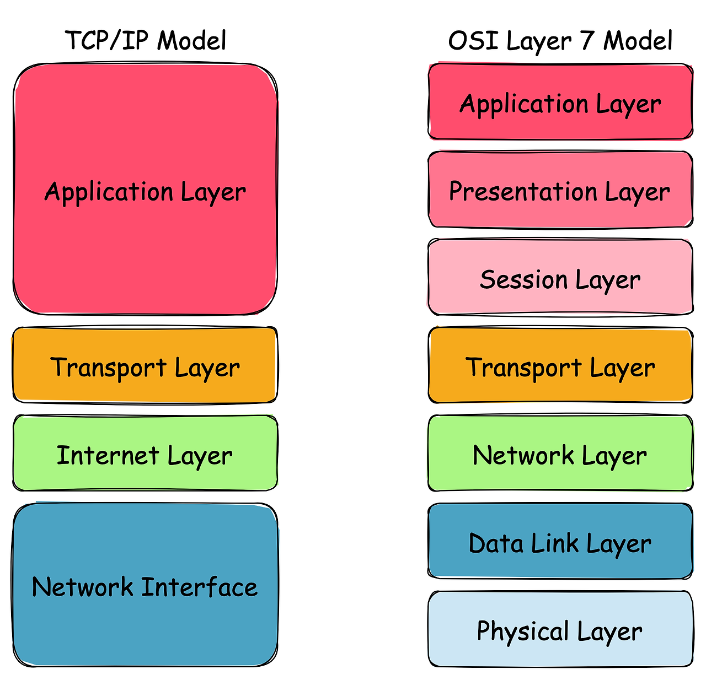
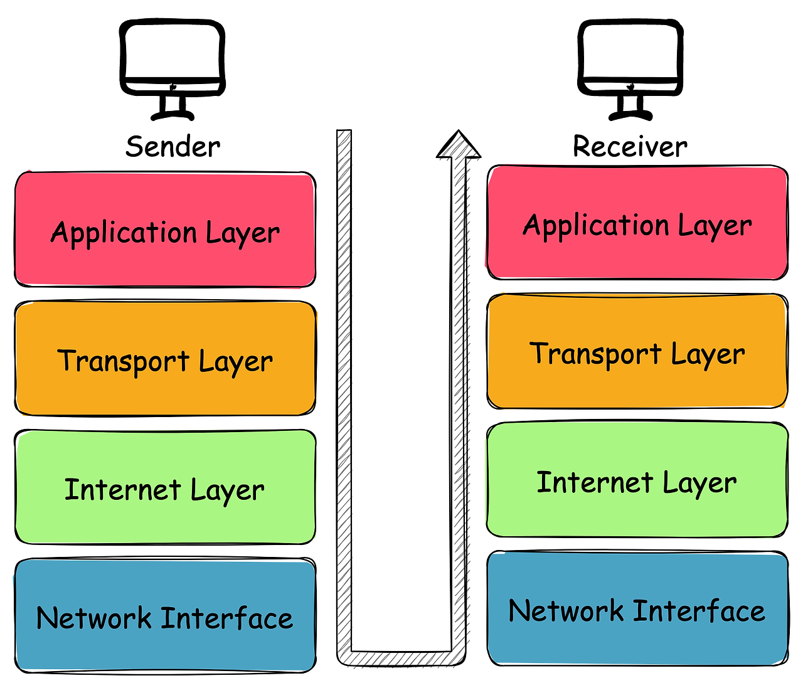

# 1장. 네트워크 첫걸음

# 2장. 네트워크의 기본 규칙
### 프로토콜(protocol)이란?
컴퓨터나 네트워크 기기 간 통신을 위한 규칙

## 통신 규격

### OSI 모델의 7계층
ISO(International Organization for Standardization, 국제 표준화 기구)에서 제정한 표준 규격

| 계층 | 이름 | 설명 | 예시 |
| --- | --- | --- | --- |
| 7계층 | 응용 계층 (Application Layer, 애플리케이션 계층) | 이메일 및 파일 전송, 웹 사이트 조회 등 애플리케이션에 대한 서비스 제공 | HTTP, SMTP, FTP, DNS |
| 6계층 | 표현 계층(Presentation Layer, 프레젠테이션 계층) | 문자 코드, 압축, 암호화 등의 데이터를 변환 | JPEG, GIF, PNG, MP3, MP4, ASCII, TLS, SSL |
| 5계층 | 세션 계층 (Session Layer) | 세션 체결, 통신 방식 결정 |  |
| 4계층 | 전송 계층 (Transport Layer, 트랜스포트 계층) | 신뢰할 수 있는 통신 구현 | TCP, UDP |
| 3계층 | 네트워크 계층 (Network Layer) | 다른 네트워크와 통신하기 위한 경로 설정 및 논리 주소를 결정 | IP |
| 2계층 | 데이터 링크 계층 (Data Link Layer) | 네트워크 기기 간의 데이터 전송 및 물리 주소 결정 | Ethernet, MAC 주소 |
| 1계층 | 물리 계층 (Physical Layer) | 시스템 간의 물리적인 연결과 전기 신호를 변환 및 제어 |  |

### TCP/IP 모델

| 계층 | 이름 | 🆚 OSI 모델 |
| --- | --- | --- |
| 4계층 | 응용 계층(Application Layer) | 응용 + 표현 + 세션 계층 |
| 4계층 | 전송 계층(Transport Layer) | 전송 계층 |
| 2계층 | 인터넷 계층(Internet Layer) | 네트워크 계층 |
| 1계층 | 네트워크 접속 계층(Network Acess Layer) | 데이터 링크 + 물리 계층 |

#### TCP/IP 통신의 흐름

사용자가 웹사이트에 접근하는 것을 예로 통신의 흐름을 설명해보면, 
- 송신 과정
1. 애플리케이션 계층(HTTP)에서 특정 웹 페이지를 보고 싶다는 HTTP request를 지시한다.
2.  트랜스포트 계층(TCP)에서 애플리케이션 계층에서 받은 데이터(HTTP 메시지)를 통신하기 쉽게 조각내어 안내 번호와 포트 번호를 붙여 네트워크 계층에 전달한다.
3. 네트워크 계층(IP)에서는 수신지 MAC 주소를 추가해서 링크 계층에 전달한다. 
- 수신 과정 
	수신 측 서버는 링크 계층에서 데이터를 받아들여 순서대로 위 계층에 전달한다.

## 캡슐화와 역캡슐화
데이터를 보내기 위해 데이터의 앞 부분에 전송하는 데 필요한 정보를 붙여서 다음 게층으로 보낸다. 이 정보를 `헤더`라 부르고, 헤더에는 데이터를 전달받을 상대방에 대한 정보도 포함되어 있다. 

송신 측은 계층을 통과할 때마다 헤더를 추가(`캡슐화`)하고, 
반대로 수신 측은 계층을 통과할 때마다 헤더를 삭제(`역캡슐화`)한다.

> [이미지 출처](https://gnidinger.tistory.com/entry/%EB%84%A4%ED%8A%B8%EC%9B%8C%ED%81%ACTCPIP) 
> 추가 참고 - 그림으로 배우는 Http & Network Basic