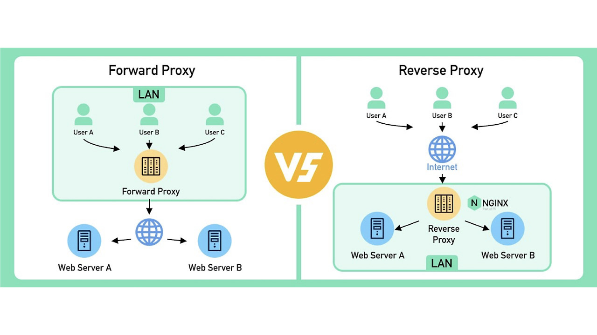

# 프록시(Proxy)란?

프록시 서버는, 클라이언트가 자신을 통해서 다른 네트워크 서비스에 간접적으로 접속할 수 있게 해 주는 컴퓨터 시스템 또는 응용 프로그램을 가리킨다.

프록시(Proxy)란, '대리'라는 의미를 갖고 있으며, 서버와 서버 사이의 중개 역할을 한다고 보면 된다.  
프록시를 사용하는 이유로는 보안상의 이유로 통신할 수 없는 두 서비스 사이에서 대리로 통신을 수행하여 보안성, 성능, 안정성을 향상시키기 위해서이다. 또한 동일한 작업이 요청되는 경우, 이전 요청에 대한 응답을 캐싱한다면, 연산을 하지 않고도 동일한 응답을 반환할 수 있다. 즉, 클라이언트에게는 빠른 서비스를 제공할 수 있고, 서버는 부하를 줄일 수 있다.

## 프록시의 종류

프록시 서버는 네트워크 상 어디에 위치하느냐, 혹은 어느 방향으로 데이터를 제공하느냐에 따라 Forward Proxy와 Reverse Proxy로 나뉜다.

### **포워드 프록시 (Forward Proxy)**

프록시 서버가 클라이언트 바로 뒤에 놓여있다.  
같은 내부망에 존재하는 클라이언트의 요청을 받아 인터넷을 통해 외부 서버에서 데이터를 가져와 클라이언트에게 응답해준다. 즉, 클라이언트가 서버에 접근 시, 클라이언트는 타겟 서버의 주소를 포워드 프록시에 전달하고, 포워드 프록시가 인터넷으로 요청된 내용을 가져오는 방식이다.

#### **이점**

가장 큰 이점 중 하나는 **클라이언트 보안(Security)**이다. 보통 기업이나, 학교, 정부 등과 같은 기관은 해당 기관에 속한 사람들의 제한적인 인터넷을 위해 방화벽을 사용한다. 포워드 프록시 서버 또한 방화벽과 같은 개념으로 제한을 위해 사용한다고 보면 된다. 예로 포워드 프록시에 룰을 추가하여 특정 사이트에 접속하는 것을 막을 수 있다.  
그 외에도 캐싱, 암호화의 사용 이점을 가진다.

### **리버스 프록시 (Reverse Proxy)**

프록시 서버가 웹 서버 / WAS 앞에 놓여 있는 것을 말한다.
클라이언트가 웹 서버에 접근할 때, 웹 서버가 아닌 프록시로 요청하게 되고, 프록시가 뒷단의 서버로부터 데이터를 가져오는 방식이다.  
이때의 reverse는 ~역으로~가 아닌, **배후, 뒷쪽**의 뜻이다.

> **프록시 서버가 클라이언트 쪽으로 데이터(response)를 밀어주는게 포워드라면,**  
> **그 반대편인 서버 쪽으로 데이터(request)를 밀어주는 것이 리버스 프록시라고 보면 된다.** 

#### **이점**

리버스 프록시의 이점 중 하나는 로드 밸런싱(Load Balancing)을 지원한다는 것이다. 또한 서버 보안, 캐싱, 암호화의 이점이 있다.

로드 밸런서는 여러 대의 서버가 필요한 경우의 사용이 일반적이지만, 리버스 프록시는 한 대의 서버인 경우에도 의미가 있다. SSL 종료(Termination), 캐싱, 보안(실제 서버 IP 은닉) 등의 이점을 단일 서버 환경에서도 얻을 수 있기 때문이다.

### 학습 이유

회사의 모든 서비스는 리버스 프록시를 통해 접근이 가능하다. 두 대의 프록시 서버를 운영하고 있고, 최근에 내부 서버 간 통신 실패 이슈를 디버깅하다가 리버스 프록시 개념이 부족하다는 걸 느끼고 학습하게 되었다.

학습한 개념과 우리 회사의 스펙을 이어보자면, 우리 회사는 Amazon Route 53(DNS)을 통하여 우리 서비스의 도메인을 관리하고 있고, 서비스의 도메인들은 모두 proxy.example-company.com 도메인으로 연결된다. 이때, 이 proxy.example-company.com가 리버스 프록시 서버인 proxy-a, proxy-b의 도메인 네임이다.

여기서, 도메인과 도메인을 연결해주는 거를 CNAME 타입이라고 하는 거 같은데 A 레코드와 더불어 정리해보았다.

**A 레코드(Address):**

-   도메인 주소를 입력하면, 바로 IP 주소(숫자)를 알려준다.
-   도메인 ➡ 주소
-   최종 목적지(서버)를 가리킬 때 반드시 필요하다.

**CNAME(Canonical Name)**

-   도메인 주소를 입력하면, 다른 도메인 이름(진짜 이름)을 알려준다. 별명 느낌인 것임.
-   도메인 ➡ 다른 도메인
-   IP가 바뀌어도 CNAME은 수정할 필요가 없어서 관리가 편리하다.

위 두가지는 프로토콜이라고 한다! 다른 DNS에서도 모두 사용된다고..

### 워크플로우

1\. 사용자: "service.example-company.com 으로 가고 싶어"  
2\. DNS(Route53): "그거 proxy.example-company.com이랑 같은 곳이야" (CNAME)  
3\. 사용자: "그래? 그럼 proxy.example-company.com은 어디 있는데?"  
4\. DNS(Route53): "그 주소는 proxy3의 IP랑 proxy4의 IP 두 곳이야. 자, 여기 주소 목록 줄게." (A 레코드 다중 IP)  
5\. 사용자(컴퓨터/OS): 받은 IP 목록 중 하나를 (보통 랜덤하게) 고른다. "오늘은 proxy4로 가야지!"  
6\. 접속: 사용자가 proxy4 서버의 Nginx로 요청을 보낸다.  
7\. proxy4 (Nginx): "요청을 받았습니다. 어? 내 IP로 왔는데, 찾으시는 도메인 이름이 app.example-company.com 이네요?"  
8\. Nginx 설정 확인: nginx.conf 안에 있는 server\_name app.example-company.com 블록을 찾아서 규칙대로 처리(백엔드 서버로 연결)

#### 참고
[🌐 Reverse Proxy / Forward Proxy 정의 & 차이 정리](https://inpa.tistory.com/entry/NETWORK-%F0%9F%93%A1-Reverse-Proxy-Forward-Proxy-%EC%A0%95%EC%9D%98-%EC%B0%A8%EC%9D%B4-%EC%A0%95%EB%A6%AC#%ED%94%84%EB%A1%9D%EC%8B%9Cproxy_%EB%9E%80?)
