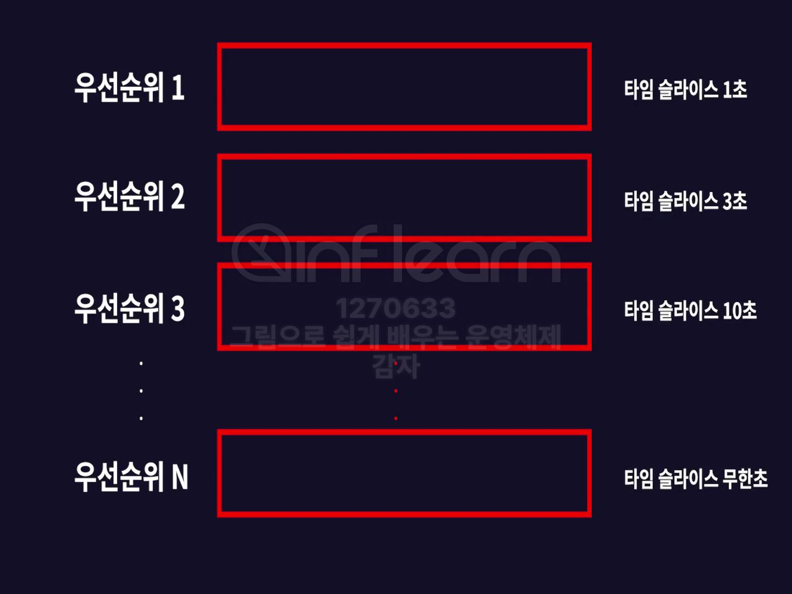

> 인프런 [그림으로 쉽게 배우는 운영체제](https://inf.run/amX3v) 강의를 기반으로 학습한 내용을 정리합니다.
>

<!-- TOC -->

- [Section1. 운영체제 들어가기](#section1-%EC%9A%B4%EC%98%81%EC%B2%B4%EC%A0%9C-%EB%93%A4%EC%96%B4%EA%B0%80%EA%B8%B0)
	- [운영체제 개요](#%EC%9A%B4%EC%98%81%EC%B2%B4%EC%A0%9C-%EA%B0%9C%EC%9A%94)
		- [컴퓨터는 운영체제 없이도 동작할 수 있다.](#%EC%BB%B4%ED%93%A8%ED%84%B0%EB%8A%94-%EC%9A%B4%EC%98%81%EC%B2%B4%EC%A0%9C-%EC%97%86%EC%9D%B4%EB%8F%84-%EB%8F%99%EC%9E%91%ED%95%A0-%EC%88%98-%EC%9E%88%EB%8B%A4)
		- [운영체제가 하는 일](#%EC%9A%B4%EC%98%81%EC%B2%B4%EC%A0%9C%EA%B0%80-%ED%95%98%EB%8A%94-%EC%9D%BC)
	- [운영체제의 역사](#%EC%9A%B4%EC%98%81%EC%B2%B4%EC%A0%9C%EC%9D%98-%EC%97%AD%EC%82%AC)
		- [1 1940년도: 에니악의 등장](#1-1940%EB%85%84%EB%8F%84-%EC%97%90%EB%8B%88%EC%95%85%EC%9D%98-%EB%93%B1%EC%9E%A5)
		- [2 1950년도 초반: 직접 회로IC의 개발](#2-1950%EB%85%84%EB%8F%84-%EC%B4%88%EB%B0%98-%EC%A7%81%EC%A0%91-%ED%9A%8C%EB%A1%9Cic%EC%9D%98-%EA%B0%9C%EB%B0%9C)
		- [3 1950년도 중후반: 싱글스트림 배치시스템](#3-1950%EB%85%84%EB%8F%84-%EC%A4%91%ED%9B%84%EB%B0%98-%EC%8B%B1%EA%B8%80%EC%8A%A4%ED%8A%B8%EB%A6%BC-%EB%B0%B0%EC%B9%98%EC%8B%9C%EC%8A%A4%ED%85%9C)
		- [4 1960년대: 시분할 시스템](#4-1960%EB%85%84%EB%8C%80-%EC%8B%9C%EB%B6%84%ED%95%A0-%EC%8B%9C%EC%8A%A4%ED%85%9C)
		- [5 1970년대: 개인용 컴퓨터의 시대 시작](#5-1970%EB%85%84%EB%8C%80-%EA%B0%9C%EC%9D%B8%EC%9A%A9-%EC%BB%B4%ED%93%A8%ED%84%B0%EC%9D%98-%EC%8B%9C%EB%8C%80-%EC%8B%9C%EC%9E%91)
	- [운영체제의 구조](#%EC%9A%B4%EC%98%81%EC%B2%B4%EC%A0%9C%EC%9D%98-%EA%B5%AC%EC%A1%B0)
	- [컴퓨터 하드웨어와 구조](#%EC%BB%B4%ED%93%A8%ED%84%B0-%ED%95%98%EB%93%9C%EC%9B%A8%EC%96%B4%EC%99%80-%EA%B5%AC%EC%A1%B0)
		- [폰 노이만 구조](#%ED%8F%B0-%EB%85%B8%EC%9D%B4%EB%A7%8C-%EA%B5%AC%EC%A1%B0)
			- [CPU 구조](#cpu-%EA%B5%AC%EC%A1%B0)
			- [메모리 종류](#%EB%A9%94%EB%AA%A8%EB%A6%AC-%EC%A2%85%EB%A5%98)
	- [컴퓨터의 부팅 과정](#%EC%BB%B4%ED%93%A8%ED%84%B0%EC%9D%98-%EB%B6%80%ED%8C%85-%EA%B3%BC%EC%A0%95)
	- [인터럽트Interrupt](#%EC%9D%B8%ED%84%B0%EB%9F%BD%ED%8A%B8interrupt)
		- [인터럽트의 필요성](#%EC%9D%B8%ED%84%B0%EB%9F%BD%ED%8A%B8%EC%9D%98-%ED%95%84%EC%9A%94%EC%84%B1)
		- [실행 과정](#%EC%8B%A4%ED%96%89-%EA%B3%BC%EC%A0%95)
		- [인터럽트 종류](#%EC%9D%B8%ED%84%B0%EB%9F%BD%ED%8A%B8-%EC%A2%85%EB%A5%98)
- [Section2. 프로세스와 스레드](#section2-%ED%94%84%EB%A1%9C%EC%84%B8%EC%8A%A4%EC%99%80-%EC%8A%A4%EB%A0%88%EB%93%9C)
	- [프로그램과 프로세스](#%ED%94%84%EB%A1%9C%EA%B7%B8%EB%9E%A8%EA%B3%BC-%ED%94%84%EB%A1%9C%EC%84%B8%EC%8A%A4)
		- [프로그램Program](#%ED%94%84%EB%A1%9C%EA%B7%B8%EB%9E%A8program)
		- [프로세스Process](#%ED%94%84%EB%A1%9C%EC%84%B8%EC%8A%A4process)
			- [프로세스 메모리 구조](#%ED%94%84%EB%A1%9C%EC%84%B8%EC%8A%A4-%EB%A9%94%EB%AA%A8%EB%A6%AC-%EA%B5%AC%EC%A1%B0)
		- [C언어 컴파일 과정](#c%EC%96%B8%EC%96%B4-%EC%BB%B4%ED%8C%8C%EC%9D%BC-%EA%B3%BC%EC%A0%95)
	- [멀티 프로그래밍, 멀티 태스킹, 멀티 프로세싱](#%EB%A9%80%ED%8B%B0-%ED%94%84%EB%A1%9C%EA%B7%B8%EB%9E%98%EB%B0%8D-%EB%A9%80%ED%8B%B0-%ED%83%9C%EC%8A%A4%ED%82%B9-%EB%A9%80%ED%8B%B0-%ED%94%84%EB%A1%9C%EC%84%B8%EC%8B%B1)
	- [PCBProcess Control Back](#pcbprocess-control-back)
		- [PCB 구조](#pcb-%EA%B5%AC%EC%A1%B0)
	- [프로세스 상태](#%ED%94%84%EB%A1%9C%EC%84%B8%EC%8A%A4-%EC%83%81%ED%83%9C)
	- [컨텍스트 스위칭Context Switching](#%EC%BB%A8%ED%85%8D%EC%8A%A4%ED%8A%B8-%EC%8A%A4%EC%9C%84%EC%B9%ADcontext-switching)
		- [컨텍스트 스위칭 과정](#%EC%BB%A8%ED%85%8D%EC%8A%A4%ED%8A%B8-%EC%8A%A4%EC%9C%84%EC%B9%AD-%EA%B3%BC%EC%A0%95)
		- [컨텍스츠 스위칭 발생 원인](#%EC%BB%A8%ED%85%8D%EC%8A%A4%EC%B8%A0-%EC%8A%A4%EC%9C%84%EC%B9%AD-%EB%B0%9C%EC%83%9D-%EC%9B%90%EC%9D%B8)
	- [프로세스 생성과 종료](#%ED%94%84%EB%A1%9C%EC%84%B8%EC%8A%A4-%EC%83%9D%EC%84%B1%EA%B3%BC-%EC%A2%85%EB%A3%8C)
		- [프로세스 생성 과정](#%ED%94%84%EB%A1%9C%EC%84%B8%EC%8A%A4-%EC%83%9D%EC%84%B1-%EA%B3%BC%EC%A0%95)
	- [스레드](#%EC%8A%A4%EB%A0%88%EB%93%9C)
	- [멀티프로세스와 멀티스레드의 특징](#%EB%A9%80%ED%8B%B0%ED%94%84%EB%A1%9C%EC%84%B8%EC%8A%A4%EC%99%80-%EB%A9%80%ED%8B%B0%EC%8A%A4%EB%A0%88%EB%93%9C%EC%9D%98-%ED%8A%B9%EC%A7%95)
- [Section3. CPU 스케줄링](#section3-cpu-%EC%8A%A4%EC%BC%80%EC%A4%84%EB%A7%81)
	- [CPU 스케줄링 개요](#cpu-%EC%8A%A4%EC%BC%80%EC%A4%84%EB%A7%81-%EA%B0%9C%EC%9A%94)
	- [다중 큐Multiple Queue](#%EB%8B%A4%EC%A4%91-%ED%81%90multiple-queue)
	- [스케줄링 목표](#%EC%8A%A4%EC%BC%80%EC%A4%84%EB%A7%81-%EB%AA%A9%ED%91%9C)
	- [비선점형 🆚 선점형 스케줄링](#%EB%B9%84%EC%84%A0%EC%A0%90%ED%98%95--%EC%84%A0%EC%A0%90%ED%98%95-%EC%8A%A4%EC%BC%80%EC%A4%84%EB%A7%81)
		- [CPU 스케줄링이 발생하는 상황](#cpu-%EC%8A%A4%EC%BC%80%EC%A4%84%EB%A7%81%EC%9D%B4-%EB%B0%9C%EC%83%9D%ED%95%98%EB%8A%94-%EC%83%81%ED%99%A9)
		- [비선점형 스케줄링Non-preemptive Scheduling/Cooperative Scheduling](#%EB%B9%84%EC%84%A0%EC%A0%90%ED%98%95-%EC%8A%A4%EC%BC%80%EC%A4%84%EB%A7%81non-preemptive-schedulingcooperative-scheduling)
		- [선점형 스케줄링Preemptive Scheduling](#%EC%84%A0%EC%A0%90%ED%98%95-%EC%8A%A4%EC%BC%80%EC%A4%84%EB%A7%81preemptive-scheduling)
	- [CPU 스케줄링 알고리즘](#cpu-%EC%8A%A4%EC%BC%80%EC%A4%84%EB%A7%81-%EC%95%8C%EA%B3%A0%EB%A6%AC%EC%A6%98)
		- [FIFOFirst In First Out](#fifofirst-in-first-out)
			- [성능](#%EC%84%B1%EB%8A%A5)
				- [Case1. Burst Time이 긴 프로세스 순으로 실행](#case1-burst-time%EC%9D%B4-%EA%B8%B4-%ED%94%84%EB%A1%9C%EC%84%B8%EC%8A%A4-%EC%88%9C%EC%9C%BC%EB%A1%9C-%EC%8B%A4%ED%96%89)
				- [Case2. Burst Time이 짧은 프로세스 순으로 실행](#case2-burst-time%EC%9D%B4-%EC%A7%A7%EC%9D%80-%ED%94%84%EB%A1%9C%EC%84%B8%EC%8A%A4-%EC%88%9C%EC%9C%BC%EB%A1%9C-%EC%8B%A4%ED%96%89)
		- [SJFShortest Job First](#sjfshortest-job-first)
		- [RRRound Robin](#rrround-robin)
			- [성능](#%EC%84%B1%EB%8A%A5)
			- [RR 알고리즘의 성능은 타임 슬라이스의 값에 따라 크게 달라진다.](#rr-%EC%95%8C%EA%B3%A0%EB%A6%AC%EC%A6%98%EC%9D%98-%EC%84%B1%EB%8A%A5%EC%9D%80-%ED%83%80%EC%9E%84-%EC%8A%AC%EB%9D%BC%EC%9D%B4%EC%8A%A4%EC%9D%98-%EA%B0%92%EC%97%90-%EB%94%B0%EB%9D%BC-%ED%81%AC%EA%B2%8C-%EB%8B%AC%EB%9D%BC%EC%A7%84%EB%8B%A4)
				- [타임 슬라이스가 큰 경우, time slice = ∞s](#%ED%83%80%EC%9E%84-%EC%8A%AC%EB%9D%BC%EC%9D%B4%EC%8A%A4%EA%B0%80-%ED%81%B0-%EA%B2%BD%EC%9A%B0-time-slice--%E2%88%9Es)
				- [타임 슬라이스가 작은 경우, time slice = 1ms](#%ED%83%80%EC%9E%84-%EC%8A%AC%EB%9D%BC%EC%9D%B4%EC%8A%A4%EA%B0%80-%EC%9E%91%EC%9D%80-%EA%B2%BD%EC%9A%B0-time-slice--1ms)
		- [MLFQMulti Level Feedback Queue](#mlfqmulti-level-feedback-queue)
			- [탄생 배경](#%ED%83%84%EC%83%9D-%EB%B0%B0%EA%B2%BD)
		- [정리](#%EC%A0%95%EB%A6%AC)

<!-- /TOC -->


<br>

# Section1. 운영체제 들어가기
## 운영체제 개요
- 개인용 컴퓨터 → Windows / MacOs
- 대형 컴퓨터 / 서버용 → 유닉스 / 리눅스
- 스마트폰 / 태블릿 → 안드로이드 / ios 운영체제
- 내비게이션 / 스마트워치 / 냉장고 / 세탁기 → 임베디드 운영체제

### 컴퓨터는 운영체제 없이도 동작할 수 있다.
다만, 처음 설계한 그대로만 동작할 뿐 다른 기능을 추가할 수 없다. 즉, 유연성이 떨어진다.<br>
예를 들어보면, 과거의 유선 전화기는 전화 외에 다른 기능은 지원하지 않는다. 운영체제가 탑재되어있는 스마트폰은 애플리케이션을 설치하여, 음악을 듣거나 게임을 하는 등의 여러 기능을 할 수 있다.

### 운영체제가 하는 일
1. 프로세스 관리
2. 메모리 관리
3. 하드웨어 관리<br>
	사용자가 하드웨어에 직접 접근하지 못하도록 제어한다.
4. 파일 시스템 관리

---

## 운영체제의 역사
### (1) 1940년도: 에니악의 등장
미군지휘하에 펜실베이니아 대학교에서 설립된 컴퓨터 `에니악`이 등장한다.
최초의 목적은 미사일 탄도개선으로, 세계에서 가장 큰 스케일의 전자디지털 계산기였다.


스위치와 배선을 연결하여 프로그래밍을 하였다. 따라서 프로그램이 바뀌면 스위치와 배선을 다시 연결해야된다는 불편함이 있었다. 
또한 입출력 속도가 굉장히 느리고, 입출력 도중에는 계산이 불가능했다. 무게는 30톤으로 과열로 터지는 경우에는 교체도 필요했다.
이 당시에는 하드웨어가 굉장히 비쌌기 때문에, 에니악 설계자들은 "어떻게 하면 CPU를 최대한 많이 사용할 수 있을까?"를 계속해서 고민헀다.

### (2) 1950년도 초반: 직접 회로(IC)의 개발
진공관과 전선으로 만들어진 논리 회로를 아주 작은 크기로 만든 직접 회로(IC)가 개발되었다. 
CPU와 메모리는 존재하지만, 키보드와 모니터는 없었다. 
펀치카드를 이용해서 카드에 구멍을 뚫는 방식으로 프로그래밍하였고, 컴퓨터가 이 카드를 읽어 계산하고 결과는 라인 프린터로 출력되었다.
이전 에니악의 스위치와 배선을 이용한 프로그래밍 방식보다 훨씬 편해졌다. 

### (3) 1950년도 중후반: 싱글스트림 배치시스템
프로그램을 순서대로 하나씩 실행시키는 `싱글스트림 배치시스템`(Single-stream Batch Processing System, 일괄처리)을 도입한다.

이후에도 CPU의 사용성을 높이기 위한 고민은 계속되었다. 특히 입출력 작업 중 CPU를 사용하지 못한다는 문제를 해결하기 위해 입출력을 담당하는 `I/O 디바이스 컨트롤러`를 만들어 CPU로부터 입출력의 역할을 분리하였다. 
I/O 디바이스 컨트롤러는 입출력 작업이 끝나면 CPU에게 인터럽트 신호를 주고, 신호를 받은 CPU는 이를 다시 처리한다. 

CPU와 입출력을 분리했지만, CPU는 입출력 작업이 완료되어야만 계산이 가능하기 때문에 CPU의 낭비가 여전히 발생한다. (싱글스트림 배치시스템의 한계)

### (4) 1960년대: 시분할 시스템
싱글스트림 배치시스템의 한계를 해결하기 위해, 메모리에 여러 프로그램을 올려놓고 매우 빠르게 번갈아 가면서 프로그램을 실행시키는 `시분할 시스템`을 도입한다. 매우 빠르게 변경되기 때문에 사용자 입장에서는 모든 프로그램이 동시에 실행되는 것처럼 보인다.
특정 프로그램이 입출력 작업 시, CPU는 다른 프로그램의 계산 작업을 처리하면 되기 때문에 CPU 사용률을 증가시킬 수 있다. (싱글스트림 배치시스템의 한계 극복)

프로그램을 동시에 여러 개 실행할 수 있게 되었기 때문에, 여러 사용자들이 터미널 단말기를 통해 하나의 컴퓨터에 접근해서 사용할 수 있다. (그 당시에는 컴퓨터는 비싸고, 터미널은 상대적으로 저렴했다.)
사용자들은 개인용 컴퓨터를 쓰는 것 같은 효과를 얻을 수 있었기 때문에 컴퓨터에 개인정보를 저장하기 시작했고, 이때 `파일 시스템`이 등장했다.

위에서 설명한 **멀티 프로그래밍**(프로그램을 동시에 여러 개 실행) + **다중 사용자**(여러 사용자 지원) + **파일 시스템**을 구현한 `UNIX` 운영체제가 등장한다. 

또한 다른 의미로 1960년도는 멘붕의 시대였는데, 여러 프로그램을 동시에 실행시키면서 문제가 발생한다.<br>
첫번째는 메모리에 여러 프로그램이 올라오면서 메모리를 침범하는 이슈이다.<br>
두번째는 프로그램의 시작 메모리 위치를 알 수 없다는 것이다. 따라서 하드웨어적으로 `베이스 레지스터`를 추가하여 프로그램의 시작 주소를 저장했고, 모든 프로그램이 0번지에서 시작한다고 가정하여 문제를 해결하였다.

### (5) 1970년대: 개인용 컴퓨터의 시대 시작
이전보다 컴퓨터의 가격이 저렴해져서 개인용 컴퓨터를 사용할 수 있게 되었다. 애플의 매킨토시, 마이크로소프트의 MS-DOS가 많이 사용되었고, 특히 매킨토시는 GUI를 도입하여 굉장한 인기를 얻었다.

운영체제의 역사를 돌아보면, 
비싼 CPU의 사용률을 최대로 끌어올리기 위해 고민하고, 
오퍼레이터와 프로그래머 사이에서 낭비되는 시간을 줄이려고 고민하였다. 
즉, CPU 사용률과 비용절감을 위한 노력으로 오늘날의 운영체제가 탄생하였다. 

---

## 운영체제의 구조


`커널`은 운영체제의 핵심으로 프로세스, 메모리, 저장장치를 관리하는 핵심적인 기능을 담당한다. 
사용자는 운영체제의 커널에 직접 접근할 수 없으며, 인터페이스를 통해 접근해야 한다. 
이때의 인터페이스는 `GUI`(Graphical User Interface)와 `CLI`(Command-Line Interface)가 있다.<br>
'현재 경로 변경하기'를 예로 들면, 
GUI의 경우, Finder의 폴더를 클릭하여 원하는 경로에 도달할 수 있다. CLI는 `cd` 명령어를 이용하여 똑같은 결과를 얻을 수 있다.<br>
CLI의 예로는 UNIX/Linux의 Shell, Docker CLI 등이 있고, GUI의 예로는 macOS Finder, Windows 탐색기, 웹 브라우저 등이 있다. 

`시스템 콜`은 커널이 사용자나 애플리케이션으로부터 자신을 보호하기 위해 제공하는 인터페이스로, 직접적인 자원 접근을 차단하고 운영체제를 통해서만 하드웨어를 제어할 수 있도록 한다. 예를 들어, `write()` 시스템 콜을 사용하면 애플리케이션이 직접 하드디스크에 데이터를 쓰는 것이 아니라, 운영체제가 이를 대신 처리하여 자원을 안전하게 관리한다.

하드웨어와 커널의 인터페이스로는 `드라이버`를 사용한다.
커널이 모든 하드웨어에 대한 드라이버를 가지고 있을 수 없으므로, 일반적으로 하드웨어를 만든 제조사에서 드라이버를 만들어 제공한다. 키보드나 마우스 같은 간단한 장치들은 커널에 포함되어 있지만, 그래픽카드나 타블렛 같은 복잡한 장치들은 디바이스 드라이버를 설치하여 사용해야 한다. 

---

## 컴퓨터 하드웨어와 구조
### 폰 노이만 구조
존 폰 노이만이 제시한 컴퓨터 아키텍쳐로, **프로그램 내장 방식**이라고도 부른다.

앞서 말한 에니악의 스위치와 배선 작업은 연산을 변경하려면 배선을 다시 연겨래향하는 번거로움이 있었다. 이를 해결하기 위해 1945년 폰 노이만이 "EDVAC의 보고서 초안"에서 새로운 아키텍쳐를 제안했다.

폰 노이만 구조는
최초의 `프로그램 내장 방식`으로
메모리에 올라간 프로그램이 명령어를 따라 처리되며, 소프트웨어만 바꿔도 다른 프로그램을 실행할 수 있다.


컴퓨터 하드웨어의 핵심은 `메인보드`로, 여러 다른 하드웨어 장치를 연결하는 역할을 한다. 장치 간에 데이터를 전송하는 것은 메인보드의 버스가 담당한다.

> 버스란, 장치 간 데이터 전송을 담당하는 공용 연결 통로이다.
>

#### CPU 구조
CPU(Central Processing Unit, 중앙처리장치)


1. 제어 장치(Control Unit, CU)
	<br>명령을 해석하고, 명령의 실행을 위한 제어 신호를 발생한다.
1. 산술논리 연산장치(Arithmetic/Logic Unit, ALU)
	<br>CU의 신호에 따라서 실질적인 산술/논리 연산이 일어난다.
1. 레지스터
	<br>CPU 내부에서 연산을 수행하기 위해 데이터를 임시 저장하는 고속 메모리이다.

#### 메모리 종류
- RAM(Random Access Memory, 주 기억장치)
  - 데이터의 저장 위치와 관계없이 동일한 속도로 접근 가능하다. 
  - 컴퓨터 전원이 꺼지면 데이터가 사라지는 휘발성 메모리로, 프로그램 실행을 위한 메인 메모리로 사용된다.
- ROM(Read Only Memory)
	- 전원이 꺼져도 데이터를 유지하는 비휘발성 메모리이다.
	- 일반적으로 읽기 전용이지만 일부 ROM은 수정이 가능하다. 
    - 주로 컴퓨터의 부팅 과정에서 필요한 바이오스(BIOS)나 펌웨어를 저장하는 데 사용된다.

> 정리하면, 폰 노이만 구조의 핵심요소는 `CPU`, `메모리(RAM)`, `입출력 장치`이며, `주 기억장치(메모리)`를 중심으로 프로그램과 데이터를 저장하고 처리하는 방식이다.<br>
> 즉, 하드 디스크(HDD)나 SSD는 보조 기억 장치로 폰 노이만 구조에 포함되지 않는다. 폰 노이만 구조가 등장한 1945년 당시에는 현대의 HDD/SSD와 같은 보조 기억 장치가 존재하지 않았기 때문이다. 
>  하지만, RAM은 휘발성이기 때문에, 영구적인 데이터 저장을 위해 보조 기억장치가 필요하다. 따라서, 폰 노이만 구조의 기본 모델에는 포함되지 않더라도, 현대 컴퓨터에서 보조 기억 장치는  필수적으로 추가되어 프로그램과 데이터를 장기간 보존하는 데 중요한 역할을 한다.
>

> 추가 참고<br>
> [폰 노이만 구조의 개념과 동작](https://adeuran.tistory.com/20)<br>
> [메모리 RAM이란 무엇일까?](https://information-factory.tistory.com/59)
>

---

## 컴퓨터의 부팅 과정
컴퓨터의 전원을 누르면,
1. ROM에 저장된 바이오스가 실행된다.
   전원, CPU, 메모리, 키보드, 마우스, 하드디스크 등의 주요 하드웨어의 상태를 확인한다.
	- 이때 주요 장치에 이상이 있으면 오류음을 내면서 부팅을 멈춘다.
2. 이상이 없다면, 하드디스크에 있는 마스터 부트 레코드에 저장된 부트로더를 메모리로 가져와서 실행시킨다.
3. 운영체제를 메모리로 불러오고 모니터에 바탕화면이 보인다.
   - 운영체제가 여러 개 설치된 컴퓨터라면 운영체제를 선택하는 과정을 선행한다.
4. 이후 모든 응용 프로그램은 메모리에 올라와서 운영체제가 관리한다.

---

## 인터럽트(Interrupt)
`인터럽트`란 프로세스 실행 중 특정 이벤트가 발생하면 해당 상황을 처리한 후 원래 작업으로 복귀하는 과정을 말한다.

### 인터럽트의 필요성	
CPU는 입출력 작업이 들어오면, 입출력 관리자에게 입출력 명령을 내린다. 이때 CPU 입장에서는 입출력 작업이 언제 완료될 지 모르기 때문에 주기적으로 확인해주어야 한다. 이러한 방식을 **폴링(polling) 방식**이라한다. 폴링 방식은 CPU가 지속적으로 입출력 작업이 완료되었는지 확인하며 불필요하게 자원을 낭비하는 문제가 있다. 
인터럽트 방식에서는 CPU가 입출력 명령을 내린 후 다른 작업을 수행하고, 입출력 장치가 완료 신호를 보낼 때만 CPU가 응답하도록 함으로써 이 문제를 해결한다.

### 실행 과정
1. CPU가 입출력 관리자에게 입출력 명령을 내리고, CPU는 다른 작업을 수행한다. 
2. 입출력 관리자가 입출력이 완료되었을 때 CPU에게 인터럽트 신호를 보낸다.
3. CPU는 현재 작업을 멈추고 인터럽트 서비스 루틴(ISR)을 실행하여 처리한다.
4. 인터럽트 처리가 완료되면 이전 작업으로 복귀한다.

<br>

> 인터럽트 서비스 루틴(ISR, Interrupt Service Routine)이란,<br> 특정 인터럽트가 발생하면 실행되는 함수로, 인터럽트마다 고유한 ISR이 존재한다.

### 인터럽트 종류
**하드웨어 인터럽트(외부 인터럽트)**
- 출력
- 타이머 인터럽트
- 전원 이상입

**내부 인터럽트 / 소프트웨어 인터럽트**
- CPU가 실행 중인 프로그램에서 발생
- 예외(exception)
  - 유효하지 않은 메모리 접근
  - 0으로 나누는 작업
- 시스템 콜(System Call) : 사용자 프로그램이 운영체제의 기능 호출
  - `write()`, `read()` etc


> 추가 참고<br>
> [[운영체제 7편] 인터럽트가 무엇인가](https://baebalja.tistory.com/354)
>

---

# Section2. 프로세스와 스레드
## 프로그램과 프로세스
### 프로그램(Program)
- **저장장치에 저장된 명령문의 집합**으로, 실행되지 않은 `정적` 상태의 코드
- 운영체제에서 실행되지 않은 상태로 존재하는 `수동적`인 개체. 
- 애플리케이션(앱) 뿐만 아니라 운영체제, 유틸리티 프로그램도 포함된다.
- `.exe` in Windows

### 프로세스(Process)
- 실행 중인 프로그램으로, **프로그램이 메모리에 적재되어 운영체제의 관리 하에 실행되는 동적 개체**
- 프로그램과 다르게, 메모리를 사용하고, 운영체제의 CPU 스케줄링 알고리즘에 따라 CPU를 사용하며, 경우에 따라서 입출력 작업도 한다는 관점에서 `능동적`인 존재이다.

#### 프로세스 메모리 구조


- 힙영역은 프로그래머가 런타임 시 할당할 수 있는 메모리 공간으로, C언어의 `malloc()` / `free()` 함수를 사용하여 메모리가 동적 할당 및 해제 된다.

<br>

### C언어 컴파일 과정
**컴파일(Compile)** 이란?<br>
사람이 이해할 수 있는 고급언어로 작성된 소스코드를 컴퓨터가 실행 가능한 형식의 기계어로 변환하는 작업이다.


1. 전처리기
- 헤더 파일 삽입 (`#include`)
- 매크로 치환 및 적용 (`#define`, `#ifdef` etc)

2. 컴파일러
- 전처리된 코드를 어셈블리어로 변환하는 과정을 거친다.

3. 어셈블러
- 어셈블리어를 기계어(바이너리 코드)로 변환한다.

4. 링커
- 여러 개의 오브젝트 파일과 프로그램 실행에 필요한 라이브러리를 연결하여 실행 가능한 바이너리(.exe, .out)를 생성한다.

---

## 멀티 프로그래밍, 멀티 태스킹, 멀티 프로세싱
메모리의 관점에서, 메모리에 적재된 프로세스의 수에 따라서 분류할 수 있다.

**유니 프로그래밍 (Uni-programming)**
- 메모리에 오직 하나의 프로세스가 올라온 것
- 문제
  - 프로세스 실행 중 I/O 작업이 완료될 때까지 대기해야 하기 때문에, CPU의 쉬는 시간이 발생하는 단점 존재
  - 하나의 프로세스 작업이 완료되어야 다른 프로세스를 실행할 수 있다.

**멀티 프로그래밍 (Multiprogramming)**
- 메모리에 여러 개의 프로세스가 올려두고 실행 대기 상태로 유지하는 것
- 한 프로세스가 I/O 작업으로 인해 대기 상태에 있을 때, 다른 프로세스에 CPU를 할당하여 전체 시스템 효율을 향상시킨다.

**멀티 태스킹(MultiTasking)** 은
하나의 CPU가 여러 작업을 빠르게 전환하며 실행하면서, 모든 프로세스를 동시에 실행시키는 것처럼 느끼게 하는 기술<br>
멀티 프로그래밍을 확장하여 CPU 스케줄링 기법을 추가하였다. 컨텍스트 스위칭을 통해 여러 작업을 동시에 실행하는 것처럼 보이게 한다.

> ⚠️ 멀티 태스킹은 멀티 프로그래밍의 한 형태이며, 멀티 프로그래밍은 더 넓은 개념이다.<br>
> 멀티 프로그래밍은 메모리에 여러 프로세스를 올려두고 CPU가 적절히 스케줄링하는 것이고,<br>
> 멀티 태스킹은 그중에서 CPU 스케줄링을 통해 컨텍스트 스위칭하면서 여러 프로세스를 실행하는 기법이다.<br>
> 즉, `멀티 프로그래밍 = 메모리 관점`, `멀티 태스킹 = CPU 관점`
> 

더 나아가서 **멀티 프로세싱(Multi-processing)** 이란,<br>
여러 개의 CPU(프로세서)가 각각 독립적으로 여러 개의 프로세스를 처리하는 것이다.<br>
여러 작업을 실행시키는 것처럼 보이게 하는 멀티 프로그래밍, 멀티태스킹과 다르게 멀티 프로세싱은 `실제로 여러 개의 프로세스`가 물리적으로 동시에 실행된다.

오늘 날의 OS는 멀티 프로그래밍과 멀티 프로세싱을 지원하지만, 
과거에는 프로그램을 여러 개 올릴 크기의 메모리가 부족하여 유니 프로그래밍과 멀티 태스킹 환경이 주로 사용되었다.<br>
이때, 멀티 태스킹을 지원하는 메모리 관리 기법 중 하나인 스와핑 기법을 사용하였다. `스와핑(swapping)` 기법이란, 실행 중인 프로세스(메모리에 적재된 하나의 프로세스)를 보조 기억장치(ex. HDD)에 저장했다가, 필요할 때 다시 메모리에 불러오는 방식이다. 하지만, 스와핑은 입출력 작업이 많아 시스템 성능 저하를 초래할 수 있다. 따라서 이를 해결하기 위해 `가상 메모리(Virtual Memory)` 기법이 도입되어 프로세스의 일부만 메모리에 올리고도 실행할 수 있도록 개선되었다.

정리하면
|  | 멀티 프로그래밍 | 멀티 태스킹 | 멀티 프로세싱 |
| --- | --- | --- | --- |
| 실행 방식 | 여러 프로그램을 메모리에 올려두고 실행 대기 | CPU가 여러 작업을 빠르게 번갈아 가며 실행시킨다. | 여러 개의 CPU가 여러 프로세스를 동시에 실행시킨다. |
| CPU 사용 방식 | 하나의 CPU가 하나의 프로세스를 | 하나의 CPU가 컨텍스트 스위칭을 통해  | 여러 개의 CPU가 독립적으로  |
| 특징 | I/O 작업 중인 프로세스를 대기시키고 다른 프로세스를 실행 | 타임 슬라이스(Time Slice, 짧은 시간)를 사용하여 여러 작업이 동시에 실행되는 것처럼 보이게 함 | 실제로 병렬 실행 가능 |

---

## PCB(Process Control Back)
운영체제가 프로세스를 제어하기 위해 프로세스의 상태 정보를 저장하는, 운영체제 커널의 자료구조

- 프로세스 생성 시, 운영체제는 해당 프로세스의 정보를 가지고 있는 PCB를 만들고 저장한다. 
- 연결리스트의 자료구조로 저장된다.
- 프로세스 종료 시, PCB도 함께 삭제된다.

### PCB 구조


- 포인터
  - 부모와 자식 프로세스에 대한 포인터
  - 할당된 자원에 대한 포인터
  - 프로세스의 상태 전환 시 저장하는 포인터
- 프로세스 상태
  - 현재 프로세스의 다섯가지 상태(생성, 준비, 실행, 대기, 완료) 중 하나를 저장한다.
- 프로세스 ID
  - 프로세스를 식별하기 위한 숫자
- 프로그램 카운터(Program Counter, PC)
  - 다음에 실행될 명령어의 주소를 포함한다.
  > 왜 필요한가?<br>
	시분할 처리 시, 다른 프로세스에 CPU를 뺏기고 다시 실행될 때, 기존에 실행하던 명령어의 위치를 알아야 작업을 이어갈 수 있다.
- 레지스터 정보
  - 프로세스가 실행될 때 사용했던 레지스터 값들이 저장된다.
  - PC와 같은 목적으로, CPU를 뺏기고 다시 시작할 때 이전에 사용하던 값을 복구하기 위한 용도이다.
- 메모리 관련 정보
  - 프로세스가 메모리에 있는 위치 정보
  - 메모리 침범을 막기 위한 경계레지스터 값
- CPU 스케줄링 정보
  - CPU 스케줄링에 필요한 우선순위
  - 최종 실행 시간
  - CPU 점유 시간
  
> 추가 참고
> [Process Table and Process Control Block (PCB)](https://www.geeksforgeeks.org/process-table-and-process-control-block-pcb/)

---

## 프로세스 상태


- `생성(New)`
	- 프로세스가 메모리에 적재되기 전에 초기화 작업을 하는 단계
	- 프로세스 제어 블록(PCB)을 생성
	- 메모리 할당 요청
	- 승인되면 준비 상태로 이동한다.
- `준비(Ready)`
  - CPU를 할당받기 위해 대기 중인 상태
  - CPU 스케줄러에 의해 CPU가 할당된다.
  - 대부분의 프로세스는 준비 상태에 있다.
- `실행(Running)`
  - 준비 상태에 있는 프로세스가 CPU 스케줄러에 의해 CPU를 할당받아 실행되는 상태
  - `실행상태에 있는 프로세스의 수` = `CPU의 개수`<br>
	즉, CPU가 한 개인 컴퓨터에서 실행 상태에 있는 프로세스는 최대 한 개이다.
  - 실행 상태에 있는 프로세스도 CPU를 무한정 쓸 수 있는 것은 아니다. CPU 스케줄러는 부여된 시간이 초과되면 프로세스에 할당된 CPU를 빼앗는다. CPU를 빼앗긴 프로세스는 다시 준비 상태가 된다. 
- `대기(Waiting/Blocked)`
  - 프로세스가 입출력 요청이나 다른 자원 대기를 요청하는 상태
  - CPU는 굉장히 빠른 장치임에 비해 입출력 작업은 상당히 느린 작업이다.<br>
	따라서 입출력 작업이 완료될 때까지 기다리는 프로세스에 CPU를 할당하는 것은 굉장히 비효율적이다.
  - 입출력 작업이 완료되면, 대기 상태의 프로세스는 준비 상태로 돌아가며, CPU를 할당받을 수 있다.
- `완료(Terminated)`
	- 프로세스가 종료된 상태
	- 프로세스의 자원(메모리, PCB 등)은 모두 반환되며, 메모리에서 제거되고, PCB도 삭제된다.

---

## 컨텍스트 스위칭(Context Switching)
프로세스를 실행하는 중에 다른 프로세스를 실행하기 위해 실행중인 프로세스의 상태를 저장하고 다른 프로세스의 상태값으로 교체하는 작업이다.<br>
- 컨텍스트 스위칭이 일어나면, PCB의 내용이 변경된다. (프로세스 상태, 프로그램 카운터, 각종 레지스터 값 등)
- 실행 중인 프로세스의 작업 내용을 PCB에 저장하고, 실행될 기존 프로세스의 PCB의 내용대로 CPU가 세팅된다.

### 컨텍스트 스위칭 과정


1. 운영체제는 프로세스A가 CPU를 너무 오래 사용했다고 판단되면, 인터럽트를 발생시킨다.
2. 현재 CPU의 레지스터 값 등을 PCB A에 저장한다.
3. PCB B를 참조해서 마지막 프로세스 B의 상태로 CPU 레지스터 값을 세팅한다.<br>
	PCB B의 PC에 다음 실행할 명령어의 주소가 저장되어 있기 때문에 프로세스 B의 작업을 이어서 할 수 있다. 

### 컨텍스츠 스위칭 발생 원인
- CPU 점유시간 초과
- I/O 요청
- 다른 종류의 인터럽트

---

## 프로세스 생성과 종료
### 프로세스 생성 과정
1. .exe과 같은 프로그램 파일 실행
2. 운영체제는 해당 프로그램의 코드 영역과 데이터 영역을 메모리에 로드하고, 빈 스택과 힙을 만들어 공간을 확보한다.
3. 프로세스 관리를 위한 PCB를 생성하고 초기화한다.

위 과정은 운영체제가 부팅되고, 0번 프로세스를 생성하면서 딱 한 번 실행된다.<br>
이후에 생성되는 모든 프로세스는 위 생성 과정을 거쳐서 새롭게 생성되는 것이 아닌, 
`fork()` 함수를 통해 0번 프로세스를 복사하여 생성된다.

```C
#include <unistd.h>

pid_t fork(void);
```
`fork()` 함수의 반환값을 pid이다.<br>
자식 프로세스에는 0을 반환하고, 
부모 프로세스에는 자식의 pid를 반환한다.

이제 이 프로세스들은 운영체제에 의해 CPU 스케줄링에 따라 실행되며, 
운영체제의 결정에 따라 실행되기 때문에 순서를 보장할 수 없다.

> 🙋 왜 생성하지 않고, 복사하는가?<br>
> 생성 과정을 거쳐 프로세스를 새로 생성하는 것보다, 복사를 하는 것이 더 빠르기 때문이다.
>

<br>


- `0번 프로세스`는 `1, 2, 3번 프로세스`의 부모 프로세스
- `1, 2, 3번 프로세스`는 `0번 프로세스`의 자식 프로세스

<br>

자식 프로세스는 생성 시, 부모 프로세스의 메모리 영역과 PCB 영역의 내용을 모두 복사한다. exec 함수를 실행시켜 자식 프로세스의 코드와 데이터 영역을 원하는 값으로 덮어쓸 수 있다. 

```C
#include <unistd.h>

int
execve(const char *path, char *const argv[], char *const envp[]);
```

`execve()` 함수를 예로 설명해보면,<br> 
`path`는 실행할 프로그램의 파일 경로로, 이 경로의 실행 파일이 새로운 **코드** 영역이 된다.<br>
`argv[]`는 프로그램 실행 시 전달한 인자들로, **스택** 영역에 적재된다.<br>
`envp[]`는 환경변수로 **데이터** 영역을 초기화할 때 사용된다.<br>
또한 `execve()` 함수 실행 시 부모 프로세스의 힙 메모리는 모두 사라지게 된다.<br>
정리하면 `execve()` 함수를 호출하면 자식 프로세스의 메모리 영역은 함수에 지정된 값으로 새롭게 교체되면서 부모 프로세스와 독립적으로 명령을 실행시킬 수 있다.

```C
#include <sys/wait.h>

pid_t wait(int *stat_loc);
pid_t waitpid(pid_t pid, int *stat_loc, int options);
```

부모 프로세스에서 wait 시스템 콜 호출 시, 부모 프로세스는 대기 상태(Waiting/Blocked)로 변경된다. 
따라서 부모 프로세스는 CPU 스케줄링의 대상에서 제외된다.
자식 프로세스의 명령이 종료되거나 exit() 호출 시 자식 프로세스는 종료되고 커널이 부모 프로세스를 준비 상태(Ready)로 변경한다.<br>
이때, 부모 프로세스는 자식 프로세스를 수거(reap)하고, 커널에서 자식 프로세스의 자원을 정리한다. wait 시스템 콜을 호출하지 않으면 자식 프로세스의 자원이 정리되지 못하면서 자식 프로세스는 좀비 프로세스가 되어 버린다.

컴퓨터를 오래 켜두면 간혹 느려지는 현상이 발생하는데,
여러 프로세스가 메모리에 올라왔기 때문도 있고,
좀비 프로세스가 많아져서 불필요한 메모리를 차지하기 때문이라고도 볼 수 있다.
컴퓨터를 리부팅하면 메모리가 초기화되면서 컴퓨터가 다시 잘 작동한다.


> 🙋 **좀비 프로세스 vs 고아 프로세스**<br>
> **좀비 프로세스**는 부모 프로세스가 wait 시스템 콜을 호출하지 않아서 자식 프로세스은 종료되었지만 일부 자원이 회수되지 못한 자식 프로세스이다. 종료되었기 때문에 메모리 영역은 이미 해제되었지만, 종료 상태가 회수되지 못하여 PCB에 남아 있는 것이다. 즉, 자원 중 PCB가 남아 있는 프로세스이다.<br>
>
> > **좀비 프로세스의 예시**
> >
> >```C
> >int main() {
> > 	int pid = fork();
> > 
> > 	if (pid == 0) {
> > 		printf("Child process PID: %d\n", getpid());
> > 		exit(0);
> > 	} else {
> > 		printf("Parent process PID: %d\n", getpid());
> > 		sleep(10);
> > 	}
> > 	return 0;
> > }
> > ```
> >
> > - 부모 프로세스가 시행 중인 10초 동안 자식 프로세스는 명령이 끝나고 좀비 프로세스로 남아있음을 확인할 수 있다. (defunct 는 좀비 프로세스를 뜻함)
> >  
> >  
> >
> > <br>
> > 
> > - 부모 프로세스에서 sleep(10) 이전에 wait 시스템 콜을 추가하면, 자식 프로세스가 종료 후 바로 자원이 회수됨을 확인할 수 있다.
> >  
> >  
> >
>
> <br>
> 
> **고아 프로세스**는 자식 프로세스보다 부모 프로세스가 먼저 종료한 자식 프로세스이다. 커널은 고아 프로세스를 관리하기 위해 고아 프로세스의 새로운 부모를 `init 프로세스`로 변경한다. 고아 프로세스가 종료되면 wait 시스템 콜을 호출해 자원을 회수한다.
> > `init 프로세스`는 pid 1번 프로세스로, 모든 프로세스는 init 프로세스를 fork한다. 
> >
> 
> > **고아 프로세스의 예시**
> >
> >```C
> >int main() {
> > 	int pid = fork();
> > 
> > 	if (pid == 0) {
> > 		char* commands[2] = {"/bin/sh", 0};
> > 
> > 		printf("Child process PID: %d\n", getpid());
> > 		execve(commands[0], commands, NULL);
> > 	} else {
> > 		printf("Parent process PID: %d\n", getpid());
> > 	}
> > 	return 0;
> > }
> > ```
> >  
> >  
> >
> > <br>
> >
> > > 🤔 위 경우엔 자식 프로세스의 실행이 콘솔에 보이지 않음. 그치만 자식 프로세스는 생성되고 고아 프로세스가 됨
> 근데, 부모 프로세스에 sleep(5)를 추가하면 콘솔에 sh이 실행되고 부모 프로세스가 종료되면서 자식 프로세스도 함께 종료됨. 부모의 종료 시그널이 자식에게도 전파되어서 그러는 것 같은데... <br> 
> > > > 부모 - 자식 프로세스가 터미널로 연결된 상태여서 부모 프로세스가 종료될 때 SIGHUP 시그널이 전달된다고 한다.<br> 
> ... 어렵구만 🥺
>

---
## 스레드
지금까지는 운영체제가 작업을 처리하는 단위를 `프로세스`로 보았다.<br>
다만 프로세스는 독립된 메모리 영역과 PCB를 갖기 때문에, 프로세스의 수가 많아지면 무거워진다.

`웹브라우저 실행`을 예로 들어보자.<br>
웹브라우저를 실행시키면 프로세스 1개가 생성된다.
여기서 웹 브라우저 탭을 하나 더 추가하면, 기존 프로세스를 복사하여 프로세스는 총 2개가 된다.
탭을 열 때마다 프로세스가 생성되니, 사용하는 메모리 양도 배로 늘어날 것이다.
또한 웹 브라우저 탭은 `IPC(Inter Process Communication)`를 통해 통신하는데, IPC의 통신 비용은 상대적으로 크다. 

컴퓨터 시스템 개발자들은, 프로세스의 단점을 해결할 다른 방법을 고민하였다.<br>
그렇게 고안한 것이 **스레드(Thread)** 이다.<br>
- 프로세스 내에 하나 이상 존재
- 프로세스 안의 스레드들은 프로세스의 PCB, 코드, 데이터, 힙 메모리 영역을 공유한다.<br>즉, `고유한 스택 영역`만을 가진다.
- 스레드는 개인의 스레드 ID와 Thread Control Back(TCB)를 갖는다.
  
따라서 운영체제는 스레드를 구분할 수 있고, 
운영체제의 작업 처리 단위를 프로세스 내의 스레드로 둘 수 있다. 

다시 웹브라우저 실행을 보자.<br>
웹브라우저 실행 시, 하나의 프로세스와 하나의 스레드가 생성된다.
탭을 하나 더 열면, 이전처럼 프로세스가 아닌 스레드를 하나 더 생성하게 된다.
이렇게 하면, 스레드는 프로세스의 힙, 데이터, 코드 영역을 공유하기 때문에 메모리를 절약할 수 있다.<br>
실제로 `Chrome`은 처음에만 프로세스를 하나 생성하고, 그 뒤의 탭은 모두 스레드로 생성한다. `FireFox`의 경우, 처음 4개의 탭까지만 프로세스로 생성하고 그 뒤의 탭은 스레드로 생성한다.

<br>


## 멀티프로세스와 멀티스레드의 특징
1. 안정성
	- 프로세스는 `독립적이다`.<br>
	하나의 프로세스가 문제가 생겨도, 다른 프로세스에는 영향이 없다.
	- 반면 스레드는 `하나의 프로세스에 종속적`이다.<br>
	프로세스에 문제가 생기면 그 안에 있는 모드 스레드에 영향을 미친다.
2. 속도와 자원
   - 프로세스는 `고유한 자원`을 가진다. 
   따라서 프로세스의 수와 비례하게 메모리 사용량이 많아진다.<br>
   또한 프로세스 간 통신은 IPC를 이용해야하기 때문에, 오버헤드가 크고 속도가 느리다.
   - 스레드는 `스택 영역을 제외한 모든 자원을 공유`하기 때문에, 오버헤드가 굉장히 작다.<br>
   또한 데이터를 공유하기 때문에 스레드 간 통신은 쉽다. 하지만, 그렇기 때문에 data race나 데드락과 같은 동기화 문제를 야기할 수 있다. 

<br>

---

# Section3. CPU 스케줄링
## CPU 스케줄링 개요
**CPU 스케줄링**이란, 
운영체제가 프로세스에 CPU를 할당하고 해제하는 과정이다.<br>
프로세스들의 CPU 대기 시간을 줄이기 위해 사용된다.

CPU 스케줄러는 
1. 어떤 프로세스에게 CPU 리소스(이용권)를 줘야하는가?
2. CPU를 할당받은 프로세스가 얼마의 시간동안 CPU를 사용해야하는가?
를 고려해야하고, 이에 따라서 컴퓨터의 성능이 달라진다.

- `CPU Burst` = CPU를 할당받아 실행하는 작업
- `I/O Burst` = 입출력 작업
- `Burst Time` = 어떤 작업이 수행되는데 걸리는 시간


## 다중 큐(Multiple Queue)
프로세스의 5가지 상태 중, `준비 상태(Ready)`와 `대기 상태(Waiting)`는 큐 자료구조로 관리된다. 

1. 실행 상태 ➡️ 준비 상태<br>
운영체제는 프로세스의 우선순위를 보고 그에 맞는 큐에 넣는다.
CPU 스케줄러에 의해 실행상태로 전환되고, CPU 스케줄러는 준비상태 다중큐를 참조해서 다음으로 어떤 프로세스를 실행시킬지 결정한다.
<br>


1. 실행 상태 ➡️ 대기 상태
<br>


> 이미지 출처 - [책] 쉽게 배우는 운영체제 <br>
> https://velog.io/@xeropise1/CPU-%EC%8A%A4%EC%BC%80%EC%A5%B4%EB%A7%81%EC%9D%B4%EB%9E%80-2
>

---
## 스케줄링 목표
1. 리소스 사용률
   - CPU
   - I/O 디바이스 (HDD, 마우스, 키보드)
2. 오버헤드 최소화
   - 스케줄링을 위한 계산
   - 잦은 컨텍스트 스위칭 
3. 공평성(Fairness)<br>
	모든 프로세스에 공평하게 CPU가 할당되어야 한다.

	이때, `공평`의 의미는 시스템에 따라 다르다. 
	
	`자율 주행 자동차`를 예로 들어보자.<br>
	자율 주행 자동차에서는, 음악의 재생이나 실내 온도 확인의 기능보다 안전을 목적으로 장애물을 인지하고 피하는 자율주행 프로세스가 가장 중요하다. 따라서 이 운영체제에서는 자율주행 프로세스에 CPU가 많이 할당되는 것이 공평하다고 할 수 있다. 
4. 처리량<br>
	같은 시간 안에 더 많은 처리를 할 수 있는 방법을 목표로 한다.<br>
	즉, CPU가 단위 시간 당 처리하는 프로세스의 수
5. 대기 시간<br>
	작업을 요청하고 실제 작업이 이루어지기 전까지 대기 시간이 짧은 것을 목표로 한다.
6. 응답 시간<br>
	`대화형 시스템`의 경우, 사용자의 요청이 얼마나 빨리 반응하는지가 중요하다.

<br>

하지만, 목표 간에 서로 상반되는 경우가 있기 때문에 위 목표들을 모두 최고의 수준으로 유지하기는 어렵다.<br> 
예를 들어, 처리량을 높이기 위해서는 하나의 프로세스에 CPU를 오래 할당해야하지만, 응답시간을 줄이기 위해서는 여러 프로세스에 CPU를 골고루 할당해야 한다.
따라서 처리량과 응답시간의 목표를 함께 달성하는 것은 어렵다.
이러한 경우에는 사용자가 사용하는 시스템에 따라서 목표를 다르게 설정해야 한다.

일반적인 시스템에서는 어느 하나의 프로세스에 CPU의 독점이 발생하지 않도록 밸런스를 유지하는 것이 중요하다. `No starvation`, `Fairness`, `Balance`<br>
**대화형 시스템(Interactive System)** 은 요청에 대해 즉각적인 처리와 응답이 필요한 시스템으로, `응답 시간`이 주 목표가 되어야 한다. 예) 터치 스크린<br>
반대로 **일괄처리 시스템(Batch System)** 은 요청을 일정기간 또는 일정량 모아뒀다가 한꺼번에  처리하는 방식으로, `CPU 사용률`, `처리량을` 주 목표로 한다.<br>

---
## 비선점형 🆚 선점형 스케줄링
### CPU 스케줄링이 발생하는 상황
1. 실행상태 ➡️ 준비상태
2. 대기상태 ➡️ 준비상태
3. 실행상태 ➡️ 대기상태
4. 실행상태 ➡️ 종료상태 

### 비선점형 스케줄링(Non-preemptive Scheduling/Cooperative Scheduling)
- time slice가 없는 스케줄링
- CPU 가 사용중인 프로스세가 자율적으로 반납하는 방식
- 프로세스가 자율적으로 CPU를 반납하는 시점에 사용한다.


### 선점형 스케줄링(Preemptive Scheduling)
- 낮은 우선순위를 가진 프로세스보다 높은 우선순위를 가진 프로세스가 CPU를 선점하는 방식
- time slice를 기반으로 한다.
- OS가 스케줄링의 알고리즘에 따라 적절히 프로세스에게 CPU를 할당하고, 필요시 회수하는 방식
- 일반적으로 `실행상태 ➡️ 준비상태` 또는 `대기상태 ➡️ 준비상태` 에서 사용된다.


---
## CPU 스케줄링 알고리즘

스케줄링의 성능은 **평균 대기 시간**으로 평가된다
여기서 **대기 시간**이란, 프로세스가 생성된 시점부터 작업이 완료될때까지 CPU를 사용하지 않고 기다리는 시간이다.

### FIFO(First In First Out)
먼저 들어온 작업이 먼저 처리되는 알고리즘으로, 
스케줄링 큐에 들어온 순서대로 CPU를 할당받는 방식이다.<br>

- 단순하고 직관적
- 먼저 들어온 프로세스가 완전히 끝나야만 다음 프로세스가 실행될 수 있다.
  따라서 `실행시간이 짧고 늦게 도착한 프로세스`가 `실행시간이 길고 빨리 도착한 프로세스`의 작업을 기다려야 한다.
- I/O 작업이 필요한 프로세스의 경우, I/O 작업이 완료될 때까지 CPU가 쉬고 있기 때문에 CPU의 사용률이 떨어진다.

`마트의 계산대`를 예로 들어보자.<br>
첫번째 단점은 물건을 30만원어치 산 손님과 아이스크림을 한 개 산 손님을 예로 들 수 있다.
아이스크림을 한 개 산 손님이 더 늦게 왔기 때문에, 물건이 더 적어도(계산 완료 속도가 더 빨라도) 30만원어치 산 손님이 계산이 끝날때까지 기다려야 한다.<br>
두번째 단점은 계산원을 CPU, 손님이 지갑을 찾는 행위를 I/O 작업이라고 하면,
손님이 지갑을 찾아 카드를 꺼내거나, 결제 금액에 맞는 현금을 찾을 때까지 계산원은 다른 작업을 하지 못하고 손님을 기다려야 한다.

#### 성능
FIFO 알고리즘의 성능을 알아보자.
|  | 작업시간 |
| --- | --- |
| 프로세스1 | 25초 |
| 프로세스2 | 5초 |
| 프로세스3 | 4초 |

##### Case1. Burst Time이 긴 프로세스 순으로 실행

| head | 프로세스1 | 프로세스2 | 프로세스3 | tail |
| --- | --- | --- | --- | --- |
| 대기시간 | 0초 | 25초 | 25 + 5 = 30초 |  |

⇒ `평균 대기 시간` = (0 + 25 + 30) / 3 = `18.3초`

##### Case2. Burst Time이 짧은 프로세스 순으로 실행

| head | 프로세스3 | 프로세스2 | 프로세스1 | tail |
| --- | --- | --- | --- | --- |
| 대기시간 | 0초 | 4초 | 4 + 5 = 9초 |  |

⇒ `평균 대기 시간` = (0 + 4 + 9) / 3 = `4.3초`

프로세스의 실행 순서에 따라서 평균 대기 시간이 많이 차이나는 것을 확인할 수 있다.

정리하면, FIFO 알고리즘은 프로세스의 Burst Time에 따라 성능의 차이가 심하게 나기 때문에, 현대 운영체제에서는 잘 사용되지 않는다. 일괄 처리 시스템에서 많이 사용되곤 한다.

### SJF(Shortest Job First)
> 짧은 작업 먼저
>

FIFO 알고리즘의
`Burst Time이 짧은 작업이 먼저 실행되면 평균 대기 시간이 짧아진다.`
개념으로부터 SJF 알고리즘이 등장하였다.

이론적으로 SJF는 FIFO보다 성능이 좋다.<br>
하지만 실제로 구현하려는 과정에서 문제가 있다.

**문제1) 프로세스의 작업 시간을 정확히 예측할 수 없다.** <br>
어떤 프로세스가 어떤 작업을 할 지 모르기 때문에, 작업 시간 또한 예측할 수 없다. 
실제로 우리가 웹브라우저를 켜서 다양한 작업을 할 수 있고, 종료하는 시점도 다르다. 따라서 프로세스의 작업 시간을 예측하는 일은 거의 불가능에 가깝다.<br>
**문제2) Burst Time이 긴 프로세스의 실행이 무한 연기될 수 있다.** <br>
Burst Time이 긴 프로세스가 먼저 요청되었더라도, 대기 중에 Burst Time이 짧은 프로세스가 요청되면 해당 작업들을 먼저 실행하면서 무한 연기 상태가 된다.<br>

이러한 문제들로 인해 SJF 알고리즘은 실제로 사용되지는 않는다.

### RR(Round Robin)
`시분할 처리`를 위해 설계된 스케줄링으로,<br>
모든 프로세스가 `같은 우선순위`를 가지고 `time slice`를 기반으로 스케줄링한다.<br>
RR 알고리즘은 FIFO 알고리즘의 문제(`먼저 들어온 프로세스가 전부 끝나야 다음 프로세스가 실행된다.`)를 해결한다.

RR 알고리즘의 동작 방식은
1. 운영체제는 프로세스의 CPU 사용 시간을 설정한다.
2. 시간이 초과되면 프로세스로부터 CPU를 강제로 뺏는다.
3. 강제로 CPU를 뺏긴 프로세스는 큐의 끝으로 이동한다.

이때, 프로세스에게 CPU를 할당하는 일정 시간을 `타임 슬라이스`(time slice, 타임 퀀텀)라고 한다.

#### 성능
|  | 작업시간 |
| --- | --- |
| 프로세스1 | 25초 |
| 프로세스2 | 4초 |
| 프로세스3 | 10초 |


**Time Slice = 10s**

| time = 0 | head | 프로세스1(25s) | 프로세스2(4s) | 프로세스3(10s) | tail |
| --- | --- | --- | --- | --- | --- |
| time = 10 |  | 프로세스2(4s) | 프로세스3(10s) | 프로세스1(15s) |  |
| time = 14 |  | 프로세스3(10s) | 프로세스1(15s) |  |  |
| time = 24 |  | 프로세스1(15s) |  |  |  |
| time = 34 |  | 프로세스1(5s) |  |  |  |
| time = 39 |  |  |  |  |  |

- 프로세스1의 대기시간 = 14s
- 프로세스2의 대기시간 = 10s
- 프로세스3의 대기시간 = 14s
- 평균대기시간 = (14 + 10 + 14) / 3 = `12.67s`


**🆚 FIFO 알고리즘**


<br>

FIFO 알고리즘의 평균 대기 시간은 (0 + 25 + 29) / 3 = `18s`

이때, RR 알고리즘과 FIFO 알고리즘의 평균대기시간이 비슷하다면, RR 알고리즘을 사용하는 것이 더 비효율적이다. 왜냐하면 RR 알고리즘은 컨텍스트 스위칭 시간까지 고려해야하기 때문이다.

#### RR 알고리즘의 성능은 타임 슬라이스의 값에 따라 크게 달라진다.

##### 타임 슬라이스가 큰 경우, (time slice = ∞s)
먼저 들어온 프로세스의 작업이 종료될 때까지 실행된다. 즉, FIFO 알고리즘과 동일하다.

웹브라우저와 음악 앱을 동시에 실행시켰을 때, time slice가 5초라면,
각 프로그램이 5초 동작하고 멈추고를 반복하게 된다. 사용자 입장에서는 프로그램이 굉장히 끊기며 불편함을 느끼게 된다.

##### 타임 슬라이스가 작은 경우, (time slice = 1ms)
사용자 입장에서 여러 프로세스가 동시에 동작되는 것처럼 느낄 수 있다.<br>
하지만, 컨텍스트 스위칭이 자주 일어나기 때문에 타임 슬라이스에서 실행되는 프로세스 처리량보다 컨텍스트 스위칭을 처리하는 양이 훨씬 커지게 된다. 즉, 오버헤드가 너무 커진다.

따라서 **최적의 타임 슬라이스 값을 정하는 것** 은 RR 알고리즘에 있어서 매우 중요하다.<br>
사용자의 입장에서 `여러 프로세스가 버벅거리지 않고` `동시에 실행되는 것처럼 느껴지면서` `오버헤드가 너무 크지 않은` 값을 찾아야 한다.

실제로 Widnwos의 타임 슬라이스는 20ms, Unix는 100ms이다.

### MLFQ(Multi Level Feedback Queue)
time slice를 기반으로 스케줄링하지만, 
프로세스의 우선순위에 따라 다른 큐를 두고, 큐마다 time slice를 다르게 설정한다.<br>
오늘날 운영체제에서 가장 일반적으로 쓰이는 CPU 스케줄링 기법이다.

#### 탄생 배경

P1 = I/O 작업 없이 CPU 연산만 하는 프로세스
→ `CPU Bound Process` (대부분의 시간을 CPU 연산을 수행) 
P2 = 1초 CPU 연산을 하고, 10초동안 I/O 작업을 하는 프로세스
→ `I/O Bound Process` (대부분의 시간을 I/O 연산)

CPU Bound Process 가 중요하게 생각하는 것 = CPU 사용률 + 처리량
I/O Bound Process 가 중요하게 생각하는 것 = 응답 속도

1. 타임 슬라이스 100초<br>


2. 타임 슬라이스 1초<br>


CPU 사용률과 I/O 사용률을 모두 고려해보았을 때, 타임슬라이스가 1초일 때의 성능이 더 좋다. 
하지만, 타임슬라이스가 100초에서 1초로 줄어들면서 P2는 I/O 사용률이 굉장히 높아졌기 때문에 이득이지만, P1은 손해가 발생한다.
100초 연속으로 실행되는 CPU 작업이 1초 단위롤 연속적으로 실행되기 때문에 손해가 없는 것처럼 보이지만, 컨텍스트 스위칭으로 인한 오버헤드가 발생하기 때문이다.

위와 같이 타임 슬라이스를 작게 했을 때, CPU Bound Process에 손해가 생기지 않게 하기 위해서 고안된 방법이 **MLFQ** 이다.



기본적으로 CPU 사용률과 I/O 사용률이 좋게 나오는 작은 크기의 타임 슬라이스를 선택하고, CPU Bound Process 와 같이 CPU Burst Time이 큰 프로세스에게는 타임 슬라이스를 점점 키워나가는 방식이다.<br>
우선순위를 가진 큐를 여러 개 두고, 프로세스 생성 시 우선순위1 큐에 등록한다. 
CPU를 사용하다가 프로세스가 타임 슬라이스 크기를 오버해서 CPU 스케줄러에 의해 강제로 CPU를 뺏기면 그 다음에는 우선순위2 큐에 등록한다. (CPU Bound Process일 확률 ⬆️)<br>
반대로, CPU를 사용하는 프로세스가 스스로 CPU를 반납하면 CPU 사용량이 적은 것으로 이전에 있던 타임 슬라이스를 그대로 사용하면 된다. (I/O Bound Process일 확률 ⬆️)
이러한 과정을 반복하며 프로세스의 작업에 맞는 타임 슬라이스를 찾을 수 있고, 프로세스에 손해를 줄일 수 있다.

이외에도 HRN, SRT, MLQ, Priority 와 같은 CPU 스케줄링 알고리즘이 있지만, 오늘날 쓰이는 CPU 스케줄링 알고리즘의 주류는 MLFQ이다.

### 정리
| 알고리즘 | 선점형/비선점형 | 장점 | 단점 | 활용 사례 |
| --- | --- | --- | --- | --- |
| FIFO | 비선점형 | 단순하고 구현이 쉬움 | 긴 작업이 먼저 들어오면 짧은 작업들이 불필요하게 오래 대기해야 함 | 일괄처리 시스템 |
| SJF | 비선점형 | 평균 대기 시간 최소화 | - 작업 시간 예측 어려움<br>- 긴 작업의 무한 대기 가능성 | 작업 시간이 예측 가능한 환경 (거의 사용되지 않음) |
| RR | 선점형 | 모든 프로세스에 공평하게 CPU 할당 | 타임 슬라이스 값에 따라 컨텍스트 스위칭 오버헤드 발생 가능 | - 시분할 처리<br>- 대화형 시스템 |
| MLFQ | 선점형 | 프로세스의 특정을 반영하여 응답 시간과 처리량의 균형 제공 | - 구현 복잡<br>- 큐 간의 튜닝(타임 슬라이스, 우선순위) 필요 | 현대 운영체제 |

<br>

> 추가 참고 
> [[운영체제] CPU 스케줄러 - FCFS, SJF, SRT, RR, Priority Scheduling](https://hyunah030.tistory.com/4)
>
