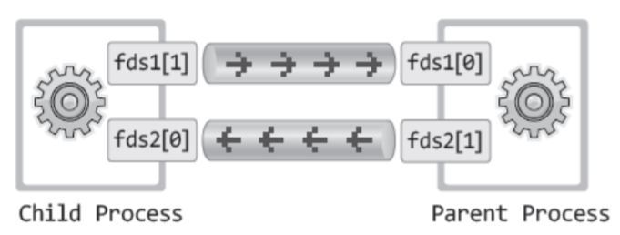
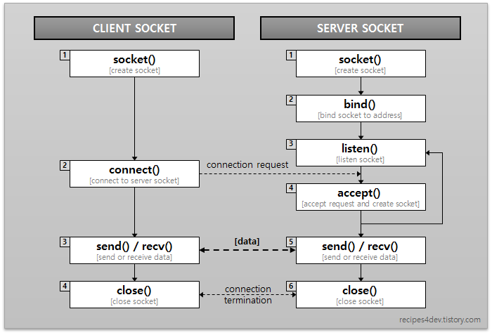

# 프로세스 간 통신(IPC)

프로세스 내의 스레드들은 스택을 제외한 모든 메모리 영역과 PCB를 공유한다. 따라서 스레드 간에 메모리 공간과 자원을 공유하기 때문에 데이터 영역의 전역변수나 힙 영역을 이용하여 쉽게 통신할 수 있다.<br>
반대로 프로세스는 `고유한 메모리 공간과 자원`을 갖기 때문에 통신을 할 공간이 없어 `통신을 위한 별도의 공간`을 만들어줘야하기 때문에 프로세스 간 통신은 어렵다. 
따라서 프로세스 간 통신을 위하여 커널 영역에서 `IPC(내부 프로세스 간 통신, Inter Process Communication)`를 제공한다.

IPC의 표준에는 `System V IPC`와 `POSIX IPC` 두 가지 버전이 있다.<br>
`System V IPC`는 비교적 오래된 버전이고, 현대에는 `System V`를 개선한 방식인 `POSIX IPC`를 사용한다. 

초기에는 하나의 파일을 여러 프로세스가 읽고 쓰는 방식을 사용하였다. 파일 기반 통신은 간단하지만, 비효율적이다.<br>
따라서 등장한 IPC 기법 중 하나가 바로 `PIPE(파이프)`다.

## PIPE


커널이 관리하는 버퍼를 통하여 데이터를 통신한다.<br>
파이프는 FIFO 방식으로 데이터를 처리하며, 데이터는 스트림(흐름) 형태로 전달된다.



익명 파이프의 경우, 두 프로세스가 양방향 통신을 하려면 2개의 파이프가 필요하기 때문에 구현이 복잡해질 수 있다. (네임드 파이프를 사용하면 일부 해결 가능하다.)<br>
또한 $n$개의 프로세스가 서로 양방향 통신을 하려면 $_nP_2 = n(n-1)$개의 파이프가 필요하므로, 프로세스의 수가 많아질수록 자원의 낭비가 심하다.

### 종류
#### 1. 익명파이프(Anonymous PIPE)
`pipe` 함수(또는 `|`)로 생성된 파이프는 일반적으로 이름이 없는 익명파이프다.
즉, 통신을 할 프로세스를 명확하게 아는 경우에 사용 가능하다.<br>
보통 자식과 부모 프로세스 또는 같은 PPID(부모 프로세스)를 가지는 프로세스 간 통신에서 사용된다.<br>
상태를 모르는 프로세스 간의 통신은 지원하지 않아 제한적이다.

#### 2. 네임드파이프(Named PIPE)
익명파이프의 한계를 보완하여 확장시킨 것으로, 외부 프로세스와의 통신을 하기 위한 파이프이다.<br>
`mkfifo`나 `mknod`를 통해 각 파이프에 이름과 권한을 부여하여 파이프를 생성한다.<br>
읽기와 쓰기가 모두 가능하지만, 한 번에 한 방향으로만 통신이 가능한 반이중통신이다.

#### 정리

| 종류 | 익명파이프 | 네임드파이프 |
| --- | --- | --- |
| 생성방법 | pipe | mkfifo / mknod |
| 외부 프로세스와의 통신 | X | O |
| 통신 방식 | 단방향 | 반이중 |
| 단점 | 외부 프로세스와의 통신 불가능 | 다수의 클라이언트를 처리하기 위해 여러 개의 파이프 필요 |

<br>

## 메시지 큐(Message Queue)
커널이 관리하는 큐를 통해 `프로세스 간 비동기 통신`을 제공한다.<br>
입출력 방식은 네임드파이프와 비슷하지만, 파이프는 데이터를 `스트림`처럼 다루어 데이터를 즉시 소비해야 한다. 반면 메시지 큐는 운영체제가 메모리 공간에 `메시지를 저장`해 두고, 필요할 때 꺼내 읽을 수 있다. 또한 송신자와 수신자가 동시에 실행되지 않아도 된다.<br>
정리하면 파이프는 한 번 읽으면 데이터가 사라지는 반면, 메시지 큐는 메시지를 저장해둘 수 있다.

>
> - 파이프
>	```text
>	프로세스 A  ───▶  [ 파이프 ]  ───▶  프로세스 B  
>              (데이터가 흐르는 즉시 읽어야 함)
>	```
>- 메시지 큐
>	```text
>	프로세스 A  ───▶  [ 메시지 큐 (커널이 관리하는 메모리 공간) ]  
>	                          ↓  
>                    프로세스 B가 나중에 꺼내서 읽음
>	```
>


각 메시지 큐는 고유의 식별자(Identifier)를 갖고, 프로세스는 메시지 큐의 ID를 통해 특정 큐에 읽기/쓰기를 할 수 있다. 

### 동작 방식
1. 메시지 큐 생성 (`msgget`)
2. 메시지 송신 (`msgsnd`)
3. 메시지 수신 (`msgrcv`)
4. 메시지 큐 삭제 (`msgctl`)

<br>

## 공유 메모리(Shared Memory)
공유 메모리는 여러 프로세스가 동일한 메모리 영역을 함께 사용하여 데이터를 공유하는 IPC 방식이다.<br>
이전 IPC 방식들은 메시지를 송수신하며 데이터를 주고 받았지만, 
공유 메모리는 `별도의 통신 없이` 같은 메모리 공간에 접근하여 데이터 공유가 가능하다.

메모리 공간을 공유하기 때문에
(1) 대량의 정보를 다수의 프로세스와 공유 가능하고,
(2) 커널을 거치지 않기때문에 빠르고 효율적이고,
(3) 경쟁 상태로 인한 동기화 문제가 발생할 수 있다.<br> 
따라서 공유 메모리에 대해 `세마포어`나 `뮤텍스`를 통한 동기화가 필요하다. 

### 동작 방식
1. 프로세스A(소유자)가 커널에 공유 메모리 생성 요청
2. 커널이 공유 메모리를 생성하고, 공유 메모리에 대한 식별자(ID) 부여
3. 프로세스B(사용자)가 같은 공유 메모리를 첨부(attach)
4. 두 프로세스가 같은 메모리 공간을 직접 읽고 쓰면서 데이터를 공유

<br>

## 메모리 맵(Memory Map)
공유 메모리처럼 메모리를 공유한다는 점이 유사하지만, 메모리 맵은 `파일`을 기반으로 데이터를 공유한다는 차이가 있다. 
또한 공유 메모리는 프로세스가 종료되면 사라지지만, 메모리 맵은 파일이 남아있다면 재사용 가능하다. 

<br>

## 소켓(Socket)
네트워크를 통한 프로세스 간 원격 통신을 지원한다. 



### 참고
[IPC의 종류와 특징](https://jwprogramming.tistory.com/54)<br>
[[IPC] 내부 프로세스간의 통신](https://mangkyu.tistory.com/9)<br>
[ipc message queue](https://velog.io/@agnusdei1207/ipc-message-queue)
