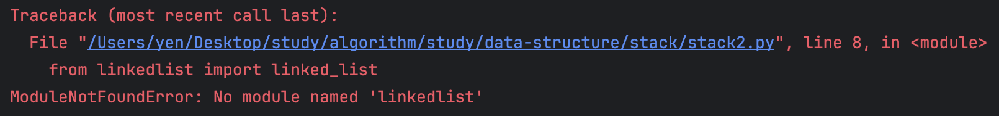
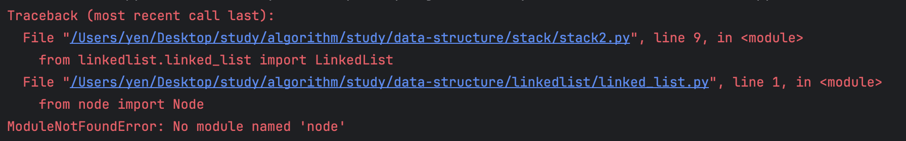

## [Solved] ModuleNotFoundError

### 문제
자료구조 실습 디렉터리 구조
```text
❯ ls -l linkedlist stack 
linkedlist:
total 32
drwxr-xr-x@ 5 yen  staff   160 Mar  6 16:28 __pycache__
-rw-r--r--@ 1 yen  staff  2262 Mar  6 16:21 doubly_linked_list.py
-rw-r--r--@ 1 yen  staff  1823 Mar  6 00:15 linked_list.py
-rw-r--r--@ 1 yen  staff  1362 Mar  6 00:09 main.py
-rw-r--r--@ 1 yen  staff   142 Mar  6 00:09 node.py

stack:
total 24
drwxr-xr-x@ 4 yen  staff  128 Mar  6 00:00 __pycache__
-rw-r--r--@ 1 yen  staff  365 Mar  6 00:00 main.py
-rw-r--r--  1 yen  staff  446 Aug  5  2024 stack.py
-rw-r--r--@ 1 yen  staff  452 Mar  6 16:29 stack2.py
```
자료구조 별로 폴더를 분리하여 그 안에서 실습 중
linked list를 사용해서 stack을 구현하려고 했는데

```Python
from linkedlist.linked_list import LinkedList
```



난리 뽕짝~~~ 보아하니 같은 경로에 있지 않아서 저렇게 import 해올 수 없는 것 같다.

### 해결 과정

폴더를 패키지로 만들어서 해결하는 방법도 있는 것 같은데, 
구현한 자료구조를 재사용할 일이 없을 것이라고 생각해서 
나는 간단하게 코드를 추가하는 방법으로 해결했다.

```python
import sys, os

sys.path.append(os.path.dirname(os.path.abspath(os.path.dirname(__file__))))
```

위 코드를 추가해주었더니, LinkedList는 import되는데 linked_list 파일 안에서 Node를 호출하는 게 또 말썽인게야...



코드를 완벽히 이해하진 못했지만, 위 코드는 현재 경로의 상위 경로를 추가한 거 같다. 그럼 아예 linkedlist 폴더를 경로에 추가하면 어떨까??

```python
sys.path.append(os.path.abspath(os.path.join(os.path.dirname(__file__), "..", "linkedlist")))
```

해결!!

### 정리
상위 디렉터리를 추가하고 싶으면 
```python
sys.path.append(os.path.dirname(os.path.abspath(os.path.dirname(__file__))))
```

동일 선상에 있는 디렉터리를 추가하고 싶으면, 
```python
sys.path.append(os.path.abspath(os.path.join(os.path.dirname(__file__), "..", [디렉터리 이름])))
```


### 참고
[[Solved] ModuleNotFoundError in Python.](https://velog.io/@y2k4388/Solved-ModuleNotFoundError-in-Python)
