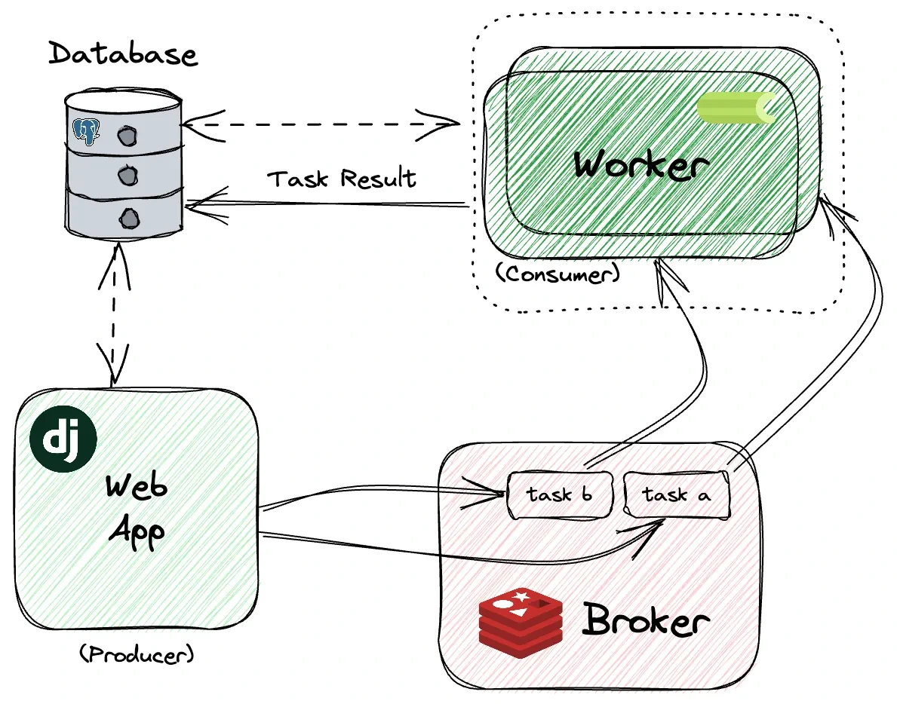

## Celery란?

: 비동기 분산 작업 큐 시스템으로, python 동시성 프로그래밍에서 가장 많이 사용되는 방법 중 하나이다.

### 도입배경

초기 helpshift webhook API는 유저 문의가 인입되는 이벤트(create issue 또는 update issue) 하나에서 답변을 생성하고, 아이템을 지급하고, 로그까지 적재하는 많은 업무를 담당하였다. Background Task를 사용하기도 했지만, 그때는 그 용도를 제대로 알고 사용하지 않았다. (지금도다. 추후 알아보자.)

그러던 중, helpshift ticket을 gitlab issue로 관리하고 싶다는 요청이 들어왔다. 구현을 하고 보니 최초 유저 문의 후 자동응답 봇과의 대화가 실시간으로 진행되어(유저의 문의 직후, 바로 자동응답 봇이 등장한다.) gitlab 이슈가 생성되기도 전에 discussion 을 추가하려고 하여 대화 일부분이 누락되거나, 순서가 보장되지 않는 문제가 생겼다. 이 순서를 보장하기 위하여 gemini랑 머리를 맞대다가, celery를 소개받았다.

### 무엇을 하는가?

celery는 앞서 말한 것처럼, 분산 처리가 요구되는 작업에 유용하다.
웹 페이지에서 처리가 복잡한 사용자의 요청이 있다고 하자. 만일 우리의 서버가 단일 서버라면, 이 요청 하나에 모든 자원을 쓰게 될 것이고 다른 요청들은 처리할 수 없다. 흔한 블로킹(blocking) 현상이다. celery는 이런 문제를 해결해준다. 요청이 들어오면, 응답을 먼저 반환하고 뒷단에서 무거운 작업을 별도로 수행한다. 동기적으로 처리하는 웹 서버가 뒷단에 작업을 위임하면서, 비동기(Asynchronous) 구조를 볼 수 있다. 

"식당"으로 간단한 예를 하나 들면,   
**celery가 없다면,**   직원 한 명이 손님의 주문을 받고, 요리를 하고, 대접까지 해야한다. 즉, 식당에서의 모든 업무를 혼자서 해내야 한다. 시간이 굉장히 오래 걸릴 것이다.  
**celery가 있다면,** 손님이 주문을 하면, 웨이터가 주문서를 요리사에게 넘겨주고, 웨이터는 다른 손님의 주문을 받거나, 물을 건네주는 다른 작업을 할 수 있게 된다. 여기서 요리사가 celery worker인 셈이다. 추가로 '주문서 꽂이'의 개념을 추가하면, 완벽한 celery 개념이 된다. celery의 구성 요소에는 broker가 있기 때문이다.

### 왜 사용하는가?

초기 도입 이유는 celery의 본질과는 거리가 멀었지만, 지금 생각해보면 webhook의 경우 timeout 시간이 짧기 때문에 빠른 응답을 요구한다. 따라서 하나의 event에 많은 작업이 처리되어야 하는 helpshift webhook에 celery의 도입은 좋은 선택이었다. 실제로 celery를 도입한 이후, timeout error로 전송되는 메일의 빈도 수가 확연히 줄어들었다.

여기까지가 helpshift webhook을 구현하면서 내가 직접 깨달은 celery의 개념이고, 조금 더 학습한 개념을 정리해보자.

### Celery의 구성 요소

#### **1\. Client(Producer)**

작업을 생성하고 브로커에 작업을 전송한다. 일반적으로 웹 애플리케이션이나 스크립트가 클라이언트가 된다. 내 경우, webhook.example-company.com이겠지. Celery를 사용하여 작업을 정의하고 실행을 요청한다.

#### **2\. Broker(Task/Message Queue)**

클라이언트와 워커 사이에서 작업을 중개한다. 작업 메시지를 저장하고 워커에게 전달한다.

#### **3\. Worker(Consumer)**
브로커로부터 작업을 전달받아 실제로 실행하는 프로세스이다. 여러 워커를 동시에 실행하여 작업을 병렬 처리할 수 있다. 또한 작업 결과를 백엔드에 저장할 수 있다.

추가 구성요소로, 

#### **4\. (Result) Backend**

작업의 상태와 결과를 저장한다. 클라이언트가 작업 상태를 조회하거나 결과를 가져올 때 사용한다. 

### 작동 과정



1\. client가 작업을 생성 후, broker에게 전달한다. (`.delay()`).   
2\. broker는 queue에 작업을 저장한다.   
3\. worker는 broker의 queue를 모니터링하고 있다가, 새로운 작업이 추가되면 작업을 가져간다.   
4\. worker가 작업을 실행한다.   
5\. (설정된 경우) worker는 backend에 작업 결과를 저장한다.   
6\. (필요한 경우) client는 backend에서 작업 상태나 결과를 조회한다.   

공식 문서에 따르면, celery는 간단하고, 유연하고, 빠르고, 높은 고가용성을 가진다고 한다.
간단하다는 건 진짜 맞는게, 브로커의 url만 지정해주면 쉽게 클라이언트와 워커를 이어줄 수 있고, 함수를 구현하여 `@task` 데코레이터를 추가하면 task가 되고, 이걸 `delay()` 메서드를 사용하기만 하면된다!

### 적용 사례

웹훅 서버에서 외부 서비스로부터 이벤트를 받아 후처리하는 구조를 Celery로 구축했다. 역할별로 워커를 분리하여 확장성을 확보하는 방향으로 설계했다.

**docker-compose 구성 (요약):**

```yaml
services:
  webhook:
    build: .
    depends_on:
      - redis
      - task-worker

  redis:
    image: "redis:alpine"

  task-worker:
    build: .
    depends_on:
      - redis
    command: celery -A app.tasks.config.celery_app worker -Q task_queue -c 8 --loglevel=info
```

**Celery 앱 설정:**

```python
# tasks/config.py
import os
from celery import Celery

celery_app = Celery(
    'app_tasks',
    broker=os.getenv('CELERY_BROKER_URL', 'redis://localhost:6379/0'),
    backend=os.getenv('CELERY_RESULT_BACKEND', 'redis://localhost:6379/0'),
    include=['app.tasks.handlers']
)

# 태스크별로 큐를 분리하여 역할별 워커가 처리하도록 라우팅
celery_app.conf.task_routes = {
    'process_event_task': {'queue': 'task_queue'},
    'send_notification_task': {'queue': 'notification_queue'},
}
```

**FastAPI에서 태스크 호출:**

```python
@app.post("/webhook/event")
async def receive_event(payload: EventPayload = Body(...)):
    # 무거운 작업은 Celery에 위임하고 즉시 응답
    process_event_task.delay(payload.event_id)
    return {"message": "Webhook received."}
```

`celery_app.conf.task_routes`로 각 태스크를 어떤 큐에 넣을지 지정하고, 워커 실행 시 해당 큐를 구독하도록 설정한다. 이렇게 하면 역할별 워커를 독립적으로 스케일 아웃할 수 있다.

```
celery -A [celery app 위치] worker \
-Q [메시지 큐] \
-c [동시성 개수] \
--loglevel=[로그 레벨] \
--logfile=[로그 파일]
```

실제로 첫번째 명령어만으로도 실행 가능하지만, 여러 옵션을 통해 커스텀하게 워커를 실행해줄 수 있다. 실행 옵션으로 로그 설정도 지정해줄 수 있다. 

```
@after_setup_logger.connect
@after_setup_task_logger.connect
def setup_celery_logging(
        logger=None,
        loglevel=None,
        logfile=None,
        format=None,
        colorize=None,
        **kwargs
):
    setup_logging(logger=logger, loglevel=loglevel, logfile=logfile, format=format, colorize=colorize)
```

### 추가로: BackgroundTasks와의 비교

초기에는 BackgroundTasks를 사용하여 뒷단에서 작업될 수 있도록 구현하였다. (전임자의 코드를 그대로 따른 게 크다)

Celery를 도입하면서, BackgroundTasks를 다 걷어냈는데 찾아보니, BackgoundTasks는 FastAPI에서 제공하는 후처리(Post-processing) 훅이라고 한다. 즉, 요청에 대한 백그라운드 작업을 실행하는 기능을 제공하는 친구로 celery와 역할이 비슷하다!

단, Celery처럼 하나의 독립적인 프로세스가 아니라 FastAPI 애플리케이션에 종속되어있기 때문에 웹서버가 예기치 않게 종료되면, 작업도 함께 없어져버린다. 또한 분산 처리, 자동 재시도, 스케줄링 등의 기능을 기본 제공하지 않는다. 따라서 Celery보다 구축하기 쉽다는 장점이 있어 간단한 후처리 작업에는 적합하지만, 배포 및 운영 서비스에서 안정적인 비동기 작업이 필요하다면 Celery가 더 적합하다.

| **특성** | **BackgroundTasks** | **Celery (+ Redis)** |
| --- | --- | --- |
| **실행 위치** | **웹 서버와 같은 프로세스** (메모리 공유) | **완전히 분리된 별도 프로세스/서버** |
| **복잡도** | 매우 낮음 (코드 몇 줄이면 끝) | 높음 (Redis 설치, Worker 실행 필요) |
| **안정성** | **낮음** (서버 재배포/다운 시 작업 소멸) | **높음** (브로커에 저장되므로 서버 죽어도 보존) |
| **서버 부하** | 웹 서버의 CPU/RAM을 같이 씀 | 웹 서버와 무관함 (Worker가 알아서 함) |
| **재시도(Retry)** | 직접 구현해야 함 (기본 기능 없음) | 자동 재시도, 지수 백오프 등 강력 지원 |
| **모니터링** | 로그 찍는 것 외에 방법 없음 | Flower 등으로 시각적 모니터링 가능 |
| **용도** | 간단한 알림, 로그 저장, 데이터 갱신 | 동영상 인코딩, ML 모델 돌리기, 대량 메일 |

### 참고 문서

[https://docs.celeryq.dev/en/main/getting-started/introduction.html](https://docs.celeryq.dev/en/main/getting-started/introduction.html)  
[https://tiaz.dev/Celery/1](https://tiaz.dev/Celery/1)  
[https://docs.celeryq.dev/en/4.0/userguide/signals.html#logging-signals](https://docs.celeryq.dev/en/4.0/userguide/signals.html#logging-signals)  
[https://fastapi.tiangolo.com/tutorial/background-tasks/](https://fastapi.tiangolo.com/tutorial/background-tasks/)