## 엔티티 매니저(Entity Manger)

엔티티를 생성, 수정, 삭제, 조회하는 엔티티와 관련된 모든 일을 처리하며, 엔티티를 관리하는 가상의 데이터베이스라고 생각할 수 있다. entityManager은 영속성 컨텍스트(Persistent Context)와 1:1 또는 1:N 관계를 갖는다.

## 영속성 컨텍스트(Persistent Context)

영속성 엔티티 인스턴트들의 모음으로, 엔티티의 생명주기를 관리한다.

즉, 엔티티의 CRUD를 담당하면서, 저장했거나 불러온 엔티티를 기억하는 1차 캐시 역할을 한다.

### 영속성 컨텍스트는 엔티티를 기억한다.

위 특징으로 인해 얻을 수 있는 이점으로, 

첫째로는 `캐싱`이 가능하다. 영속성 컨텍스트에서 엔티티를 기억하고 있기 때문에 애플리케이션에서 동일한 엔티티가 필요할 경우, DB를 조회하지 않고 캐싱된 엔티티를 사용할 수 있다.

두번째는 `더티 체킹`이 가능하다. 캐싱된 엔티티를 활용해 애플리케이션에서 엔티티 변경 시 기존과 바뀐 내용이 있는지 쉽게 파악할 수 있다.

세번째는 `동일성이 보장`된다는 것이다. 캐싱 덕분에 동일한 엔티티를 여러 번 조회해도 동일성이 보장된다.

엔티티 매니저에 트랜잭션 시작 이후 상태 변경(persist, remove 등)을 차례로 요청하면, 엔티티 매니저는 엔티티의 상태 변경사항을 데이터베이스에 바로 요청하지 않고, 영속성 컨텍스트에 따로 저장해둔다. 엔티티 매니저에 커밋 요청 시(트랜잭션 종료), 변경사항이 한꺼번에 데이터베이스로 요청된다. 이러한 과정을 플러시(flush)라 한다.; 영속성 컨텍스트에 쌓인 엔티티 상태 변경사항을 데이터베이스와 동기화하는 절차.

이런 전략을 `쓰기 지연(write-behind)`라 하고, 영속성 컨텍스트는 엔티티 변경사항을 저장하는 트랜잭션 내 쓰기 지연 캐시로써 역할한다.

### 참고
https://psvm.kr/posts/tutorials/jpa/3-em-and-persistence-context
