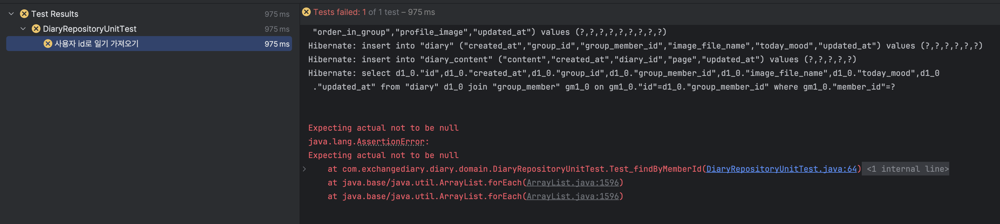

## [Solved] Repository Unit Test

```java
@Test
@DisplayName("사용자 id로 일기 가져오기")
public void Test_findByMemberId() {
	Diary diary = Diary.of(TODAY_MOOD, groupMember, group);
	entityManager.persist(diary);
	DiaryContent diaryContent = DiaryContent.of(1, "오늘의 날씨 맑음 :)", diary);
	entityManager.persist(diaryContent);

	List<Diary> diaries = diaryRepository.findByMemberId(member.getId());

	assertThat(diaries).hasSize(1);
	assertThat(diaries.get(0).getContents()).hasSize(1);
}
```

테스트 코드 리팩터링 중 위 DiaryRepository의 JPQL문이 잘 동작되는지 확인하기 위해서 위 테스트 메서드를 생성했다가 오류가 났다. 



'DiaryContent가 LazyLoading으로 이어져있어서 가져오지 못하는 것인가..?' 했지만,<br>
원인은 일기를 조회해올 때 DB에서 조회해오는 것이 아닌 1차 캐시, 즉 영속성 컨텍스트에서 일기를 꺼내오기 때문이었다.

따라서 위 문제를 해결해주기 위해서는 `findByMemberId` 메서드 호출 시, 1차 캐시를 사용하는 것이 아닌 DB에서 데이터를 조회해오도록 하면 된다.<br>
즉, 영속성 컨텍스트를 초기화해주는 것이다. 


```java
entityManager.clear();
```

생각보다 간단하게 해결된 문제 ㅎㅎ.. 테스트 코드는 짜도짜도 어려운 것 같다..

### 참고
[ChatGPT 도움](https://chatgpt.com/share/67f4ac89-0e64-8000-8f91-e4cf7155c5ca)