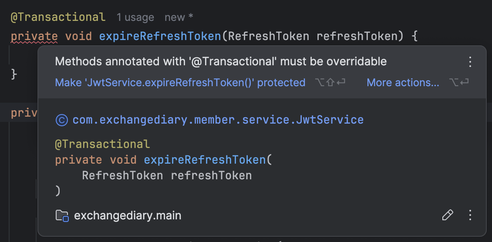
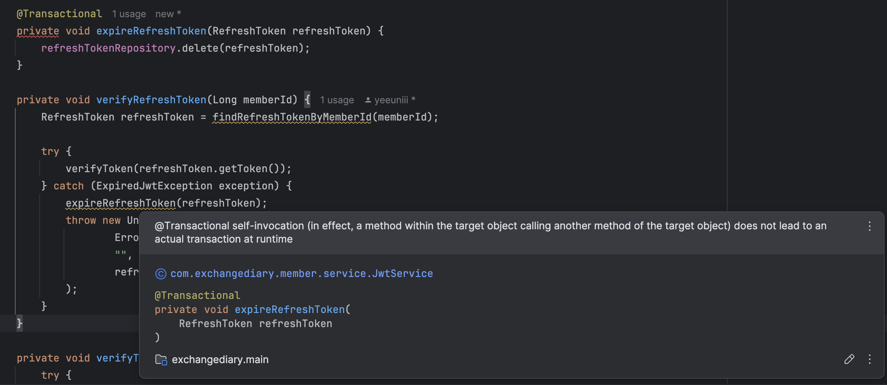
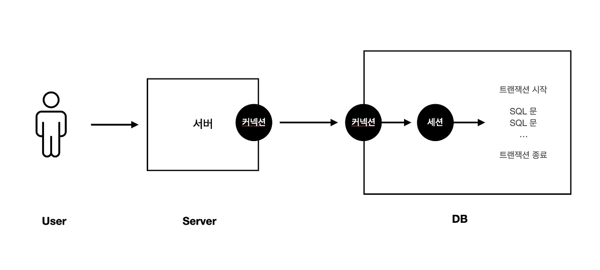
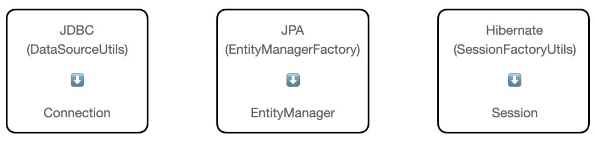
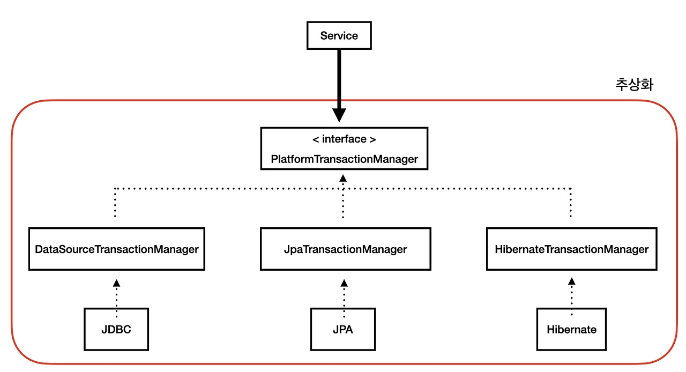

# 스프링 트랜잭션

> 그룹원 테이블 추가 중 RefreshTokenService를 제거하고 JwtService 하나로 jwt 토큰과 관련된 로직들을 다루기로 결정!!했는데 이것 뭐에요~??
> 
> 
> <br>문제 해결하러 떠나봅시다..~=

## 들어가며
### 서버와 Database 는 어떻게 연결되어 있을까?

서버와 DB가 연결되어 있고 사용자의 요청에 따라 서버에서 DB 관련 로직을 처리 시, DBCP(Database Connection Pool)에서 미리 생성되어있던 커넥션 객체를 가져온다. 그 후 데이터베이스는 서버 내부에서 세션을 만들고 커넥션과 연결하여 커넥션을 통해 전달된 SQL 요청을 처리하는 방식으로 동작한다.
<br><br>
위 데이터베이스 연결 구조는 자바 프로그램이 클라이언트로서 직접 데이터베이스 서버에 접근하여 데이터를 요청하는 2Tier이고, 자바 프로그램과 데이터베이스 서버 사이에 미들웨어 계층이 존재하는 3Tier도 있다. 이때의 미들웨어 계층은 비즈니스 로직 구현, 트랜잭션 처리, 리소스 관리 등을 담당한다.
<br><br>
JDBC는 Java Database Connectivity의 약어로, 자바 애플리케이션이 다양한 종류의 관계형 데이터베이스에 접근할 수 있도록 자바에서 제공하는 표준 API이다. 다음과 같은 구조로 동작한다. : Java (Web) Application ➡️ JDBC API ➡️ JDBC Driver ➡️ DB<br>
사용자의 요청 시, JDBC Driver를 로드하고, 연결 객체를 생성하여 데이터베이스를 연결하고 쿼리를 수행한다.
<br><br>
사용자가 요청할 때마다 위 과정을 반복하는 것은 비효율적이다. 따라서 이를 해결하기 위해  DBCP(Database Connection Pool)을 사용한다.
Connection Pool은 WAS가 실행될 때 일정량의 Connection 객체를 미리 만들어서 Pool에 저장한다. 이후 클라이언트 요청 시, Connection 객체를 빌려주고 요청 종료 시 Connection 객체를 Pool에 반환한다.

---

## Spring은 트랜잭션과 관련된 3가지 핵심 기술을 제공한다. 
1. 트랜잭션 동기화
2. 트랜잭션 추상화
3. 선언적 트랜잭션


### 트랜잭션 동기화
JDBC를 이용하는 개발자가 직접 여러 개의 작업을 하나의 트랜잭션으로 관리하려면 Connection 객체를 공유하는 등 불필요한 작업들이 많이 생길 것이다. Spring은 이러한 문제를 해결하고자 트랜잭션 동기화 기술을 제공한다. 
**트랜잭션 동기화**는 트랜잭션을 시작하기 위한 `Connection` 객체를 특별한 저장소에 보관해두고 필요할 때 꺼내쓸 수 있도록 하는 기술이다.
트랜잭션 동기화 저장소는 작업 스레드마다 Connection 객체를 독립적으로 관리하기 때문에 멀티스레드 환경에서도 충돌 발생 가능성이 없다. 

하지만 JDBC가 아닌 Hibernate와 같은 기술을 사용한다면 JDBC에 종속적인 트랜잭션 동기화 코드들은 문제를 유발한다. 예를 들어 Hibernate는 Connection이 아닌 Session 객체를 사용하기 때문이다. 따라서 이러한 기술 종속 문제를 해결하기 위해 Spring은 트랜잭션 추상화 기술을 제공한다.



<br>

### 트랜잭션 추상화
Spring은 트랜잭션 기술의 공통점을 담은 트랜잭션 추상화 기술을 제공한다. 이를 이용함으로써 애플리케이션에 각 기술마다(JDBC, JPA, Hibernate ETC) 종속적인 코드를 이용하지 않고도 일관되게 트랜잭션을 처리할 수 있다.



구체적으로 추상화가 어떻게 되는지 설명하면, 
- 각각의 데이터베이스에 맞는 TransactionManager는 PlatfromTransactionManager의 구현체로 정의하도록 로직을 구현한다.
- 서비스는 내부적으로 각각의 Database에 맞는 TransactionManager를 의존하는 것이 아닌 PlatfromTransactionManager 인터페이스를 의존한다.
- 스프링에서 자동으로 개발자가 사용하는 Database 기술에 맞게 구현체를 연결해 Database 기술 간의 의존성을 제거한다.


하지만 트랜잭션 추상화 방식에도 한계가 있다. 
서비스 로직 내에서 비즈니스 로직 외에 트랜잭션을 열고, 커밋하고, 롤백하는 일련의 작업들까지 구현해야 하기 때문에 코드가 길어진다는 단점이 존재한다. 또한 서비스가 트랜잭션 관리 코드와 비즈니르 로직 코드를 모두 가지면서, 2가지 책임을 갖는 문제가 있다. 
이 문제를 해결하기 위해 Spring은 AOP를 이용해 트랜잭션 로직과 비즈니스 로직을 분리하였다.

<br>

### 선언전 트랜잭션(Declarative Transcation)
선언적 트랜잭션 기술을 통해 트랜잭션 생성 및 종료와 같은 트랜잭션 로직과 비즈니스 로직을 분리할 수 있다. 스프링 AOP를 통해 프록시 객체를 만들고, 해당 객체에서 트랜잭션 로직이 처리된다. 프록시 객체가 실제 서비스를 대신 호출하여 서비스 코드에 구현되어 있는 비즈니스 로직을 처리한다. 로직에 문제가 생기면 Rollback을, 문제가 없으면 Commit 후 트랜잭션을 종료하는 일련의 처리를 프록시 객체에서 처리한다. 

`@Transactional` 어노테이션을 사용하여 선언적 트랜잭션 기술을 사용할 수 있다.


#### 이때, 프록시 패턴이란 무엇인가?
**프록시 패턴**은 대상 객체의 기능을 대신 수행하는 대리 객체를 사용하는 패턴으로, 실제 객체가 아닌 임의의 객체를 생성하여 주입한다. 따라서 **프록시 객체**는 원래 객체를 감싸고 있는 객체이다. 프록시는 클라이언트로부터 요청을 받으면 타겟 클래스의 메소드로 위임하고 경우에 따라 부가 작업을 추가한다. 즉, 프록시는 클라이언트가 타겟 클래스를 호출하는 과정에만 동작한다. 타겟 클래스가 자기 자신의 메소드를 호출할 때는 AOP가 적용되지 않고 대상 객체를 직접 호출하게 되어 프록시 객체를 타지 않는다.

### @Transactional 이란?
선언적 트랜잭션 기술.<br>
메서드 레벨 또는 클래스 레벨에 사용할 수 있으며, 해당 메서드 또는 클래스의 모든 public 메서드에 트랜잭션을 적용한다.

메서드가 실행되면 스프링은 트랜잭션을 시작하고, 메서드가 정상 종료되면 트랜잭션을 commit하고, 예외가 발생하면 트랜잭션을 rollback한다. 따라서 비정상 종료로 인한 rollback이 발생할 경우에는 트랜잭션의 일부 작업만 데이터베이스에 반영되는 것을 방지하여 데이터 일관성을 유지한다. 

#### 왜 사용하는가? 
트랜잭션의 성질 중 원자성을 보장하기 위해서이다.<br>
또한 Dirty Checking을 수행해주기 때문에 영속상태의 엔티티에 대해서 따로 save 메서드를 사용하지 않아도 데이터베이스에 데이터의 변경사항을 적용시켜준다.

**트랜잭션을 적용하는 메서드는 반드시 `public`으로 선언하자.** <br>
@Transactional 어노테이션은 스프링 AOP를 통해 프록시 객체를 생성해서 처리되므로 외부에서 접근 가능한 인터페이스를 제공해야 한다. 따라서 프록시 객체 생성 시 private이나 protected 메서드는 외부에서 접근할 수 없어서 해당 메서드에 대한 트랜잭션 관리가 불가능하다.

**서비스 계층에서만 사용하자.** <br>
`@Transactional` 어노테이션을 사용하는 이유는 하나의 비즈니스 로직에 대한 원자성을 보장하기 위해서이다. 

또한 JpaRepository의 구현체인 SimpleJpaRepository를 들여다보면, 
```java
@Repository
@Transactional(
    readOnly = true
)
public class SimpleJpaRepository<T, ID> implements JpaRepositoryImplementation<T, ID> 
```
`@Transactional` 어노테이션이 사용되고 있다. 

**조회 메서드에는 `readonly=true`를 설정하자.** <br>
1. 성능 향상<br> 
세션 플러시 모드가 MANUAL로 설정되어 트랜잭션 내에서 사용자가 flush(ex. save())를 직접 호출하지 않으면, flush가 자동으로 수행되지 않는다.
즉, 트랜잭션 내에서 강제로 flush를 수행하지 않으면, 데이터베이스에 데이터의 변경사항이 적용되지 않는다.<br>
또한 JPA는 해당 트랜잭션 내에서 조회하는 엔티티는 조회용임을 인식하고 스냅샷을 따로 생성하지 않아 메모리가 절약되는 이점도 존재한다.
1. 코드의 가독성<br>
데이터의 조회만 수행하는 메서드임을 직관적으로 파악할 수 있다.

<!-- ### 무분별한 사용은 좋지 않다.
https://tech.kakaopay.com/post/jpa-transactional-bri/
https://woonys.tistory.com/238 -->

### 참고
[데이터베이스 연결(DB Connection)](https://velog.io/@_jaehye0n/dbconnection)<br>
[@Transactional 잘 모르고 쓰면 오히려 독이 될 수 있다.](https://swmobenz.tistory.com/34)<br>
[@Transactional 바르게 알고 사용하기](https://medium.com/gdgsongdo/transactional-%EB%B0%94%EB%A5%B4%EA%B2%8C-%EC%95%8C%EA%B3%A0-%EC%82%AC%EC%9A%A9%ED%95%98%EA%B8%B0-7b0105eb5ed6#id_token=eyJhbGciOiJSUzI1NiIsImtpZCI6Ijc2M2Y3YzRjZDI2YTFlYjJiMWIzOWE4OGY0NDM0ZDFmNGQ5YTM2OGIiLCJ0eXAiOiJKV1QifQ.eyJpc3MiOiJodHRwczovL2FjY291bnRzLmdvb2dsZS5jb20iLCJhenAiOiIyMTYyOTYwMzU4MzQtazFrNnFlMDYwczJ0cDJhMmphbTRsamRjbXMwMHN0dGcuYXBwcy5nb29nbGV1c2VyY29udGVudC5jb20iLCJhdWQiOiIyMTYyOTYwMzU4MzQtazFrNnFlMDYwczJ0cDJhMmphbTRsamRjbXMwMHN0dGcuYXBwcy5nb29nbGV1c2VyY29udGVudC5jb20iLCJzdWIiOiIxMTM5MjE4OTY2NjAxMTA3NzU5MDUiLCJlbWFpbCI6ImFubmE4NjI3MDBAZ21haWwuY29tIiwiZW1haWxfdmVyaWZpZWQiOnRydWUsIm5iZiI6MTc0MDU0MjI1MSwibmFtZSI6IuuwleyYiOydgCIsInBpY3R1cmUiOiJodHRwczovL2xoMy5nb29nbGV1c2VyY29udGVudC5jb20vYS9BQ2c4b2NJX1g2NmVDTXU5Smk3RVJzRHdqSmROV2dpZ1F2R1ZzclZRMURpcXB6Zk9TajBsX2c9czk2LWMiLCJnaXZlbl9uYW1lIjoi7JiI7J2AIiwiZmFtaWx5X25hbWUiOiLrsJUiLCJpYXQiOjE3NDA1NDI1NTEsImV4cCI6MTc0MDU0NjE1MSwianRpIjoiOGFmNWI0ZDI3NTc2Zjg3Mjg0YWViNjZiODEzNjhlOWNjNThlMmVhNSJ9.otVbSp7FpVzQxyKCrDWaZxx28J4xXg3XxPAmONHI1_13V8MPovAvHdDWoNY44oFY60qkq1r3T3pf2Iixk6KK_EWwqITOEzWyeKMTfTpXRCeU9GX4NGDWnHi3B4Q1YXB6fW3y5Kf2cupLVkE-KhGNMGLVJcUf5h4l87ELXPKDS-W6J3wrsUMsz-qHqulReYbp7WdYuIqyz3bCsP0JDOX5edUe1OvSwOPrI8hEU3cQwmUg8o_8gwEk2UkUwvhNNRY-4dQxcYzgAkFhacot6_iajHhhcMqPoHgv2WZkBVQ8j3EqVz0JaXqZdeyfb1BLFDQL_0jDt7c3dYDOSTAwSnVrLA)
